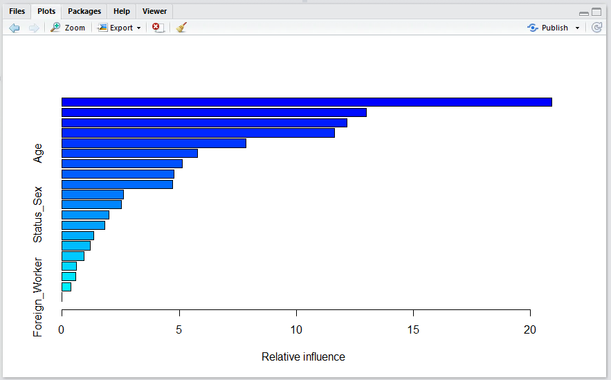

# Procedure 10: Creating a Gradient Boosting Machine

A relatively underutilised classification tool, which is built upon the concept of boosted decision trees, is the Gradient Boosting Machine, or GBM.  The GBM is a fairly black box implementation of the methods covered thus far, in this module.  The concept of Boosting refers to taking underperformed classifications and singling them out for boosting, or rather creating a dedicated model targeting the weaker performing data.  The GBM is part of the GBM package, as such install that package:


Click Install to download and install the package:


Load the library:

``` r
library(GBM)
```


Run the line of script to console:


The warning messages can be ignored as we can be reasonably assured of backward compatibility between the package build and this version of R.

Creating a GBM is similar to the familiar interfaces of regression, except for having a few parameters relating to the taming of the GBM:

``` r
gbm = gbm(Dependent ~., CreditRisk,
n.trees=1000,
shrinkage=0.01,
distribution="gaussian",
interaction.depth=7,
bag.fraction=0.9,
cv.fold=10,
n.minobsinnode = 50
)
```

Run the line of script to console:


Run the line of script to console, it may take some time:


To review the performance statistics of the GBM, simply recall the model:

``` r
gbm
```


Run the line of script to console:


The most salient information from this summary is that 1000 iterations were performed, with the cross validation diverging at tree 542.  A visual inspection of the cross validation can be presented by:

``` r
gbm.perf(gbm)
```


Run the line of script to console:


It can be seen that the line was drawn at the point divergence started:


As decision trees can become a little unwieldy, it might be prudent to inspect the relative importance of each of the independent variables with a view to pruning and rerunning the GBM training.  To understand the importance of each Independent Variable, wrap the summary function around the GBM:

``` r
summary(GBM)
```


Run the line of script to console:


The most useful and important variable is written out first, with the less important being written out last.  This is also displayed in a bar chart giving the overall usefulness of the independent variables at a glance:

