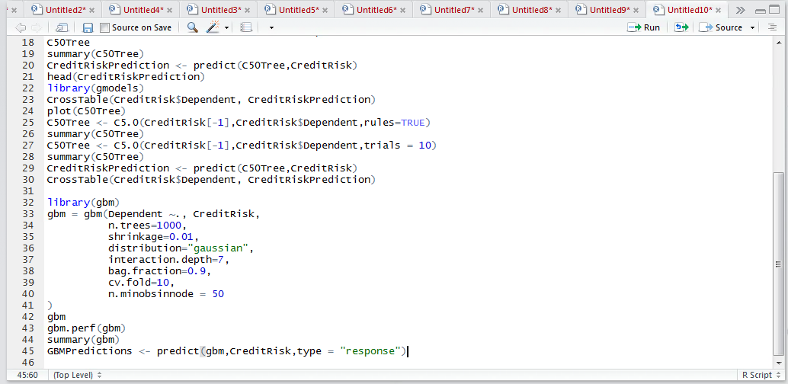
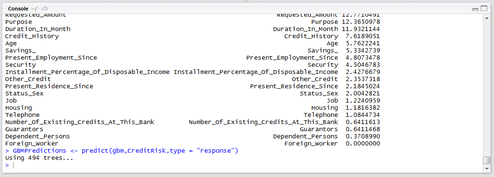
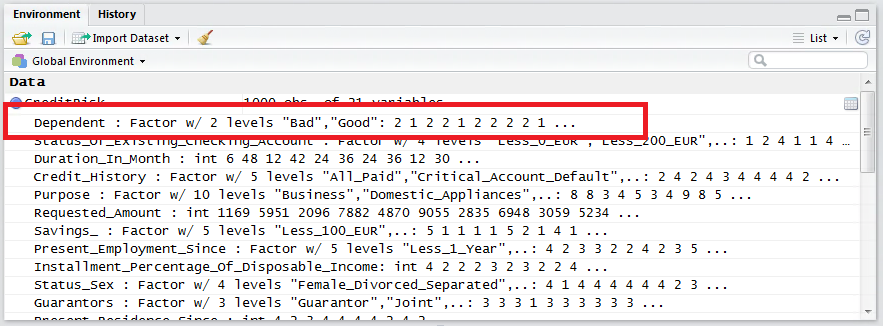
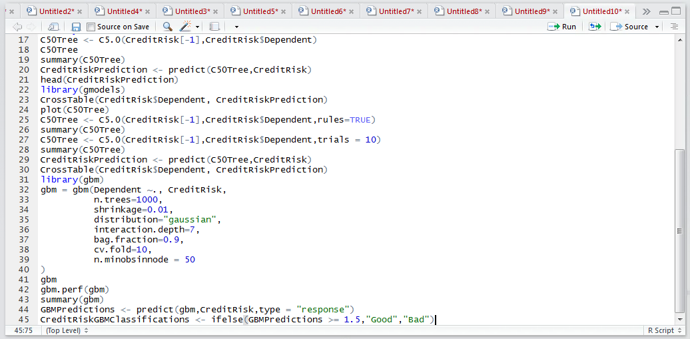
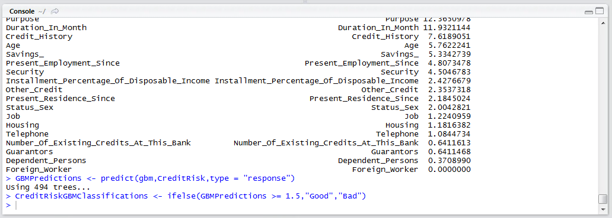
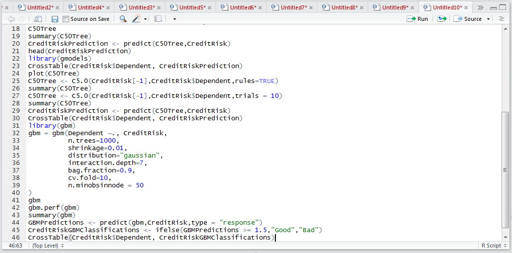
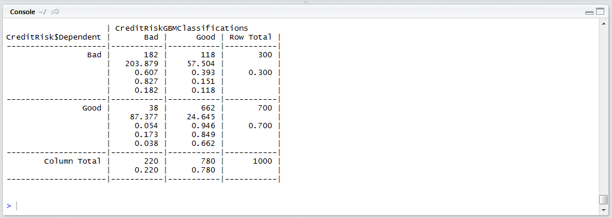

# Procedure 11: Recalling a Gradient Boosting Machine

Recalling the GBM is quite initiative and obeys the standardised predict signature.  To recall the GBM:

``` r
GBMPredictions <- predict(GBM,CreditRisk,type = "response")
```



Run the line of script to console:



A distinct peculiarity, given that the CreditRisk data frame has a dependent variable which is a factor, is that the binary classification has been modelled between 1 and 2, being the levels of the factor with 1 being Bad, and Good being two: 



It follows that predictions that are closer to 2, than 1 would be considered to be Good, whereas vice versa, 1.  To appraise the model performance, a confusion matrix should be created.  Create a vector using the ifelse() function to classify between Good and Bad:



Run the line of script to console:



Create a confusion matrix between the actual value and the value predicted by the GBM:

``` r
CrossTable(CreditRisk$Dependent, CreditRiskGBMClassifications)
```



Run the line of script to console:



It can be seen in this example that the GBM has mustered a strong performance.  Of 220 accounts that were bad, it can be seen that the GBM classified 182 of them correctly, which gives an overall accuracy rating of 82%.