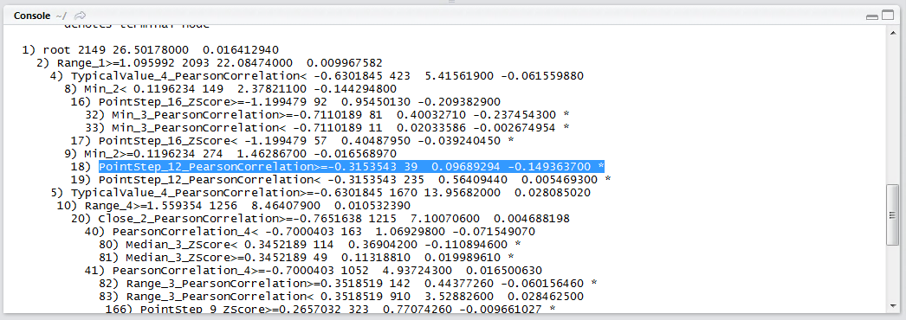

# Procedure 1: Create a Decision Tree using rpart

Firstly it is necessary to install the rpart package:


Click the install button to download and install the package:


Load the library rpart:

``` r
library(rpart)
```


Run the line of script to console:


Unlike in regression procedures, where it is necessary to be selective about the independent variables being passed to the model,  regression trees do not necessarily require any variable selection as they are much better at producing models on very large feature sets, as such can be instructed to use all independent variables.  To train a regression tree, use the rpart() function, specify the dependent variable and the independent variables:

``` r
RegressionTree <- rpart(Dependent ~ ., data = FDX)
```


Run the line of script to console:


A regression tree has been created and saved to the RegressionTree object.  To retrieve information about the splits and tree simply:

``` r
RegressionTree
```


Run the line of script to console:


A regression tree has been written out that can be interpreted as a series of if, then, else statements.  In this example, the follow logic would predict a percentage price change, although there are many variations:

If Range_1>=1.095992 and Min_2>=0.1196234 and PointStep_12_PearsonCorrelation>=-0.3153543 then Forecast is -0.149363700:



The rtree() function has though suggested a wide range of potential rules,  the endpoints being denoted by a *.  It is though important to understand the performance of each one these endpoints to propose implementation of these rules.  To establish the error rates of these endpoints, use the summary() function passing the RegressionTree object:

``` r
summary(RegressionTree)
```


Run the line of script to console:


Notice in the regression tree output, each node is labelled and in this example, node 18 was referenced.  By searching for this node in the summary output, the error rate can be determined:

