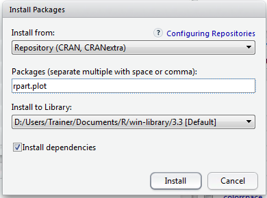
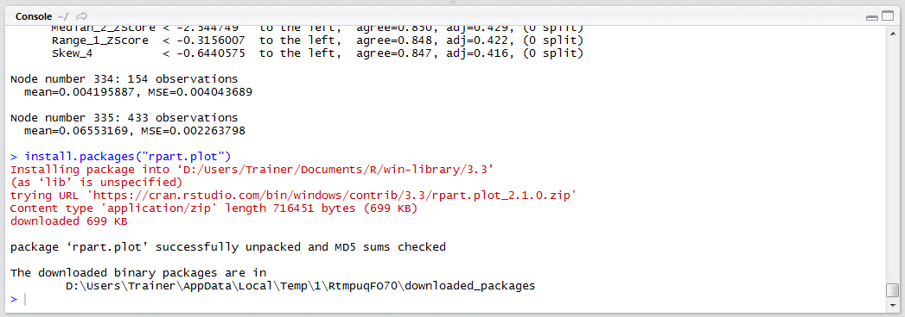
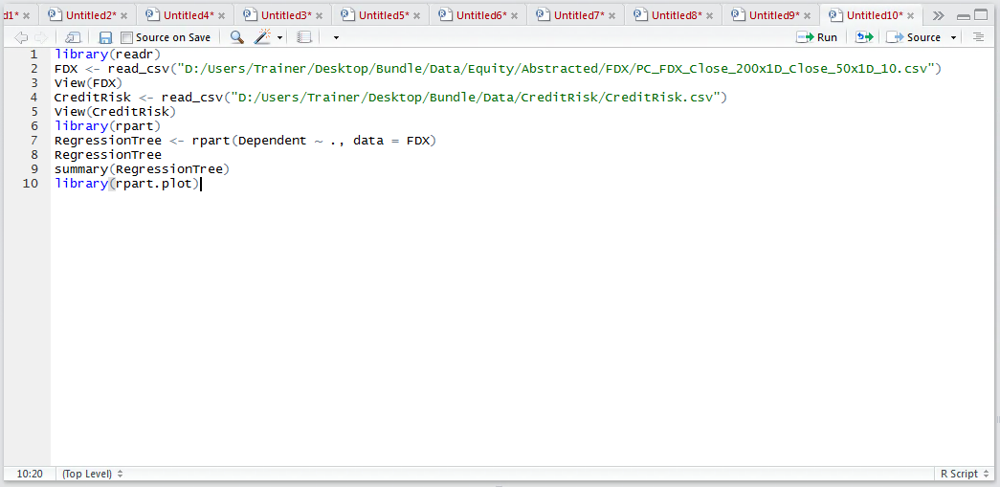
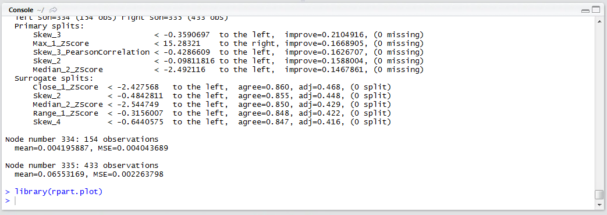
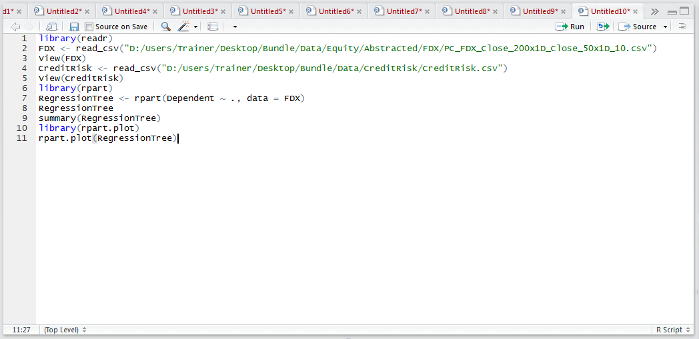
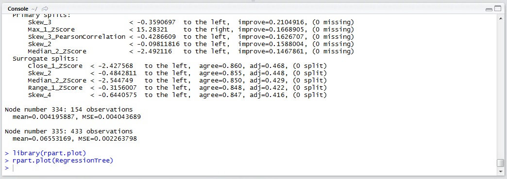
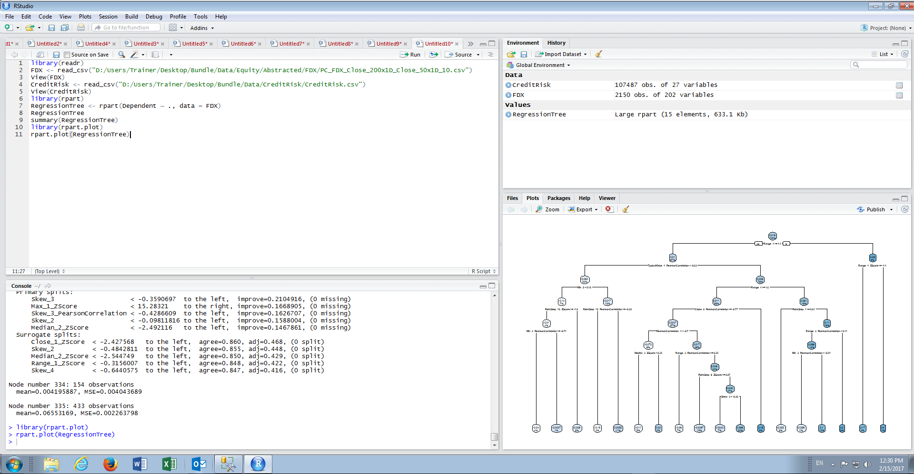
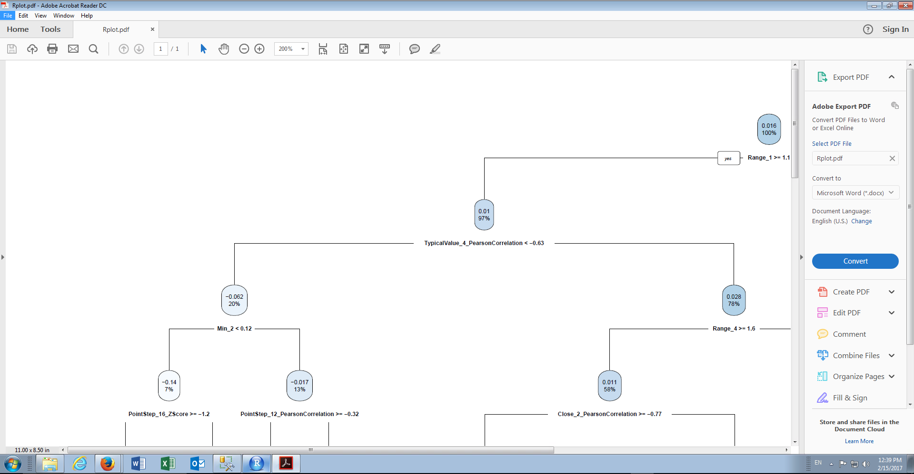

# Procedure 2: Visualise a rpart Decision Tree

Once familiar with the output of a regression tree, it becomes an informative means to create business rules. Quite often however, for the purposes of communication, it is more satisfying to create a visualisation.  A package called rpart.plot is available for the purposes of translating regression trees to a visualisation.  Start by installing the rpart.ploy package:



Click install to download and install the package:



Reference the library:

``` r
library(rpart.plot)
```



Run the line of script to console:



To transpose the Regression Tree to a plot, simply pass it as an argument to the rpart.plot() function:

``` r
rpart.plot(RegressionTree)
```



Run the line of script to console:



It can be seen that a complex visualisation has been created in the plots window of R Studio:



The visualisation is exceptionally hard to interpret for a large regression tree; hence it will likely need to be exported to a PDF or Image file to use a zoom function:

