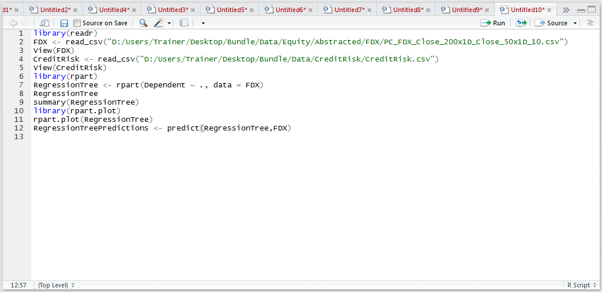
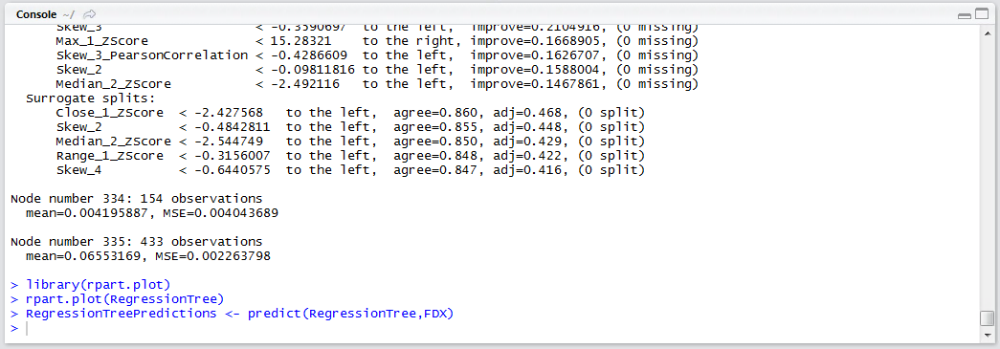
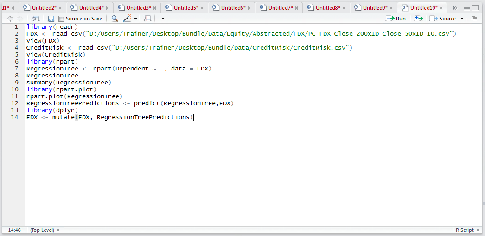
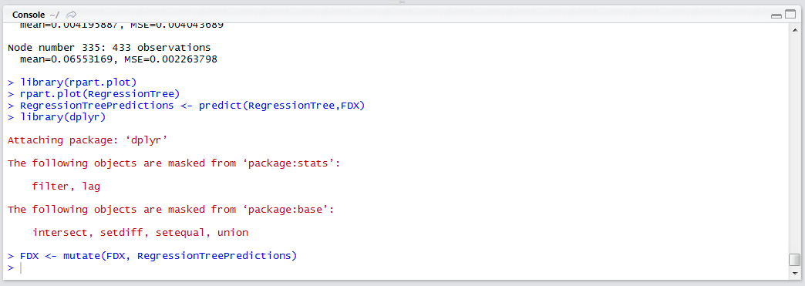

# Procedure 3: Recalling a rpart() Decision Tree

As with regression and most of the predictive analytics tools presented in this document, the predict() function can take the RegressionTree object in conjunction with a data frame,  then return the predictions.  To create predictions using the RegressionTree model and the FDX dataset:

``` r
RegressionTreePredictions <- predict(RegressionTree,FDX)
```



Run the line of script to console:



Merge the newly created vector into the FDX data frame for completeness:

``` r
library(dplyr)
FDX <- mutate(FDX, RegressionTreePredictions)
```



Run the block of script to console:

