# Procedure 4: Creating a C5 Decision Tree object

Install the C50 package using RStudio:

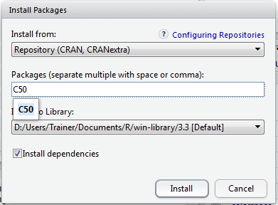

Click Install to download and install the package:

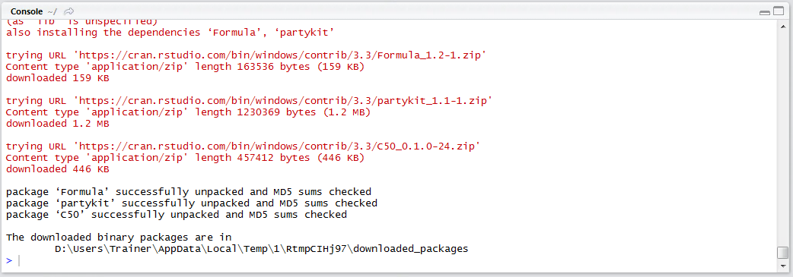

The CreditRisk data frame contains loan application data and a dependent variable which details the overall loan performance, titled Dependent for consistency.  The first and most obvious difference between this data frame and those used previously is the extent to which data is categorical and string based:

``` r
View(CreditRisk)
```

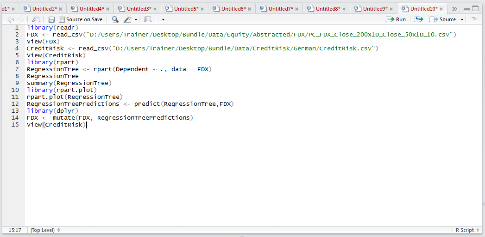

Run the line of script to console:

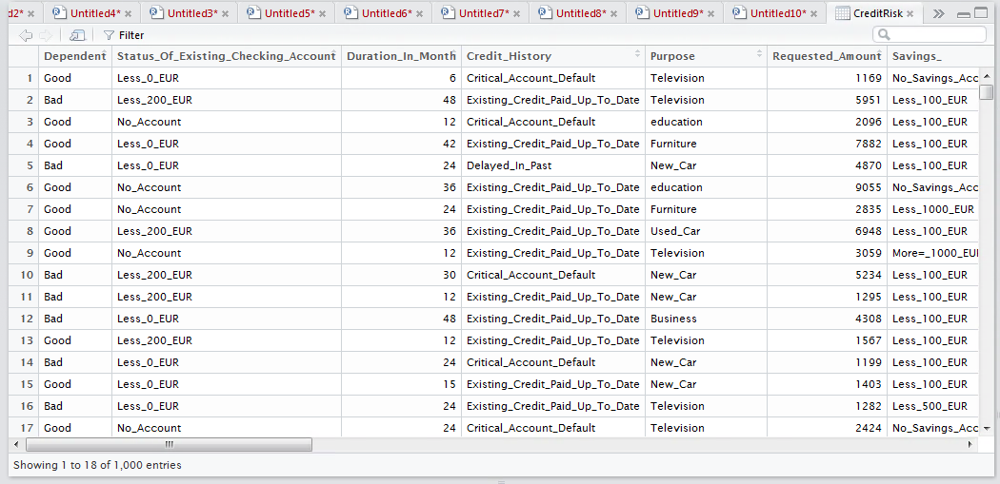

Emphasising, the dataset is far more categorical in nature.  To begin training a C5 Decision Tree load the library:

``` r
library(C50)
```


Run the line of script to console:

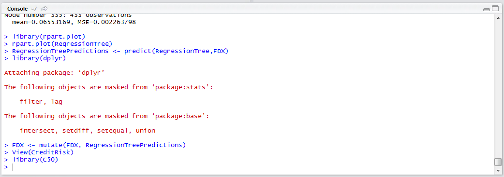

The input parameters to the C5.0() function, which is used to train a decision tree, is slightly different to that observed in procedures beforehand.  A data frame containing only the independent variables (no dependent variable), then a vector containing the dependent variable is required to train a model and in this regard, it differs from many of the other procedures in this guide.

In this example, the CreditRisk data frame contains both dependent and independent variables and needs splitting, in this case using negative subsetting to negate the first column then referencing the dependent variable explicitly:

``` r
C50Tree <- C5.0(CreditRisk[-1],CreditRisk$Dependent)
```

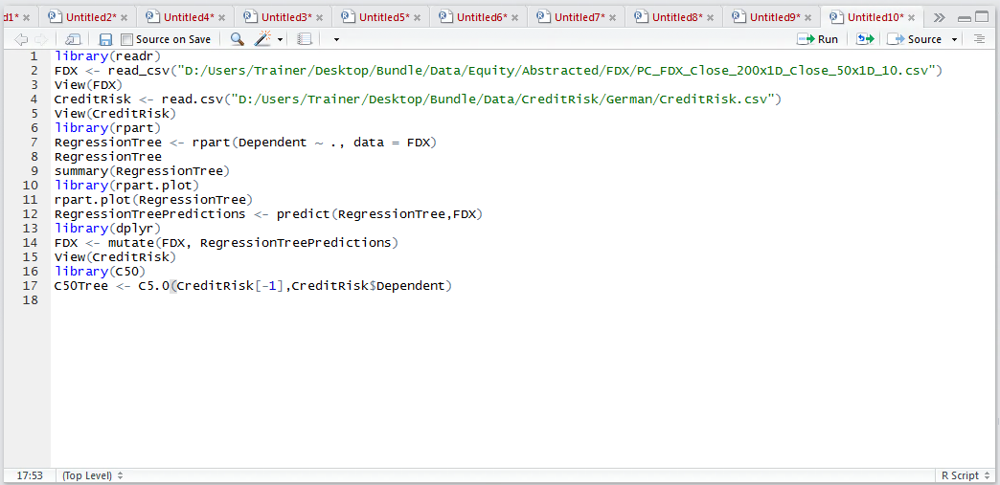

Run the line of script to console:

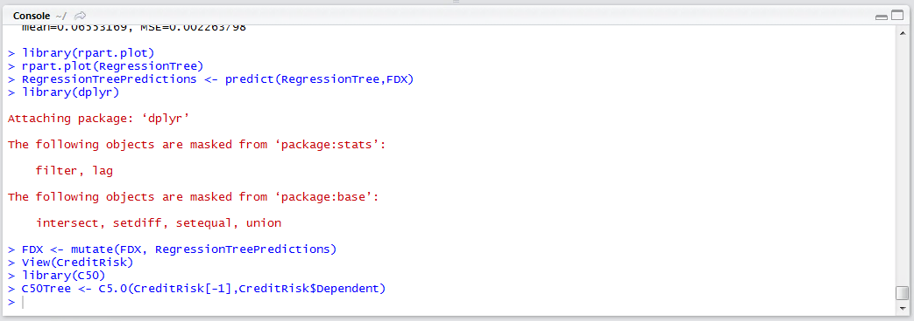

Run the line of script to console:

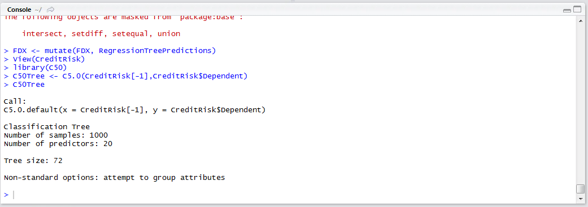

Use the summary() function to output the C5 decision tree and view the logic required to implement the classification tool:

``` r
summary(C50Tree)
```

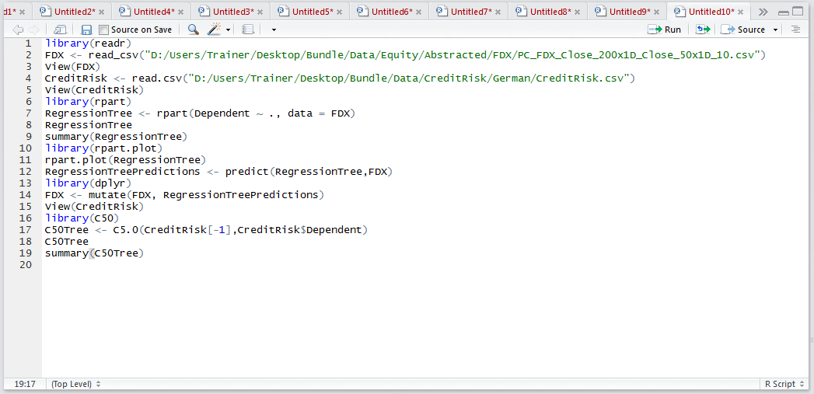

Run the line of script to console:

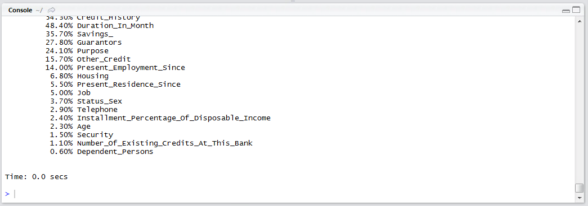

The summary output is overwhelming, however, scrolling up through the pane of results reveals the decision tree:

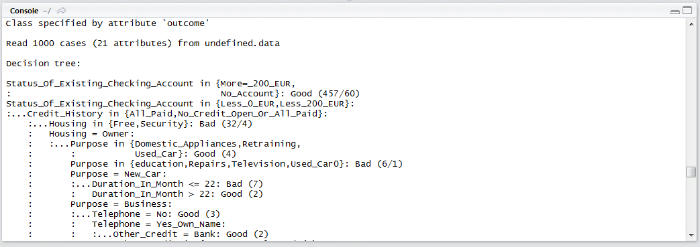

The interpretation of this decision tree is very similar that of a regression tree.  One such branch in this example would suggest that the following scenario would yield a bad account:

If Housing = Owner AND Purpose = "New Car" AND the Loan_Duration <= 22 Months Then BAD

In the above example, out of 1000 cases, it can be seen that 7 cases had this disposition:

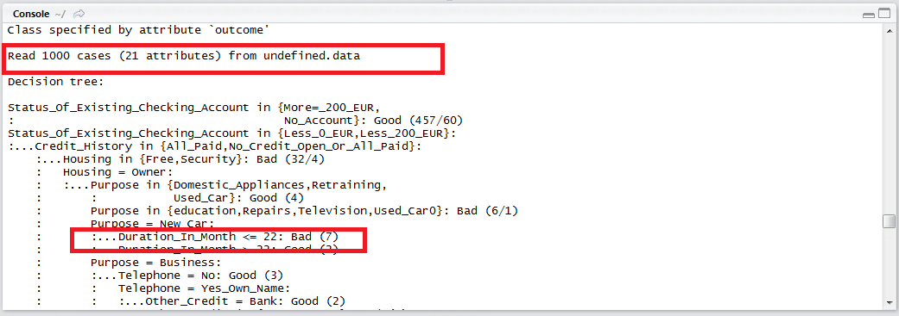

Scrolling down further, below the tree output, is the performance measures of the model overall:

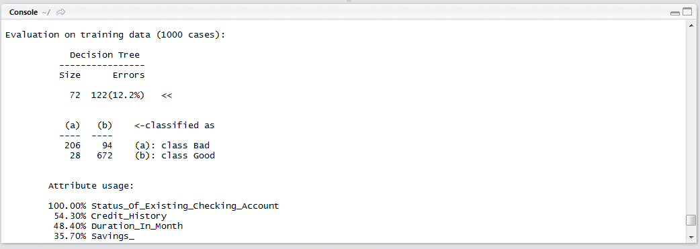

It can be seen in this example that the error rate has been assessed at 12.2%, suggesting that 87.8% of the time the model correctly classified.  A confusion matrix has been written out, however it is more convenient to use the CrossTable function for the purposes of understanding false positive ratios.