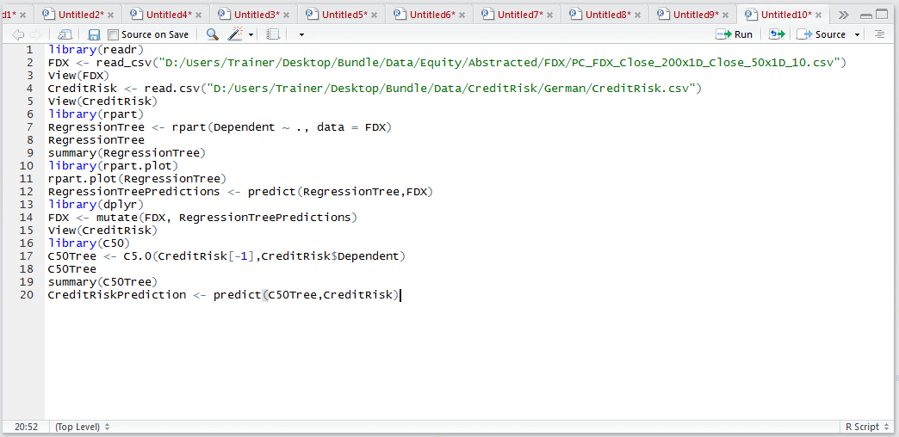
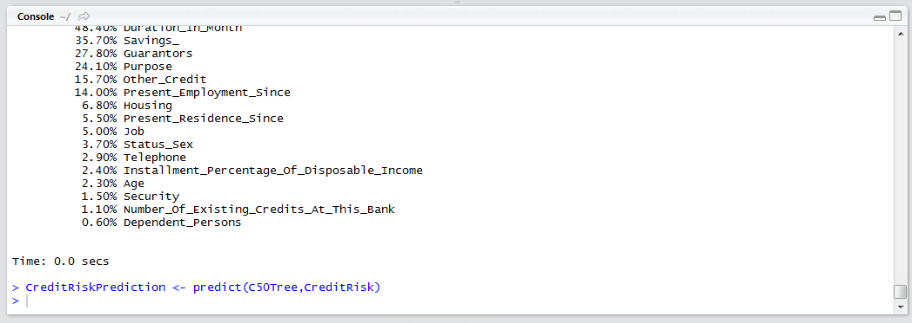
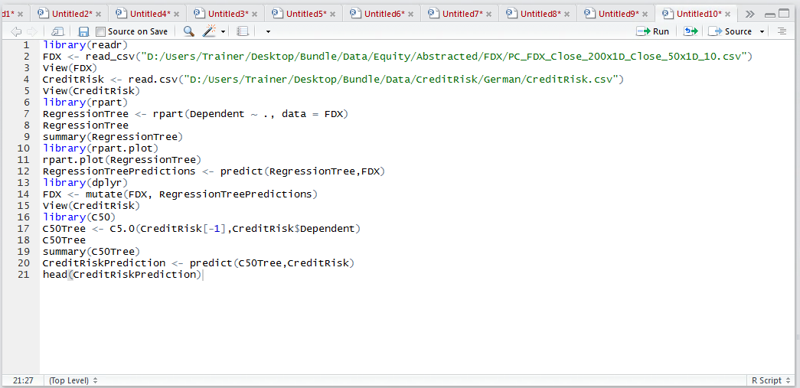
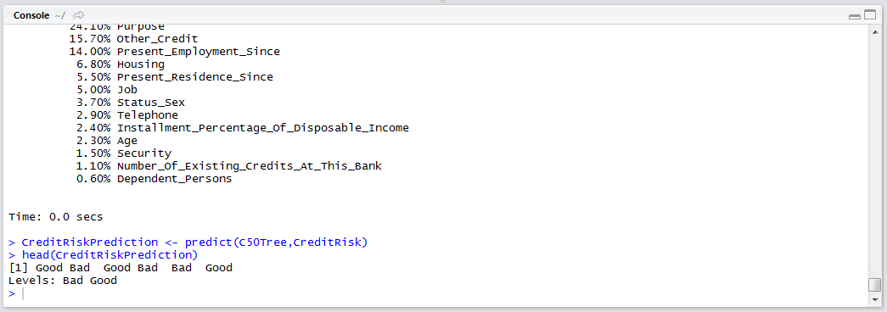

# Procedure 5: Recalling a C5 Decision Tree

As is the case of the majority of models in R, the predict function can take a model object and a data frame as its argument:

``` r
CreditRiskPrediction <- predict(C50Tree,CreditRisk)
```



Run the line of script to console:



For time being, do not add the vector to the data frame as revised decision tree will be created subsequent to this procedure and owing to the different signature used in training a C5 model, it would be interpreted as an independent variable in its own right.  Use the head() function to take a peek at the classification results:

``` r
head(CreditRiskPrediction)
```



Run the line of script to console:



It can be observed that a factor has been created and there are several entries of textual classification result.