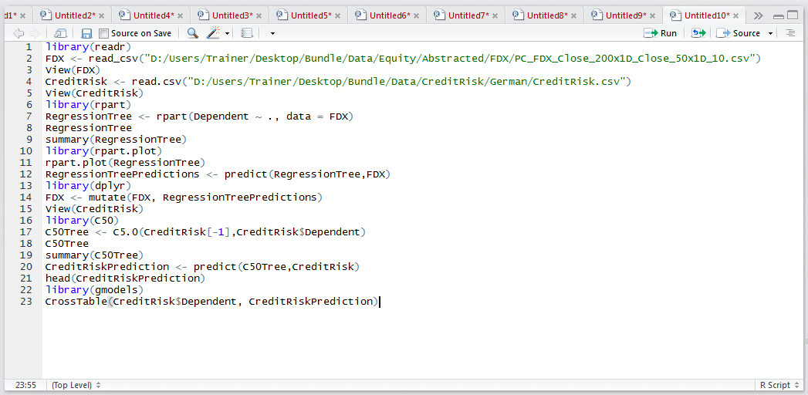
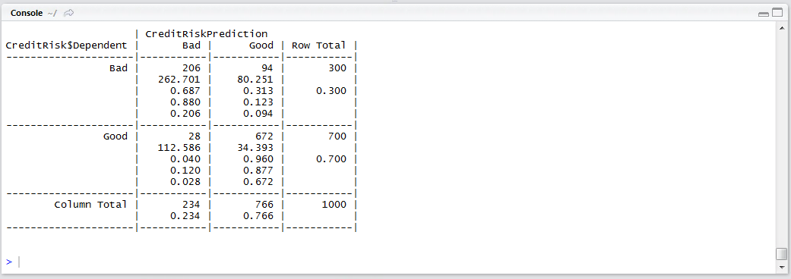

# Procedure 6: Creating a Confusion Matrix for a C5 Decision Tree

Beyond the summary statistic created, the confusion matrix is the most convenient means to appraise the utility of a classification model. The confusion matrix for the C5 decision tree model will be created in the same manner:

``` r
library("gmodels")
CrossTable(CreditRisk$Dependent, CreditRiskPrediction)
```



Run the line of script to console:



The overall utility of the C5 decision tree model can be inferred.

The confusion matrix classified 206 records as being bad correctly, taking CreditRiskPrediction column wise, it can be seen that 28 records were classified as Bad yet they were in fact Good.  It can be said that there is an 11.9% error rate on records classified as bad by the model.  Taking note of this metric, boosting will be attempted which should bring about improvement of this model.