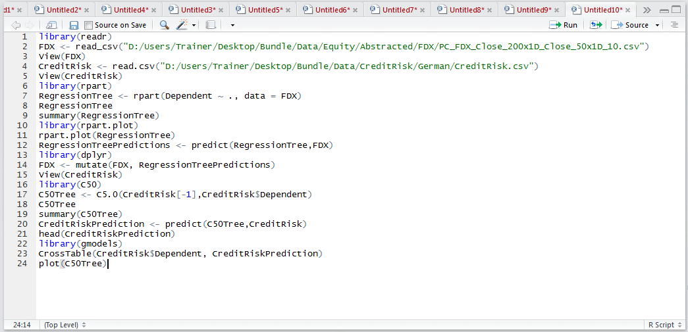
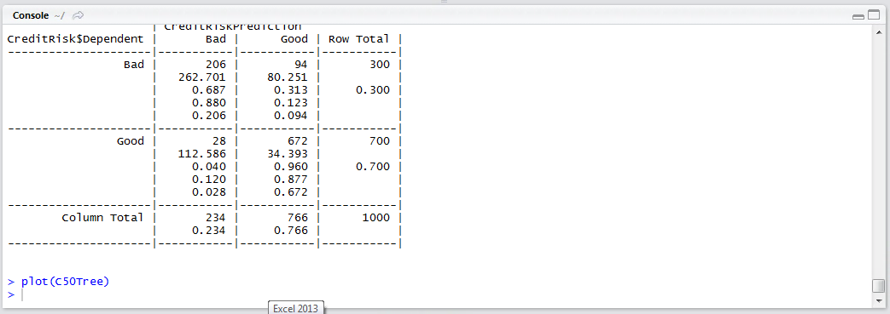
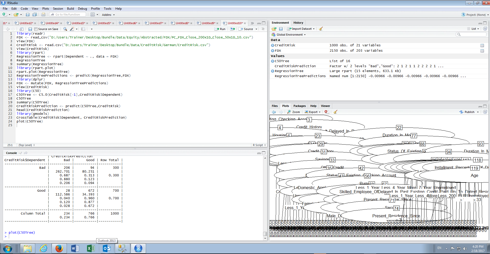

# Procedure 7: Visualising a C5 Decision Tree

To visualise a C5 Decision tree, the plot() function from the R base functions can be used, passing the C5 decision tree model as the argument:

``` r
plot(C50Tree)
```



Run the line of script to console:



It can be seen that a visualisation has been written out to the plots pane:



If the tree is very large, then the zoom feature will need to be used to ensure that the plot fits the screen.  Even with zoom, it is possibly more appropriate to communicate the product of C5 decision trees as a list of rules.