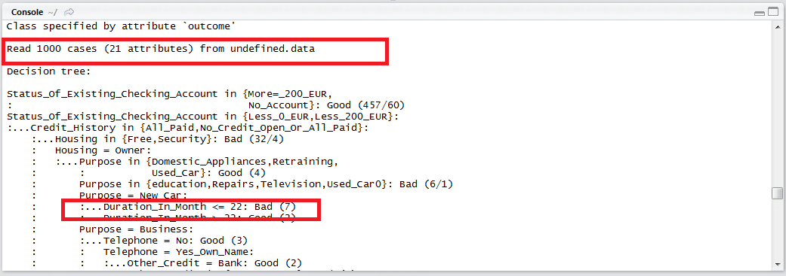
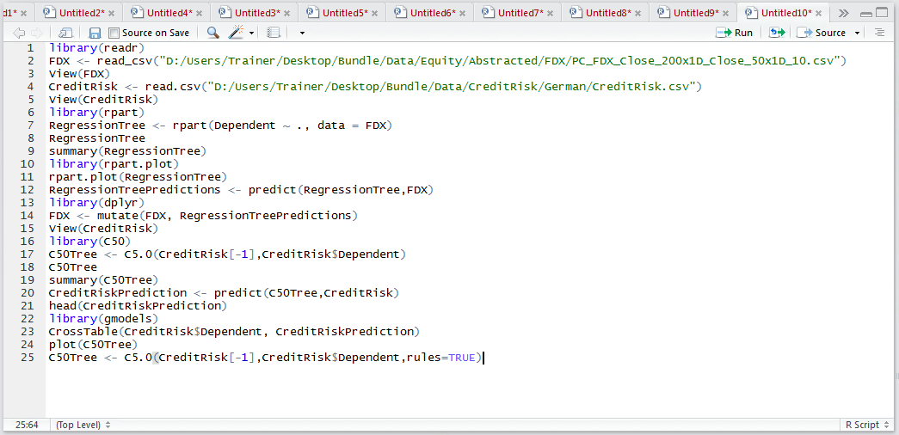
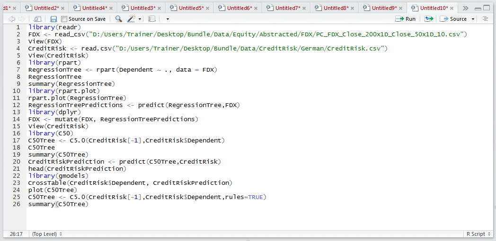
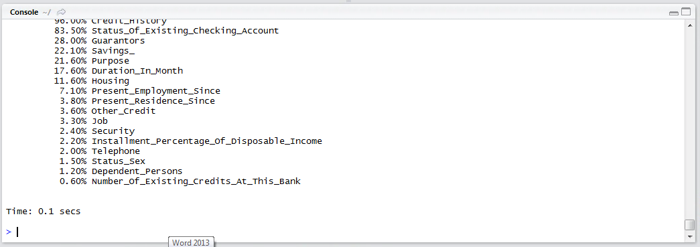
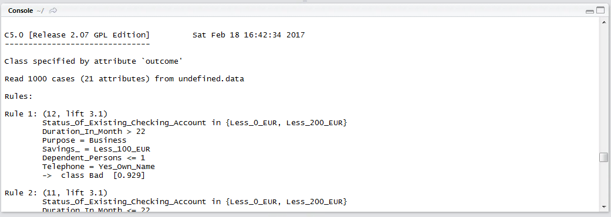

# Procedure 8: Expressing Business Rules from C5

In traversing the C5 decision tree it is almost certain that when coming to deploy the model, beyond using the predict() function as described,  that it will be expressed or programmed as logical statements,  for example:

If Status_Of_Existing_Checking_Account < 200 EUR
AND Credit_History in ("All_Paid","No_Credit_Open_Or_All_Paid")
AND Housing = "Owner"
AND Purpose = "New Car"
AND Duration_In_Month < 22 THEN "Good"



To display the model as rules rather than a tree, it is necessary to rebuild the model specifying rules argument to be true:

``` r
C50Tree <- C5.0(CreditRisk[-1],CreditRisk$Dependent,rules=TRUE)
```



Thereafter, the summary() function can be used to output a series of rules created in the rebuild as opposed to a decision tree:

``` r
summary(C50Tree)
```



Run the line of script to console:



Scrolling up in the console, it can be observed, towards the top, that in place of a decision tree a series of rules has been created:



These rules can be deployed with very small modification far more intuitively in a variety of languages, not least SQL.