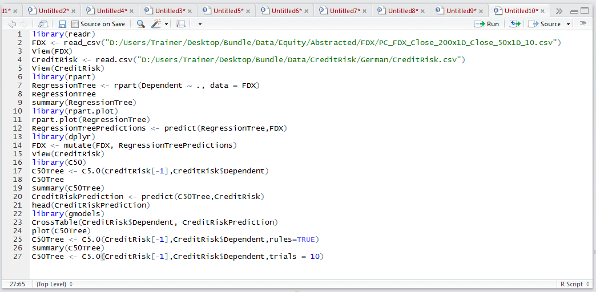
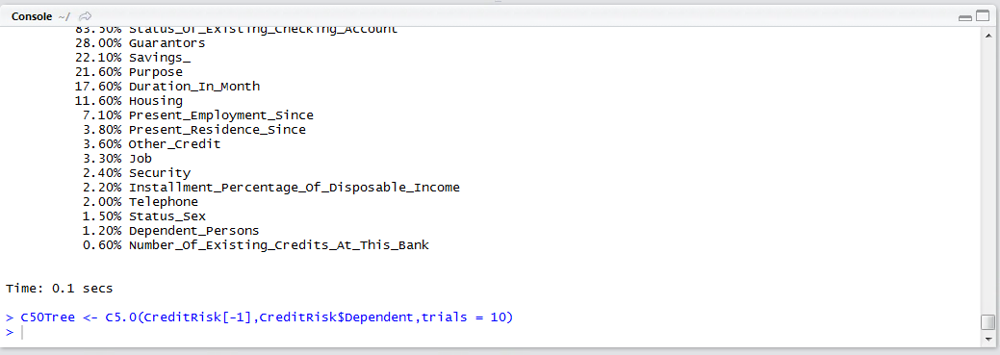
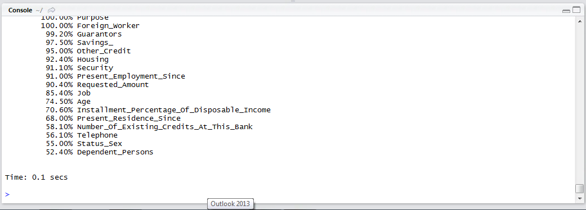
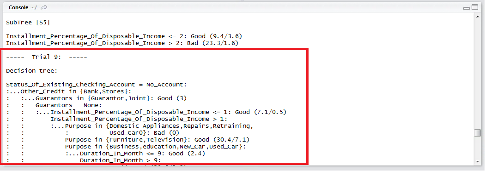
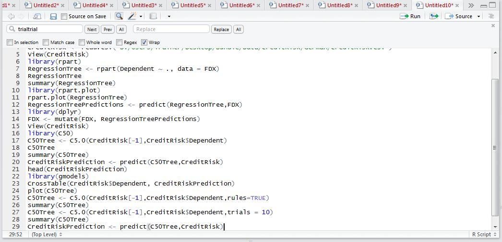
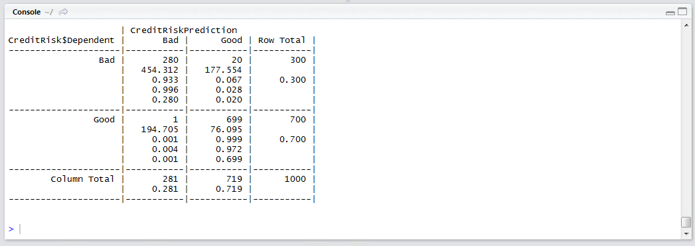

# Procedure 9: Boosting and Recalling in C5

Boosting is a mechanism inside the C5 package that will create many different models, then give opportunity for each model to vote a classification, with the most widely suggested classification being the prevailing classification.  The majority classification voted for wins.

Simply add the argument 10 to indicate that there should be ten trials to vote:

``` r
C50Tree <- C5.0(CreditRisk[-1],CreditRisk$Dependent,trials = 10)
```



Run the line of script to console:



The summary function will produce a report in a similar manner:

``` r
summary(C50Tree)
```



In this instance, however, upon scrolling up, it can be seen that several different models \ trials have been created:



In the above example the decision tree for the 9th trial has been evidenced.  Prediction takes place in exactly the same manner, using the predict() function,  except for it will run several models and established a voted majority classification.  This is boosting:

``` r
CreditRiskPrediction <- predict(C50Tree,CreditRisk)
```



Run the line of script to console:



In this example, it can be observed that there were 281 accounts where predicted to be bad, taking the CreditRiskPrediction column-wise, it can be observed there was a 1 account classification as bad in error.  Out of 281 classifications as bad, it can be said that the error rate is just 0.3%.  It can be seen that an 11% increase in performance has been achieved from boosting.