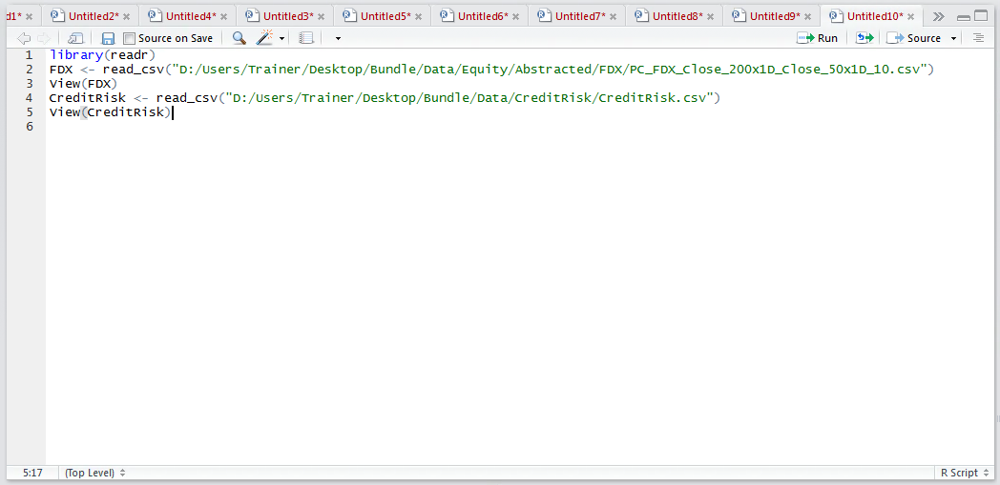
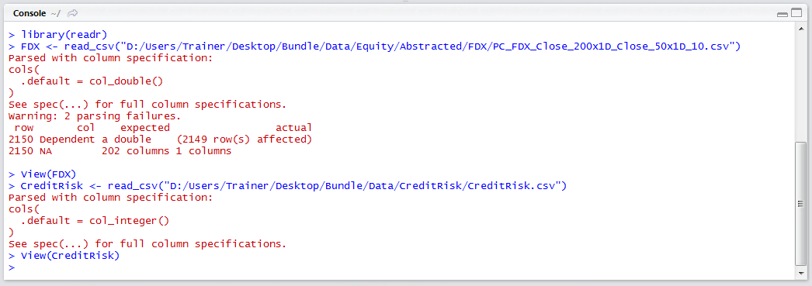
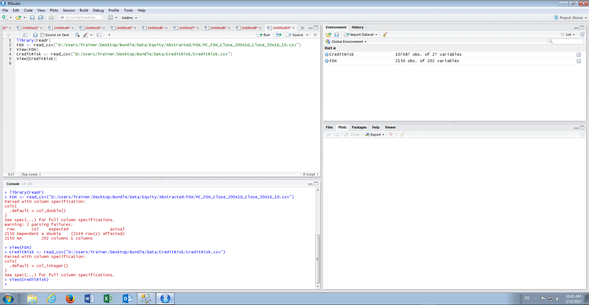

# Module 10: Splits, Probability and Decision Trees

Probability and product is a fairly radical departure from regression based techniques and form the foundation creating decision trees.  However, as a convenient stepping stone to splitting, there is a hybrid technique which uses the concept of splitting based on the standard deviation.  This module intends to introduce the concept of splitting data into homogenous groups, as best can be, with a view to creating decision trees on this data.

This module uses two different datasets.  For the purposes of creating regression trees Bundle\Data\Equity\Abstracted\FDX\PC_FDX_Close_200x1D_Close_50x1D_10.csv which contains data that has already been abstracted for the FedEx stock on the NYSE.  
For the purposes of creating C5 decision trees the dataset Bundle\Data\CreditRisk\CreditRisk.csv is used.

Start with a new script and import both datasets:

library(readr)
FDX <- read_csv("D:/Users/Trainer/Desktop/Bundle/Data/Equity/Abstracted/FDX/PC_FDX_Close_200x1D_Close_50x1D_10.csv")
View(FDX)
CreditRisk <- read.csv("D:/Users/Trainer/Desktop/Bundle/Data/CreditRisk/German/CreditRisk.csv")
View(CreditRisk) 

Run the block of script to console:

It can be seen that there are now two data frames available in the environment pane for use in the subsequent procedures:

Note however that in loading the CreditRisk data frame, the read.csv() function of base R has been used and NOT the read_csv() function of the library readr.  The functions of readr are many times faster and more efficient than that of the base R functions but will never convert character strings to factors, instead presenting them as character vectors.

As the CreditRisk data frame is going to be used exclusively for classification, it is very useful that any character strings are inferred as factors and will save a large amount of time in pre-processing.  It follows as a rule of thumb, use the read_csv() almost universally,  unless the intention is to convert character strings to factors in which case use read.csv() function.