# Procedure 1: Converting Continuous Data to Categorical Data

Start by loading the CreditRisk dataset using the base read.csv() function,  to assure that strings are converted to factors.

``` r
CreditRisk <- read.csv("D:/Users/Trainer/Desktop/Bundle/Data/CreditRisk/German/CreditRisk.csv")
View(CreditRisk)
```

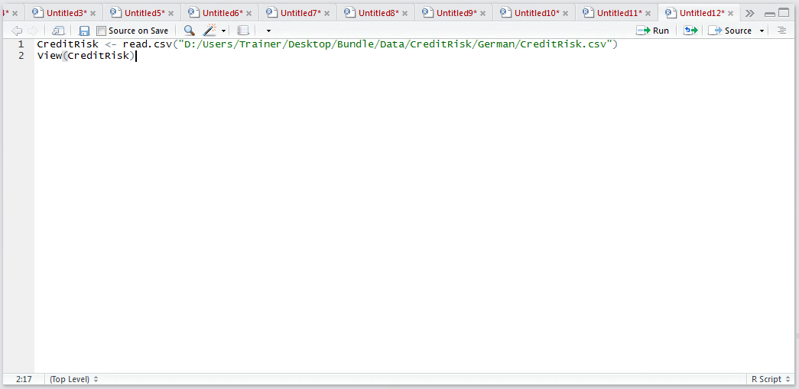

Run the block of script to console:

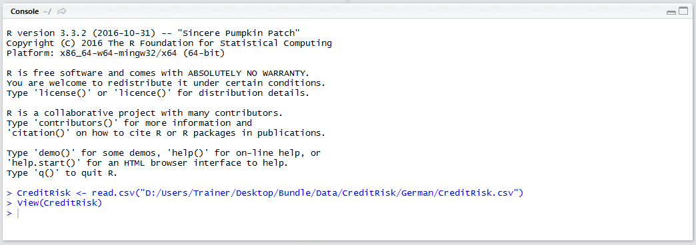

The View() function will load the dataset in the R Studio Viewer:

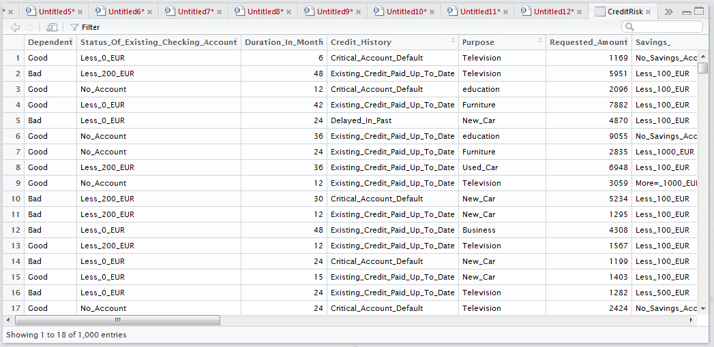

There are several vectors that are not appropriate for Bayesian analysis as they are continuous:

* Requested_Amount.
* Installment_Percentage_Of_Disposable_Income.
* Present_Residency_Since.
* Age.
* Number_Of_Existing_Credits_At_This_Bank.
* Dependent_Persons.

There are a variety of ways to convert the continuous values to categorical data, yet in this example we will focus on binning on a single vector, Age.  In this example, the Age will be broken into commonly used Age brackets:

* 18-24 Years old.
* 25-34 Years old.
* 35-44 Years old.
* 45-54 Years old.
* 55-64 Years old.
* 65-74 Years old.
* 75 Years or older.

It would be possible to use a series of logical statements to make the slice, or cut, between the values in this continuous series of data, but it would be quite cumbersome.  Fortunately there is a function that can simplify this for us, the cut() function.  The cut function takes a vector of data, and a vector of points to make the cut, returning a string denoting the range.  To make the cut based on the ranges described:

``` r
Age <- cut(CreditRisk$cut,c(18,24,34,44,54,64,74,999))
```

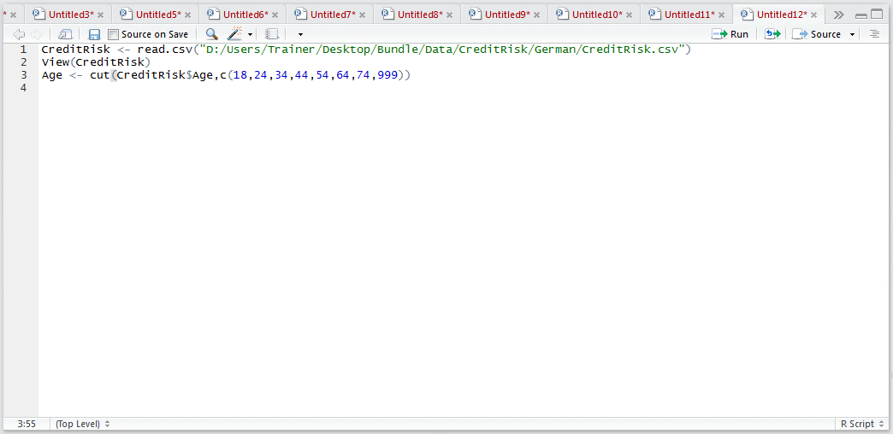

Run the line of script to console:

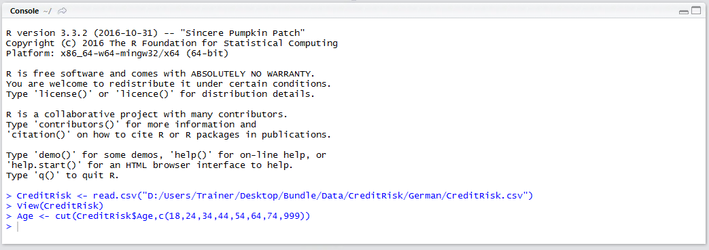

The head() command can used on Age to confirm that it is indeed a factor and that the levels have been apportioned:

``` r
head(Age)
```

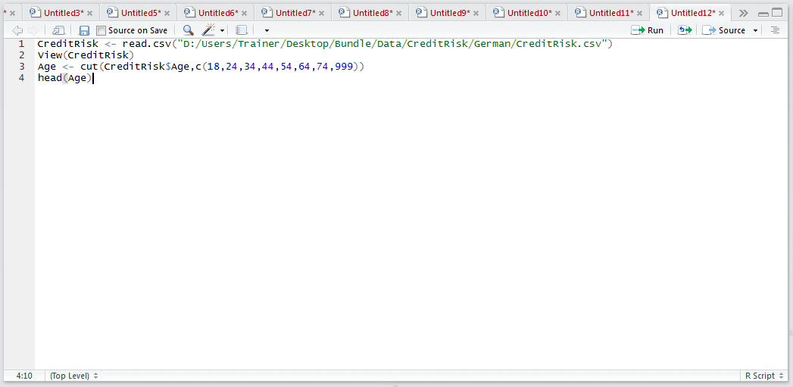

Run the line of script to console:

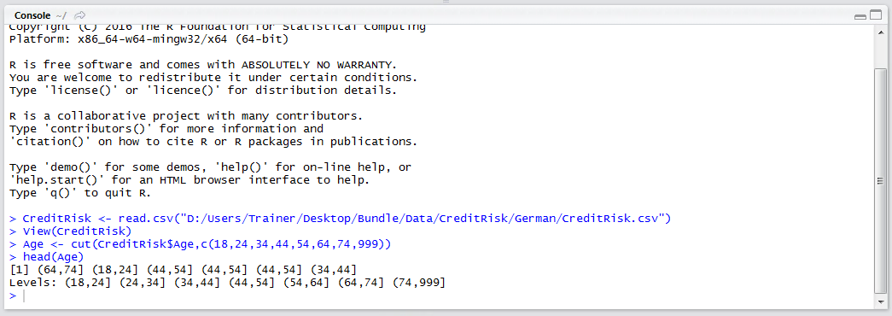

Having created a factor for Age, it is necessary to overwrite the vector in the CreditRisk Data Frame.  This is a simple procedure of targeting the Age vector in the data frame as the target of assignment for the Age factor:

``` r
CreditRisk$Age <- Age
```

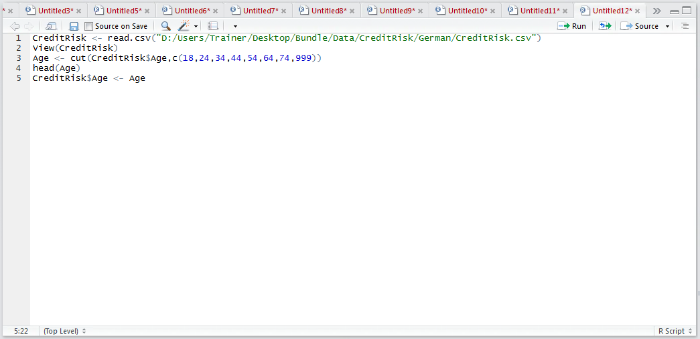

Run the line of script to console:

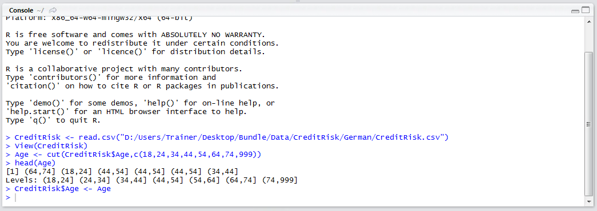

Check that the assignment has indeed transformed the CreditRisk$Age to a factor peeking the head() function:

``` r
head(CreditRisk$Age)
```

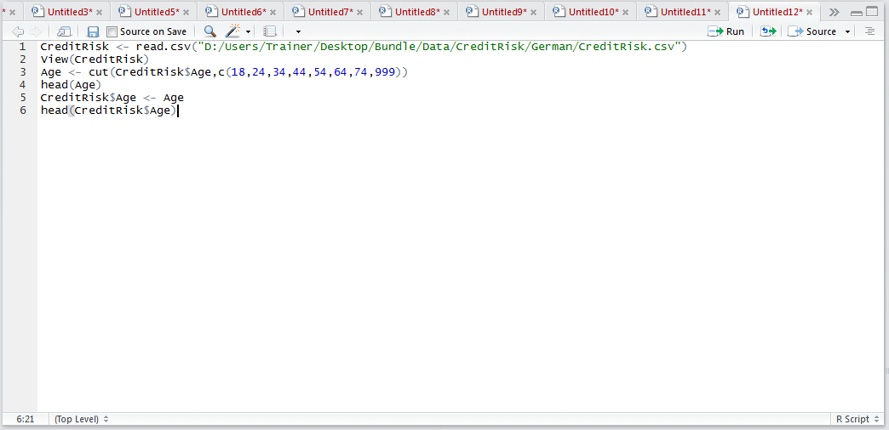

Run the line of script to console:

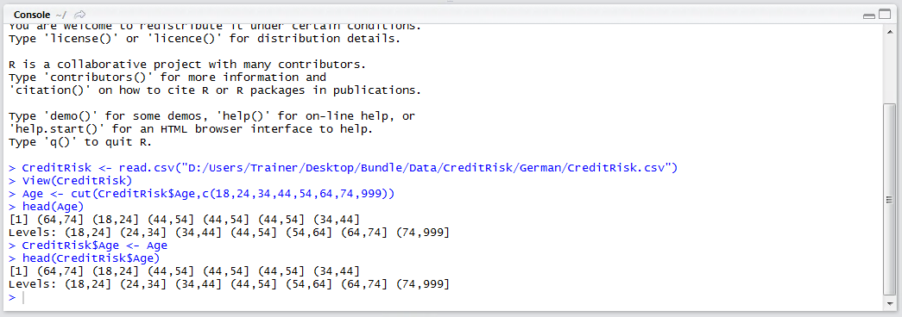

It can be seen that the continuous variable has been transformed.

Repeat for the remaining continuous variables, perhaps using the hist() function as described to identify appropriate thresholds, as the following example:

``` r
#Bin
Requested_Amount <- cut(CreditRisk$Requested_Amount,c(0,5000,10000,15000,20000))
Installment_Percentage_Of_Disposable_Income <- cut(CreditRisk$Installment_Percentage_Of_Disposable_Income,c(0,1,2,3,4,5,6,7,8,9,10,999))
Present_Residence_Since <- cut(CreditRisk$Present_Residence_Since,c(0,1,2,3,4,5,6,7,8,9,10,999))
Number_Of_Existing_Credits_At_This_Bank <- cut(CreditRisk$Number_Of_Existing_Credits_At_This_Bank,c(0,1,2,3,4,5,999))
Dependent_Persons <- cut(CreditRisk$Dependent_Persons,c(0,2,3,4,5,999))
Duration_In_Month <- cut(CreditRisk$Duration_In_Month,c(0,20,40,60,999))
#Allocate
CreditRisk$Requested_Amount <- Requested_Amount
CreditRisk$Installment_Percentage_Of_Disposable_Income <- Installment_Percentage_Of_Disposable_Income
CreditRisk$Present_Residence_Since <- Present_Residence_Since
CreditRisk$Number_Of_Existing_Credits_At_This_Bank <- Number_Of_Existing_Credits_At_This_Bank
CreditRisk$Dependent_Persons <- Dependent_Persons
CreditRisk$Duration_In_Month <- Duration_In_Month
```

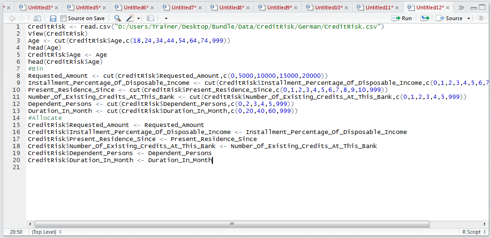

Run the block of script to console:

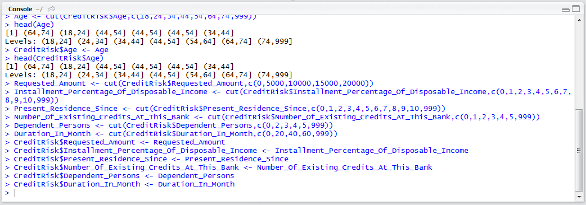

It can be seen that from the data view pane in R studio, that for this data frame all components are now factors and so therefore appropriate for Bayesian Analysis:

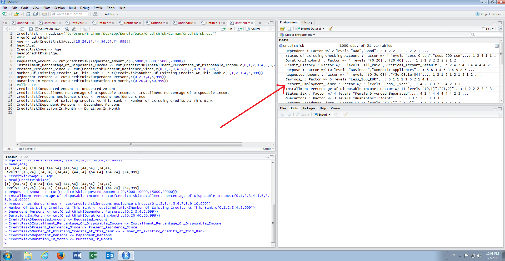