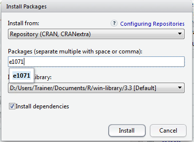
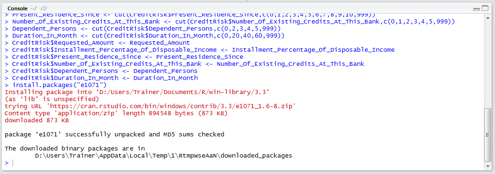
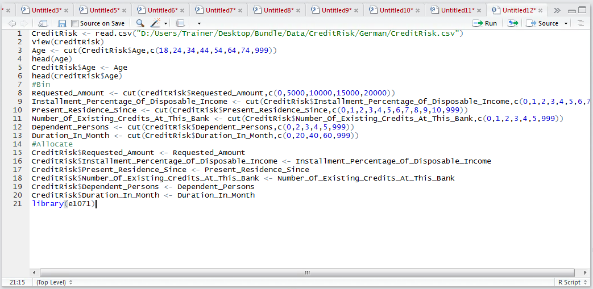
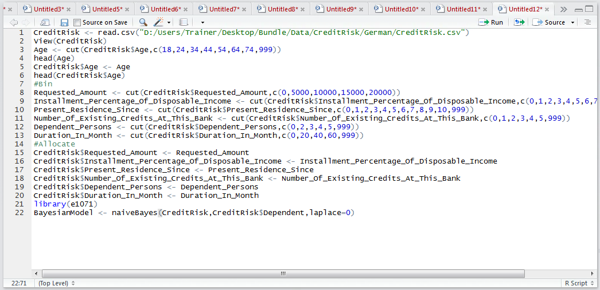

# Procedure 2: Training a Naive Bayesian Classifier

As a Naive Bayesian classifier is rather simple in its concept, all independent variables being treated and arcs flowing away from the dependent variable, it is to be expected that the process of training such a classifier is indeed trivial.  To train a Bayesian model, simply pass the data frame, specify the factor that is to be treated as the dependent variable and the Laplace estimator (zero in this example).  The naiveBayes() function exists as part of the e1071 package,  a such begin by installing the package via RStudio:



Click install to download and install this package:



Reference the library:

``` r
library(e1071)
```



Run the line of script to console. To train a Naive Bayesian model:

``` r
BayesianModel <- naiveBayes(CreditRisk,CreditRisk$Dependent,laplace=0)
```



Run the line of script to console. The BayesModel object now contains a model that can be used to make P predictions as well as classifications.