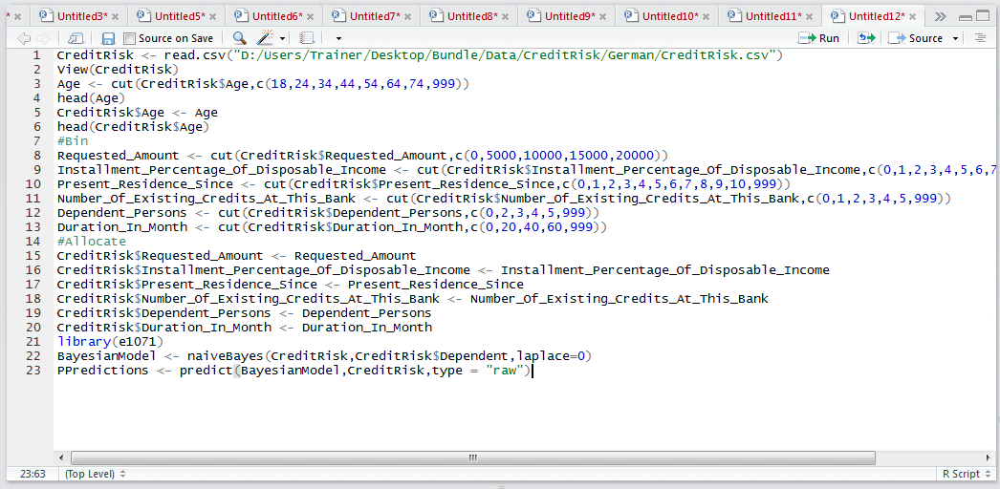
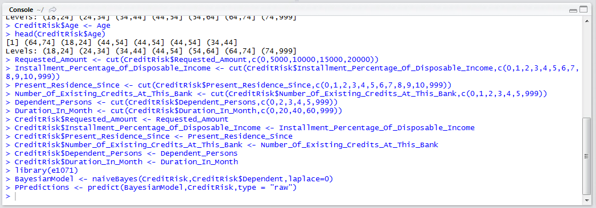
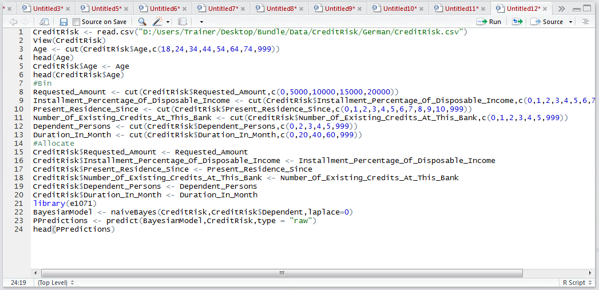
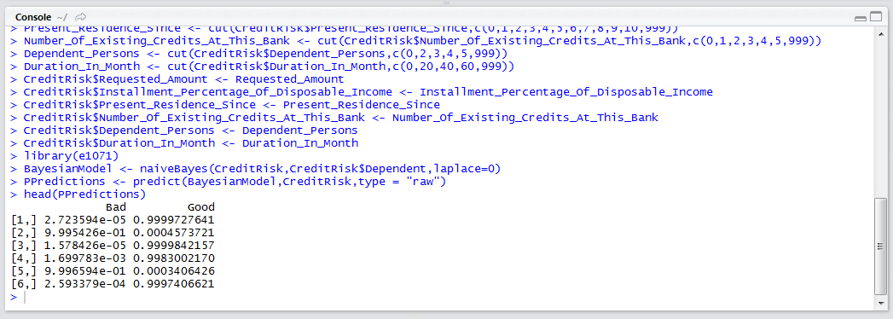

# Procedure 3: Recalling a Naive Bayesian Classifier for P

One of the benefits of using a Bayesian classifier is that it can return initiative probabilities which, ideally, should be fairly well calibrated to the actual environment.  For example, suppose that a 30% P of rain is produced by a weather station for 100 days, if it were to rain on 30 of those days, that would be considered to be a well calibrated model.  It follows that quite often it is not just the classification that is of interest, but the probability of a classification being accurate.

The familiar predict() function is available for use with the BayesModel object, the data frame to use in the recall and specifying a type to equal Raw,  instructing the function to return P and not the most likely classification:

``` r
PPredictions <- predict(BayesianModel,CreditRisk,type = "raw")
```



Run the line of script to console:



A peek of the data in the PPredictions output can be obtained via the head() function:

``` r
head(PPredictions)
```



Run the line of script to console:



Horizontally the P will sum to one, and evidences clearly the most dominant class. Anecdotally, the calibration of P in naive Bayesian models can be somewhat disappointing, while the overarching classification and be surprisingly accurate.