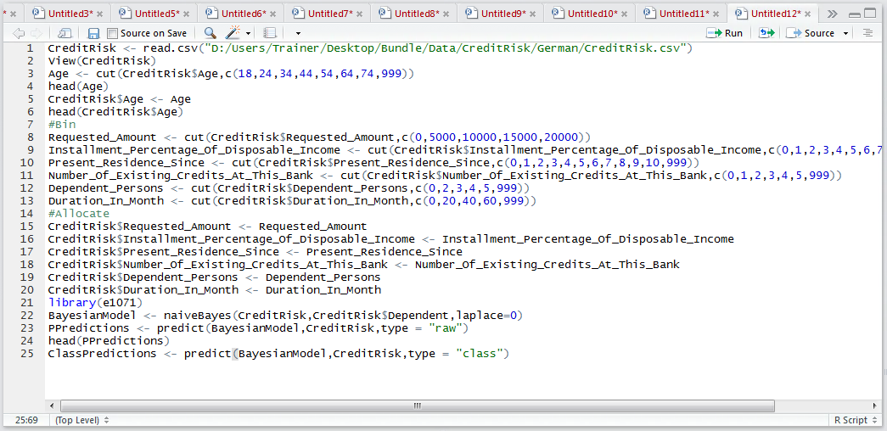
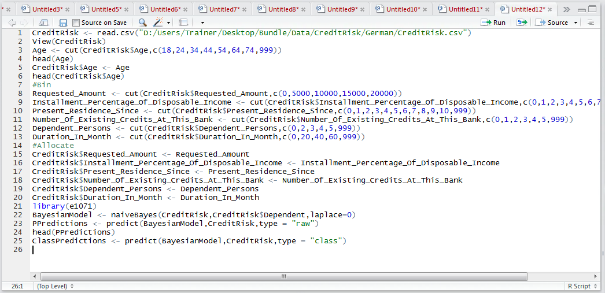
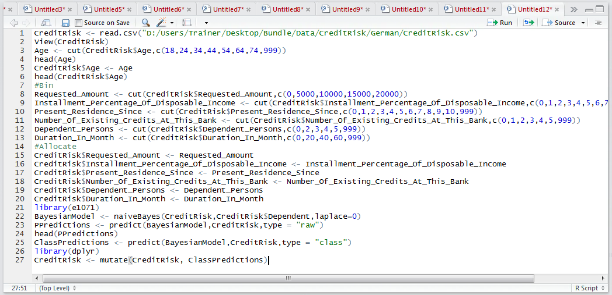
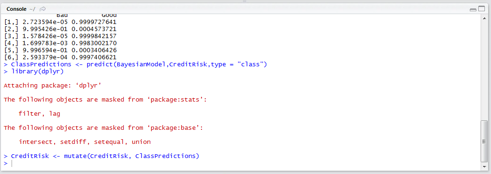
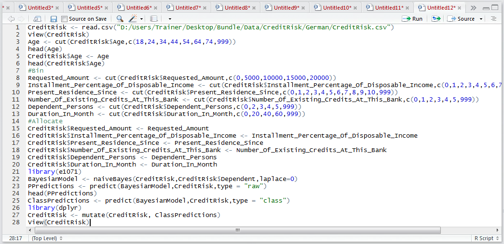
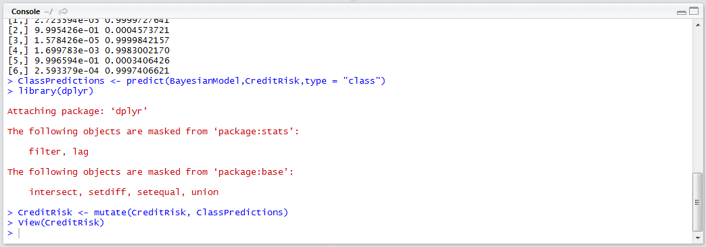
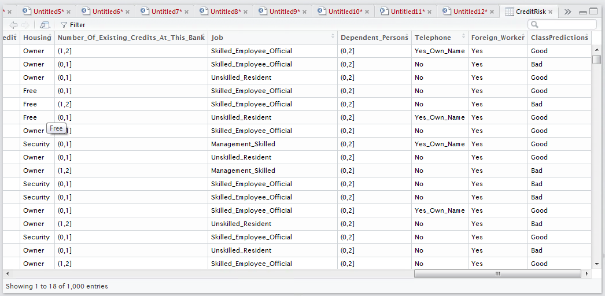

# Procedure 4: Recalling a Naive Bayesian Classifier for Classification

To recall the pivotal classification, rather than recall P for each class and drive it from the larger of the values, the type class can be specified:

``` r
ClassPredictions <- predict(BayesianModel,CreditRisk,type = "class")
```



Run the line of script to console:



Merge the classification predictions into the CreditRisk data frame, specifying the dply library also:

``` r
library(dplyr)
CreditRisk <- mutate(CreditRisk, ClassPredictions)
```



Run the line of script to console:



Viewing the CreditRisk data frame:

View(CreditRisk)



Run the line of script to console:



Scroll to the last column in the RStudio viewer to reveal the classification for each record:

