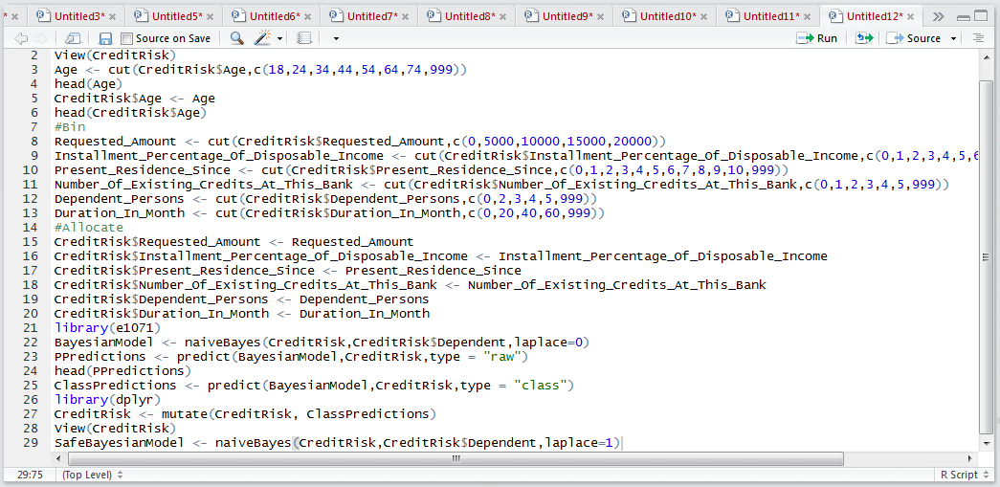
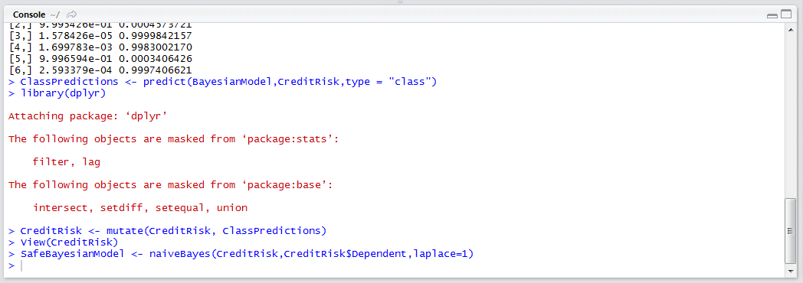
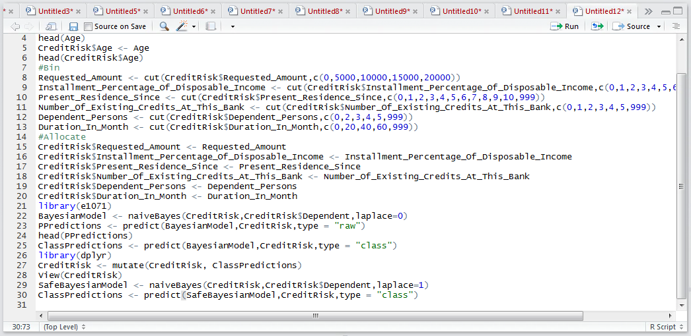
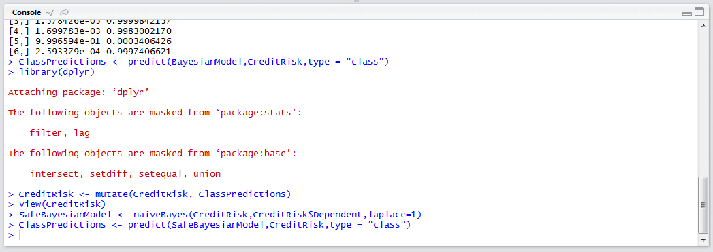
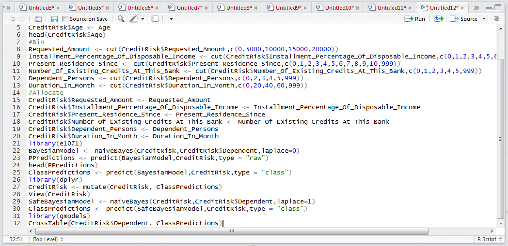
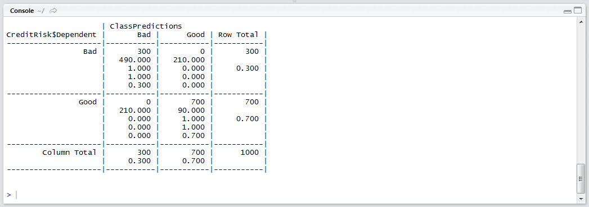

# Procedure 5: Create a Naive Bayesian Network with a Laplace Estimator

To create a Bayesian model with a nominal Laplace estimator of 1, which will mean that in the event that there is nothing it is switch to at least one occurrence in the observation, simply change the parameter value in the training:

SafeBayesianModel <- naiveBayes(CreditRisk,CreditRisk$Dependent,laplace=1)



Run the line of script to console:



A Bayesian model has been created as SafeBayesianModel.  Recall the model:

``` r
ClassPredictions <- predict(SafeBayesianModel,CreditRisk,type = "class")
```



Run the line of script to console:



The de-facto method to appraise the performance of the model would be to create a confusion matrix:

``` r
library(gmodels)
CrossTable(CreditRisk$Dependent, ClassPredictions)
```



Run the block of script to console:



It can be seen that this naive Bayesian model appears to be startlingly accurate, which stands to reason as the same data is being used to test as was trained.  It follows that this would benefit from an element of cross validation: