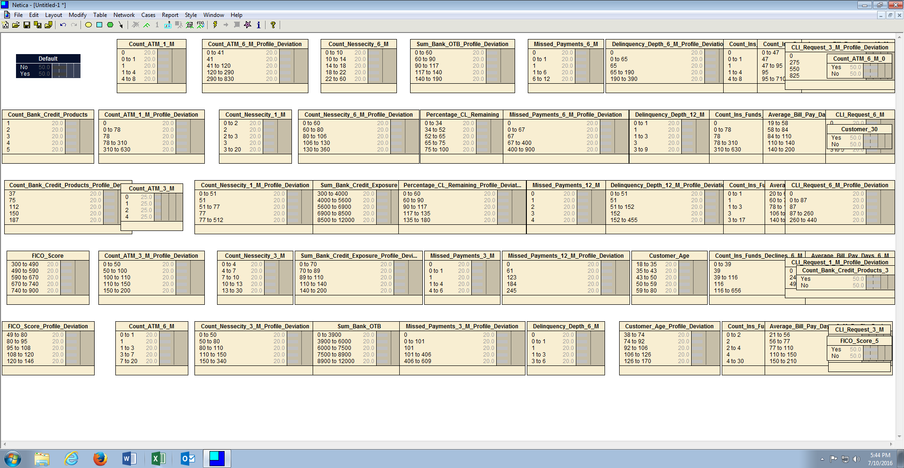
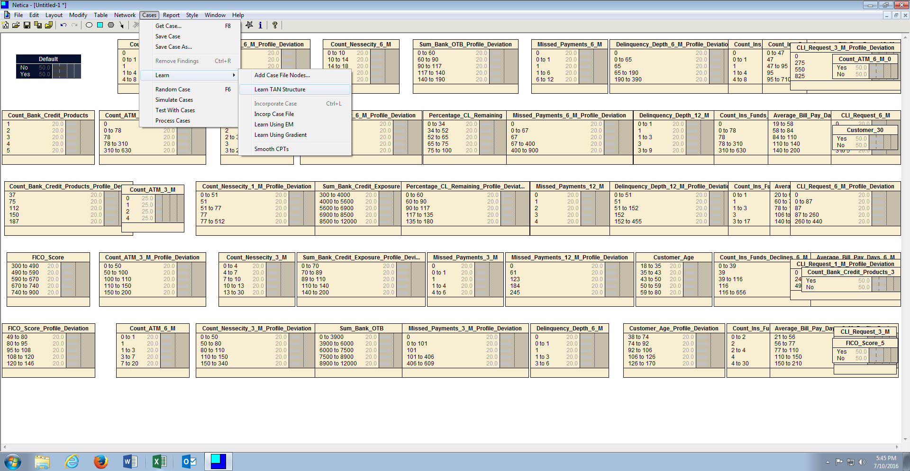
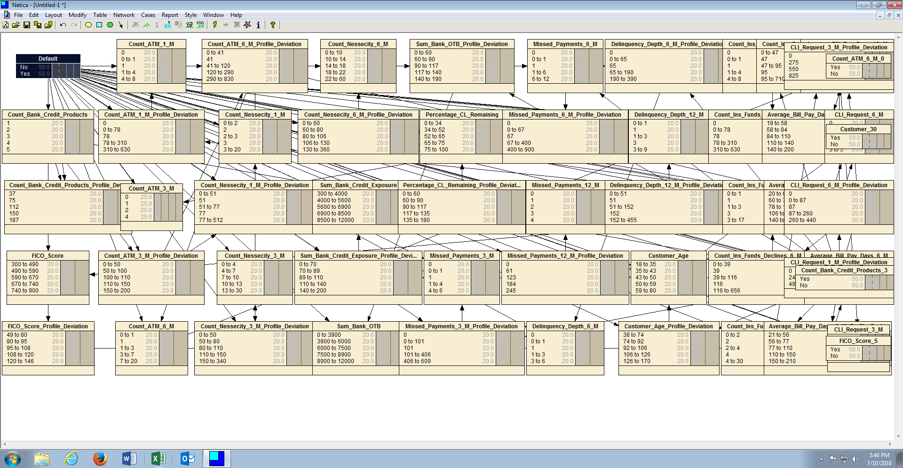

# Procedure 10: Learn TAN Structure to Link Nodes Automatically

When dealing with an overwhelming number of nodes it is possible to automatically link these nodes, based firstly on a naive structure, then augmenting this structure to look for relationships between the nodes that may be of interest.  This approach is called Tree Augmented Naive Bayesian Networks, or TAN Bayesian Networks.

For Netica to learn the structure, start by selecting the dependent variable node in the canvas, in this case Default:

To learn the structure using Tre Augmented Naive approaches, click on the Cases menu item, click or hover on Learn, then click Learn TAN Structure:

Select the file to be used for the purposes of training the structure, in this example CreditRisk.csv:

Clicking OK will begin the learning process:

Firstly, all nodes will be linked to / from the dependent variable, thereafter relationships to / from independent variables will be established.

The direction of the link is not that important as Bayesian Inference will be performed, however if links do not follow the direction of causation, maintaining node \ conditional probability table can become bewildering.  It follows that a learnt TAN structure would likely be used only where probabilities are going to be learnt also. It follows that updating the node probability tables, followed by determination of the classification accuracy of this network, so to determine if this extremely complex network provides any uplift on a simpler network.