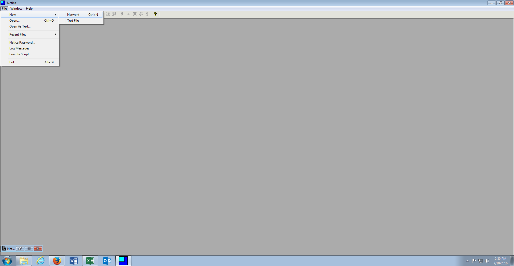
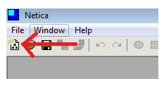
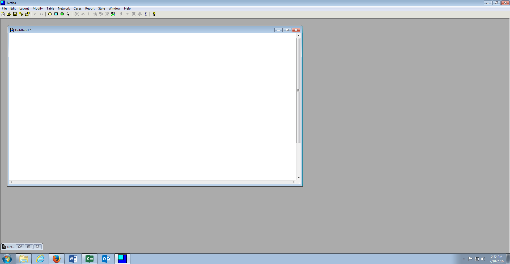
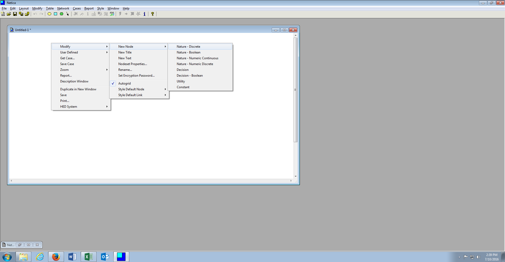
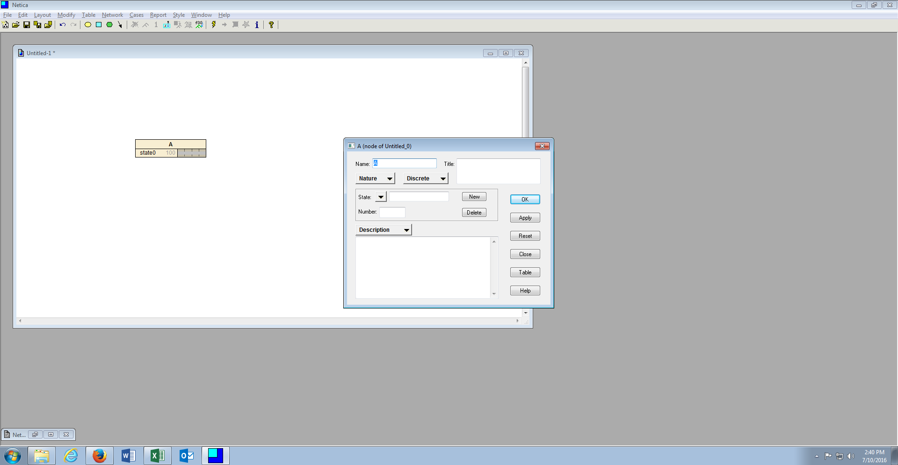
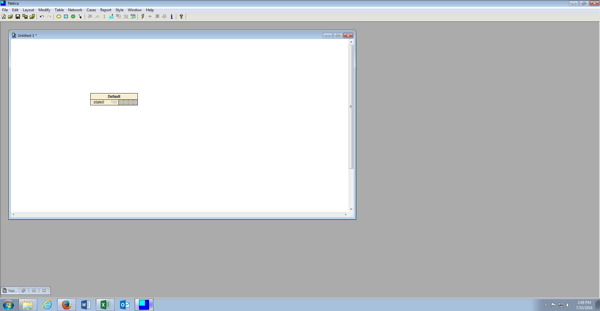
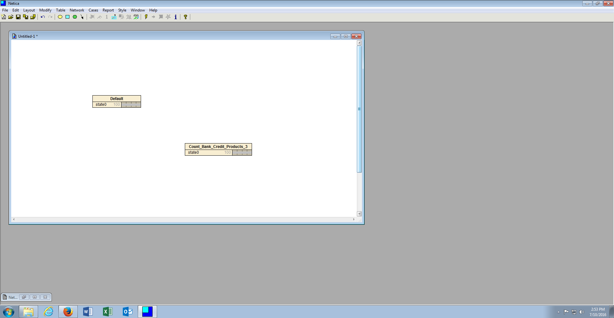

# Procedure 1: Create a New Canvas, add a Dependent Variable and an Independent Variable

Like Decision Trees, Netica is quite visual.  Independent and Dependent variables are stamped to a canvas and joined together in the direction of causation, creating a network.  The starting point for creating a Bayesian Network is to create a new canvas.

Creating a new canvas is achieved from the File menu, by clicking File….New….Network:

Creating a new canvas can also be achieved by clicking the icon as follows:

A new canvas will appear:

Variables, hitherto nodes, are stamped to the canvas with one node for each variable to be included in the model.  In this example there will be a single node representing the dependent variable and a single node representing the independent variable.

Right click on the canvas and expand the Modify Menu by right clicking, then clicking New Node, then clicking Nature Node Discrete:

A node will be stamped to the canvas in the location of the right click with the nodes properties box being shown by default:

Name the variable to EXACTLY the same as the dependent variable is named in the dataset, in this example Default, then click OK:

Repeat the process adding a second node to the canvas, this time naming the node as an independent variable with yes \ no states, in this example Count_Bank_Credit_Products_Greater_3:

Notice that there are now two nodes stamped to the canvas, one for the dependent variable and one for the independent variable.  Notice also that while each of these nodes has two possible values, referred to as states, the nodes only reflect one default state.