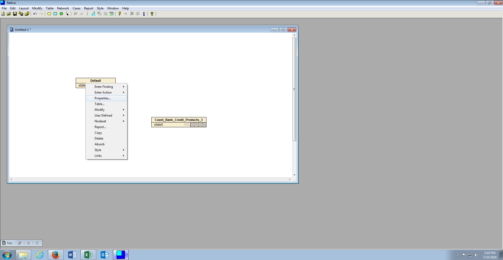
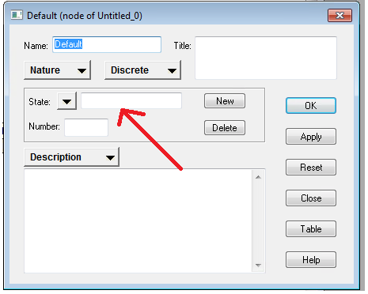
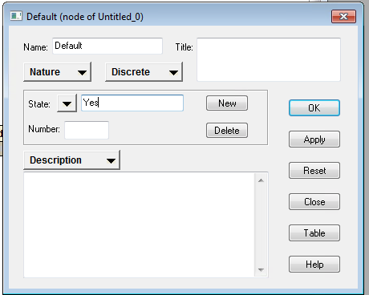
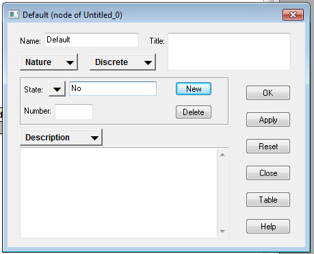
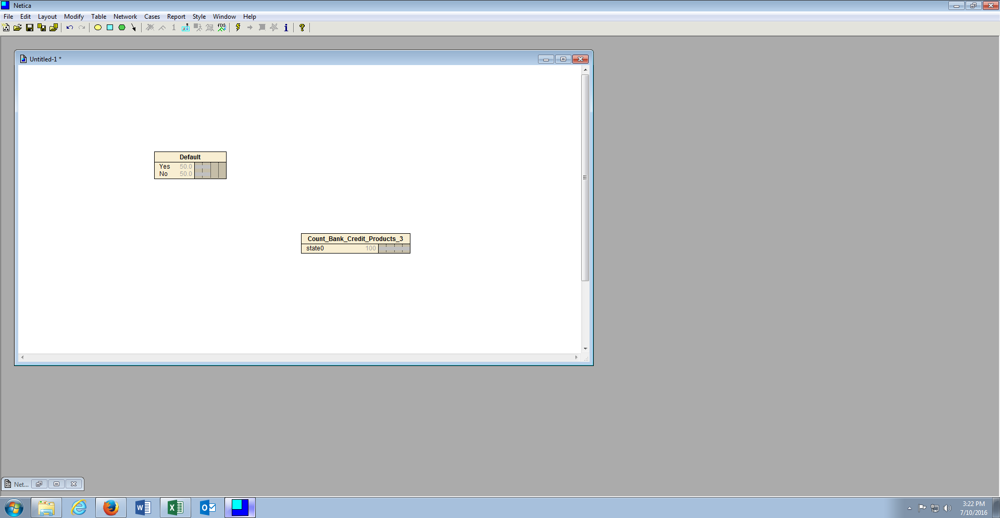
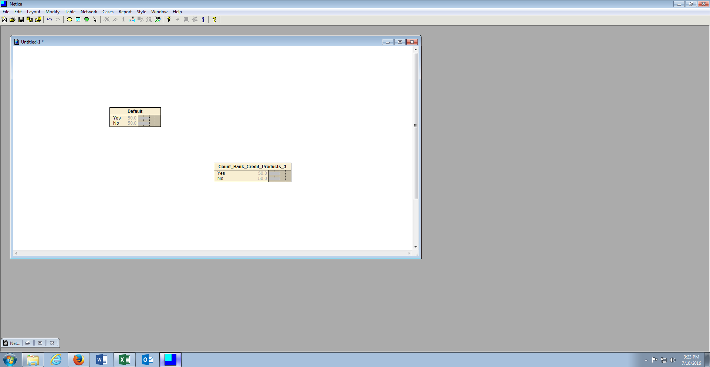

# Procedure 2: Set States attributed to the Dependent and Independent Variables

For both of the nodes stamped to the canvas, representing a single dependent variable or a single independent variable, there is the same states of Yes \ No (i.e. both nodes only have two possible, string based outcomes). It follows that each of the nodes needs to have the Yes \ No states set.

To set the states of a node, right click on the node and select properties, in this case right click on the Default node (the dependent variable):

The properties window will open which is the same windows used to name the node.  Focussing attention towards the centre of the window, there is an entry box titled State:

Type the name of the first state, which would be Yes:

Then click New to commit the Yes state, proceeding to create the No state:

Click OK to commit both states to the node, after which the Node will be updated to reflect both states with an even probability:

Repeat the process for each node on the canvas, for each possible state for that node:

