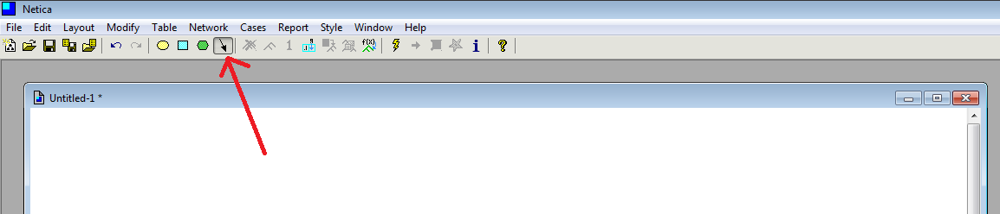
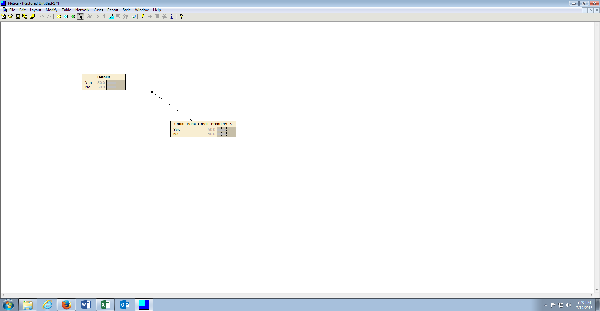
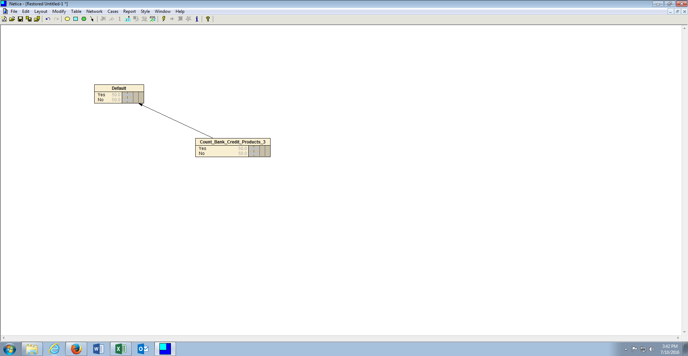

# Procedure 3: Link Variables as causes consequence

One method of creating Bayesian Networks is to judge an Independent Variable to cause a consequence to another, most likely dependent, variable.

To reflect that one variable can cause a consequence for another variable, in this example Count_Bank_Credit_Products_3 having consequence for Default, a link is drawn between the variables.  Links always flow in the direction of causation.

To add a link, click the link button on the icon menu:

After the link icon is toggled, click in the centre of the node that is causing a consequence, in this case Count_Bank_Credit_Products_3 then drag:

Drag the link to the centre of the node which suffers consequence, in this case Default, then drop to consummate the link:

Following the causes consequence paradigm makes the construction of node probability tables more intuitive (as the tables will be built at the consequence inferring all possible scenarios).  Repeat the links for every node that causes a default consequence on the canvas.

This approach constructs what is known as a naive Bayesian Network, in that all nodes evenly cause a single consequence in structure.