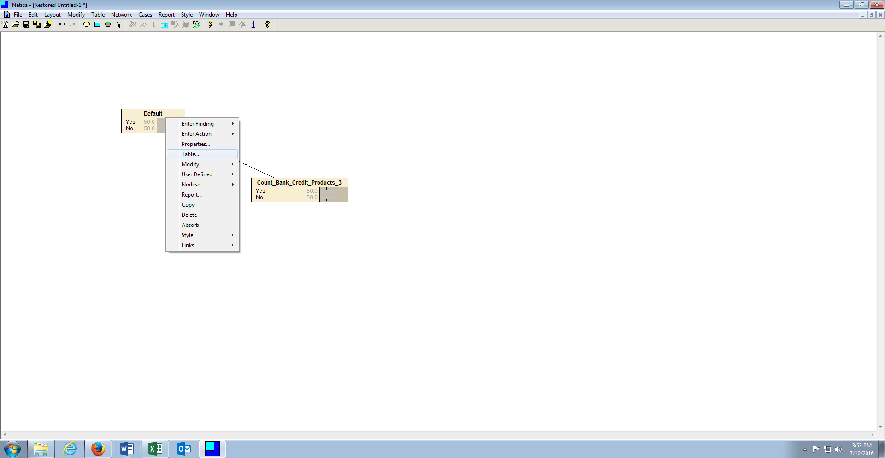
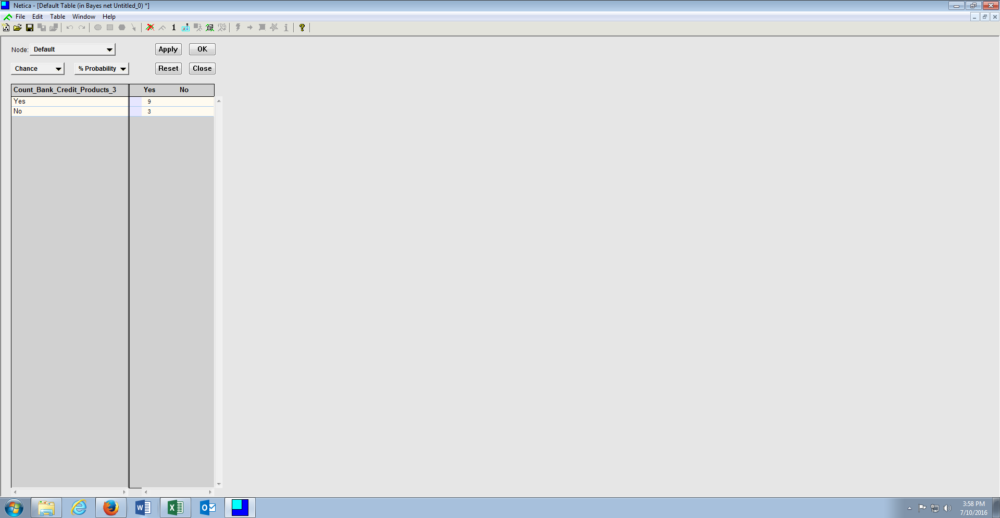
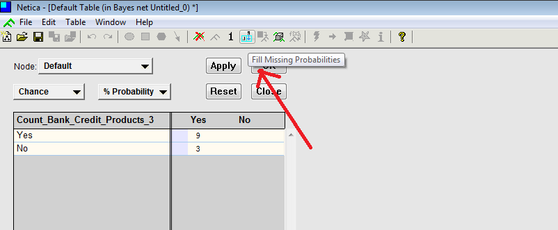
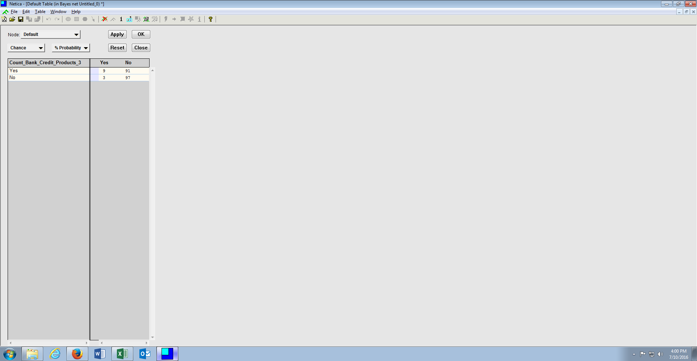
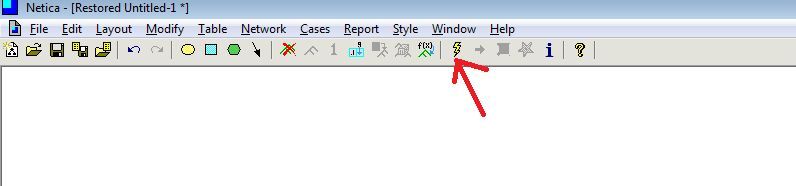
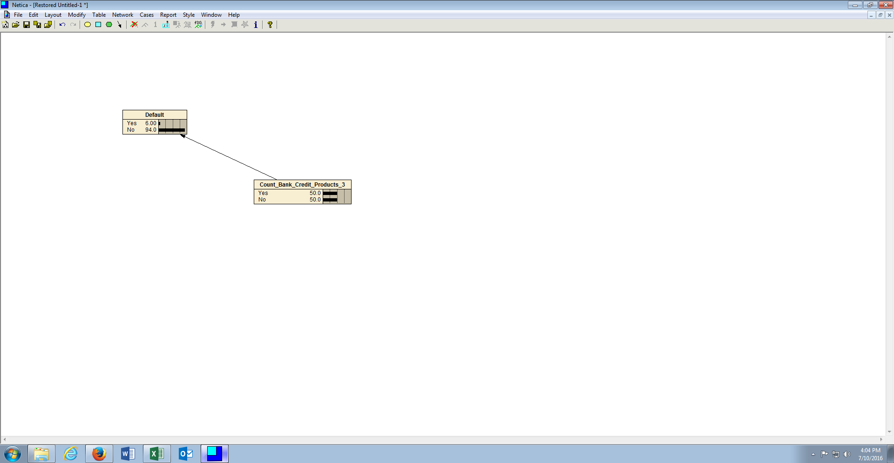

# Procedure 4: Enter subjective probabilities for each consequence

In creating a consequence, with many potential causes, and with the causes being state based (which in this example is Yes \ No), a finite set of scenarios that cause a consequence can now be inferred by Netica.

To view the finite scenarios that can cause a consequence, right click on the consequence node, in this case Default, the click Table (short for Node \ Conditional Probability Table):

The node probability infers every possible scenario in the Bayesian Network, calling for subjective probabilities to be included:

In this simple example, there are two scenarios which require subjective probabilities, however, with more nodes this GREATLY expands.  Subjective probability needs to be apportioned to each scenario, rather belief (hence Bayesian Belief Networks).

In this example apportion the following subjective probability:

* If Count Bank Card Products > 3 then P(Default) = 9%
* If NOT Count Bank Card Products > 3 then P(Default) = 3%

These probabilities would be updated in the corresponding table:

Clicking on the Fill Missing Probabilities Icon will complete the missing probabilities where possible, summing to 100%:

Click Apply, then Ok to close the window. The node probabilities have been set, however the network has not been compiled, and so the states retain the default probabilities:

To compile the network, click on the lightning bolt icon in the menu to compile the network and set the probabilities:

The Bayesian network has now been compiled and is ready to both predict Default and explain Default via Bayesian Inference.