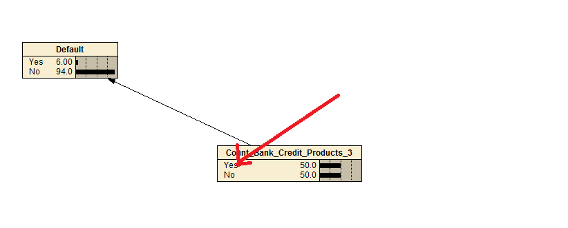
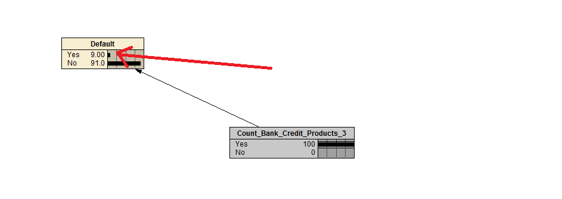
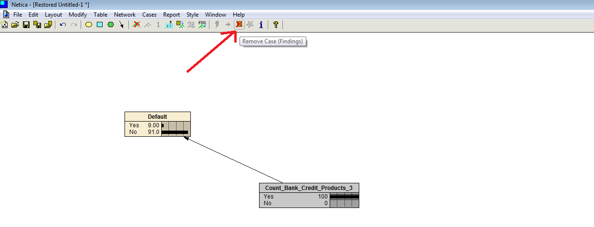
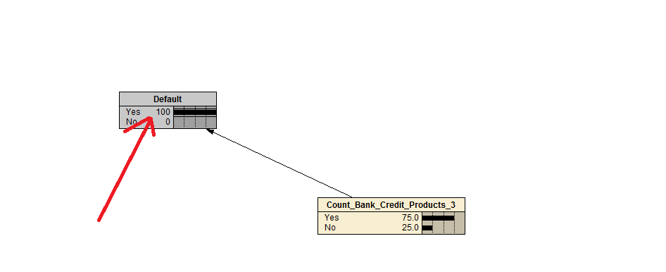

# Procedure 5: Manually setting node states to predict and explain

To make a prediction, which in is in reality a simple matter of recalling the states from the Node \ Conditional Probability tables that were manually entered, it is a simply matter of hovering over the node and state to set, then clicking to set that node:

In this example the prediction of whether an account will default is based on the customer having more than three credit products, rather Count_Bank_Credit_Products_3, Yes:

A lookup from the Node \ Conditional probability takes place, in effect, predicting the probability of default to be 9% based on this finding.  Forward wise this is an unremarkable prediction based entirely on belief, however Bayesian can perform inference for the purposes of providing explanatory value for the most probable environment surrounding a customer defaulting.  

Reset all case findings by clicking the Icon of the same name in the menu:

In this example, click on the Yes state of the Default Node, to update the causation nodes to using Bayesian inference, so to provide some explanatory value as to the environment that causes a customer to default:

In this example it can be observed that a customer is in all probability going to have more than three credit products, if they default.