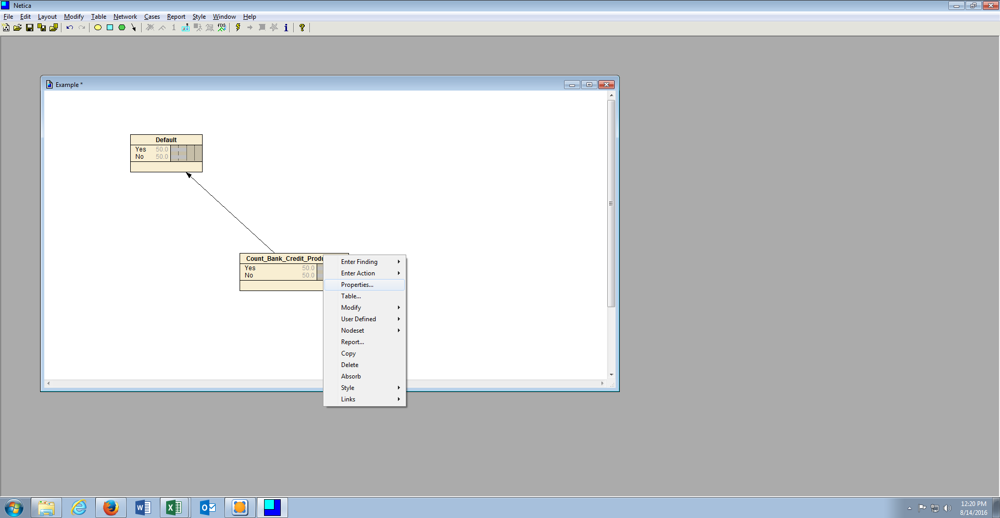

# Procedure 6: Netica Discretisation of Continuous Variable

Bayesian Methods should be considered as being incompatible with continuous variables as the premise of the analysis technique is that it apportions probability to states (akin to the sides of a dice).  Embracing the state only maxim of Bayesian Networks, presented with a continuous variable, the task is to convert that continuous variable into a state.  

In the procedures thus far there have been several methods presented to bin variables for the purposes of model improvement (reference procedure 12).  Netica provides a quick and convenient means to turn continuous variables into states, a process it refers to as discretisation.  

There are three useful automated forms of discretisation offered by Netica:

* Fixed Bin.
* Exponential Bin.
* Natural Logarithm.

The boundaries can be bound by -infinity or infinity if it is felt that the lower or upper bounds may change over time.

To enter the discretisation for a Node, right click on the node, then click properties:

It can be noted that the current node is set as Discrete, which means that States and their values are entered manually:

Click on the button Discrete which will present the opportunity to change the node to be Continuous:

Upon changing the node type to Continuous, click on the Description button which will expose a sub menu, then select Discretisation:

On clicking the Discretisation button, the large textbox will now accept (rather process) the shorthand notation that will divide a continuous variable into states:

Clearing out any existing values, shorthand will be used to specify the lower boundary, the upper boundary and the number of bins between these boundaries, in this example 0 is the lower boundary, 100 is the upper boundary and there are to be 5 bins:

[0,100] / 5

Upon clicking OK the node will be updated with these states.  If prompted to remove existing states, click OK:

This example uses a Fixed Bin shorthand.  There are three types of shorthand available, where the values in highlight are the parameters:

* Fixed Bin (as example): [Begin,End] / Bin
* Exponential Bin: [Begin, End] +%Bigger
* Natural Logarithm: [Begin, End] / L Bin

If the production values of the upper and lower bound are not known at design time, then -infinity or infinity can be used as lower and upper bound respectively.  The use of infinity will bring about runtime resizing of the bounds.