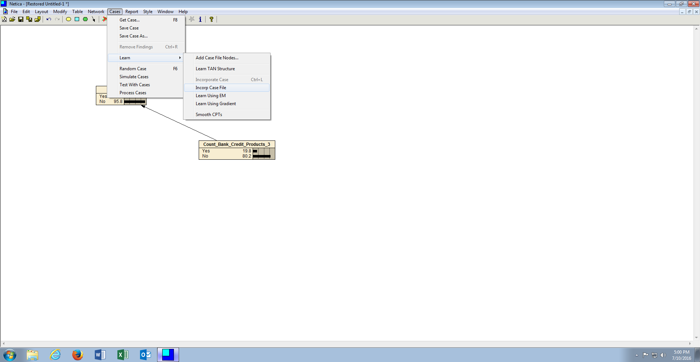
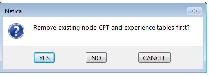
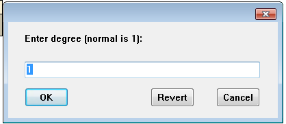
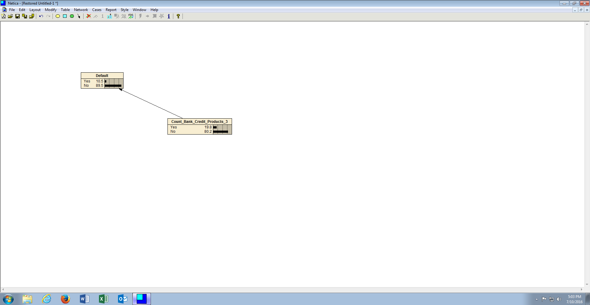

# Procedure 7: Learn node probabilities

Up to this point the procedures have created a naive Bayesian network based on belief, belief being an encapsulation of subjective probability in Node \ Conditional probability tables.

Subjective probability is extremely good when derived in a group and can allow for the creation of predictive analytics models where there is no data available (another tool for such scenarios is conjoined Regression \ ANN).  In the event that data is available, it is far better to train the structure with real probabilities based upon the contents of a data file.

The procedure to train a Bayesian network is quite simple. Start by resetting all findings, as specified in procedure 39, then clicking into the canvas to ensure that no node is selected:

It is very important that the name of the nodes match the names of the columns in the file that is intended to train the Bayesian Network and that all of the states that exist in the data, are reflected in the respective nodes.

To train the Bayesian Network, click on the menu item Cases, then click or hover on the Learn sub menu item, then click Incorporate Case File (Learn using EM achieves the same but is better where data is thought to be missing):

Locate the file to be used for training, in this case CreditRisk.csv:

Click open once the CreditRisk.csv file has been identified to begin the training process.  Remove pre-existing Node \ Conditional probability tables if prompted to do so:

Maintain the default degree of 1 when prompted:

The network has now been trained using actual probabilities identified in the data rather than those added subjectively:

An interesting exercise is to observe the difference between subjective and frequentist (i.e. learned) probabilities.