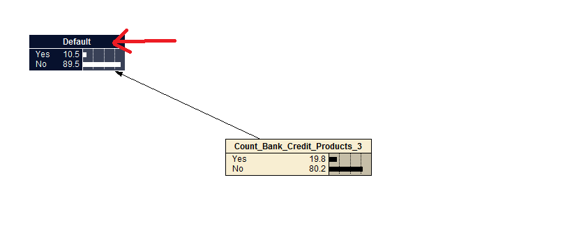
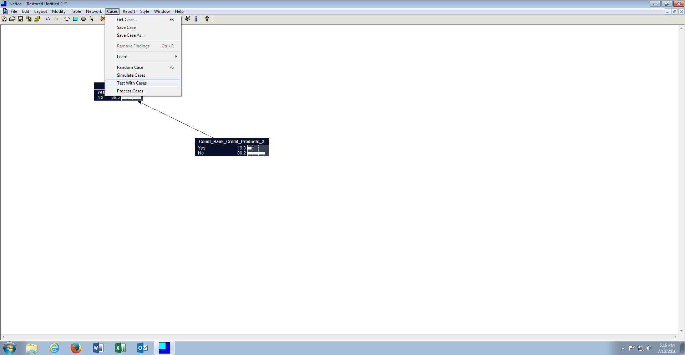
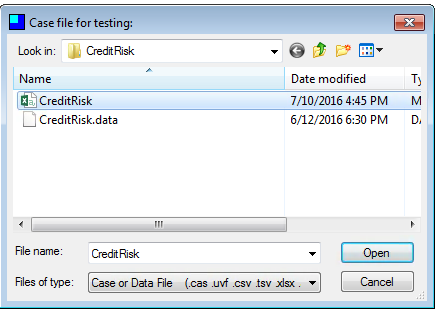
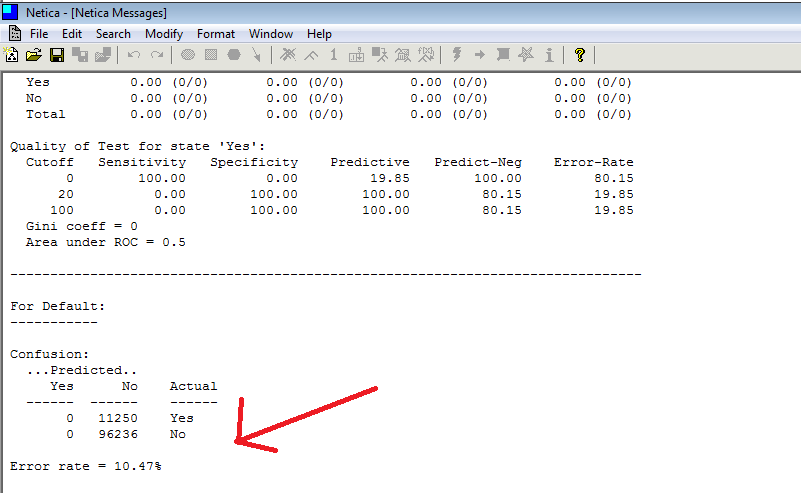

# Procedure 8: Test Classification Accuracy of a Bayesian Network

Bayesian Networks are viewed to be extremely useful for classification problems with the measure of the performance of being classification accuracy, commonly presented as a confusion matrix (in the same manner as Logistic Regression).

Bayesian networks, once constructed and trained, can facilitate a testing process which produces similar analysis to that observed in logistic regression procedures.

Firstly, highlight all nodes required by holding down the ctrl key and clicking the node name:

To test the network, navigate to the Cases menu, then click on the Test with Cases sub menu:

Select the CreditRisk.csv file when prompted to open a file:

Clicking the Open button begins the testing process, for the dependent variable, this is Default in this example, a Confusion Matrix and Error Rate is presented, being the main focus of optimisation in a stepwise approach, or perhaps using more automated means to add nodes to the canvas and establish relationships between the independent variables:

