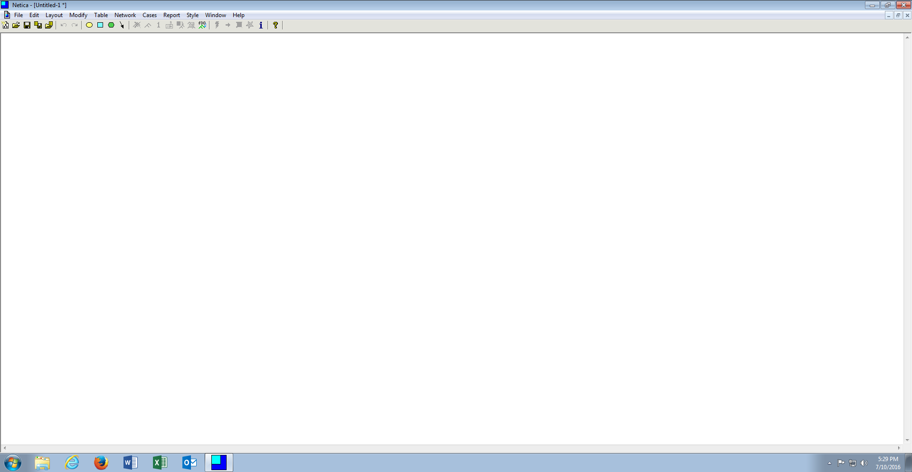
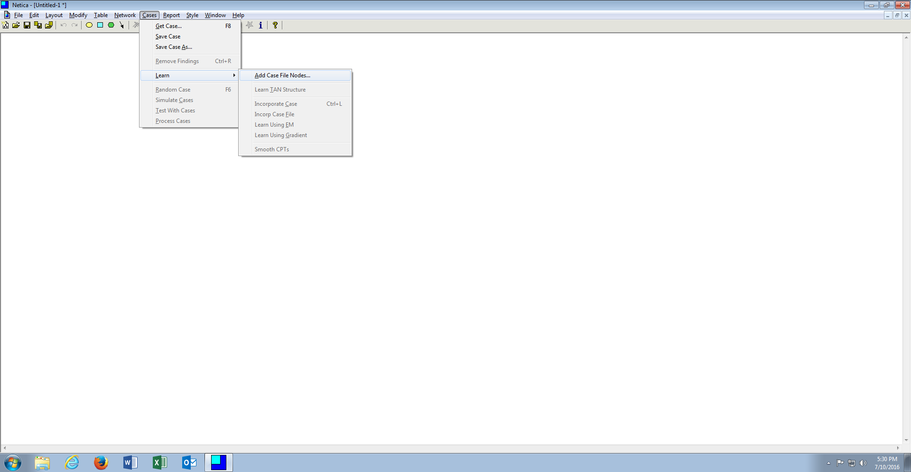
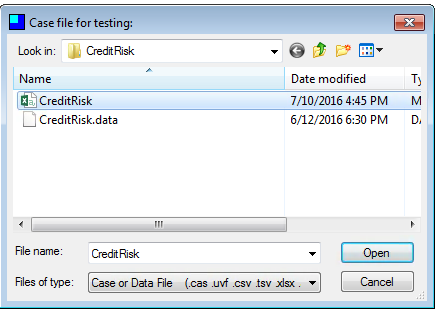
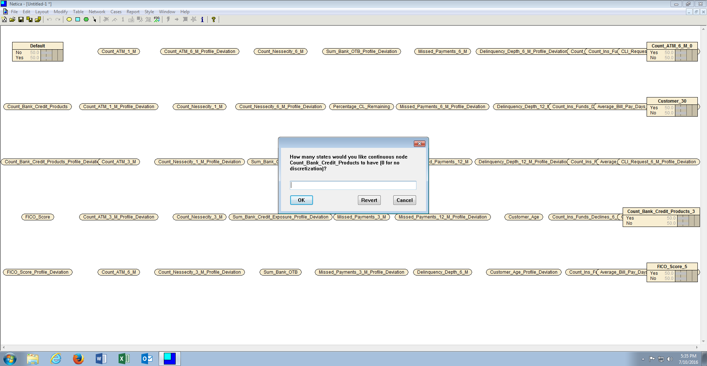
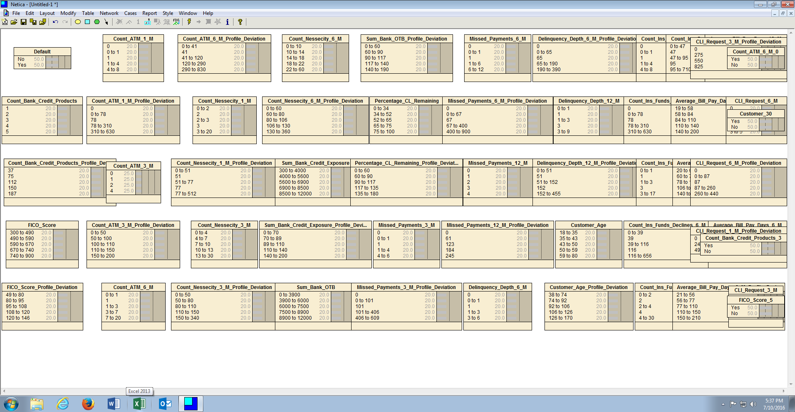

# Procedure 9: Add Nodes Automatically to a Canvas

The process of manually adding nodes to a canvas is quite laborious and with a key benefit of Bayesian networks being the ability to handle extremely large networks with hundreds of nodes, impractical.  Furthermore, Bayesian techniques are inherently state based, which would rely on a process of dividing continuous variables into appropriate state bins. 

Netica has the ability to infer columns from a file, thus allowing for automation in the creation of nodes on the canvas.

Start by creating a blank canvas as demonstrated:

To infer and then add the case file nodes, click Cases in the menu Item, then click or hover on the Learn sub menu item, then click Add Case File Nodes:

When the dialog box opens, select the file CreditRisk.csv:

Clicking Open will begin the process of creating nodes based upon the Variables name coupled with an analysis of the number of states within that Variable.  In the event that a variable is determined to be continuous, a prompt will be displayed to determine the number of states to set for this variable:

Specify the number of states deemed appropriate for the variable, then click ok.  Repeat for each variable until all of the nodes have been added to the canvas:

