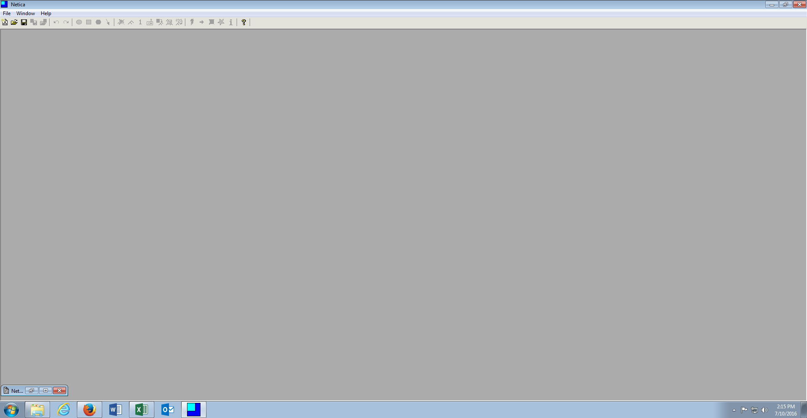

# Module 12: Norsys Netica and Bayesian Analysis
Norsys Netica is a modelling tool that allows for the creative development of Bayesian networks based on either belief (this would be subjective probability) or data (taking a frequentist approach to probability as available in data).
The software does not install nativity to the operating system, the executables are in the directory:

\Training\Software\Netica 521

Execute the program Netica.exe, which will open the Netica user interface:

The data file that will be used in these procedures is available in Training\Data\CreditRisk and is titled CreditRisk.csv:

The CreditRisk.csv file is extremely large containing an uneven number of default vs. good cases, it could be said that this is a representative sample unlike the logistic regression techniques with rely on an even number of cases in both dispositions.

IN DESIGN TIME NETICA OFTEN HAD BUGS AND CAN CRASH.  BE SURE TO SAVE WORK REGULARLY.