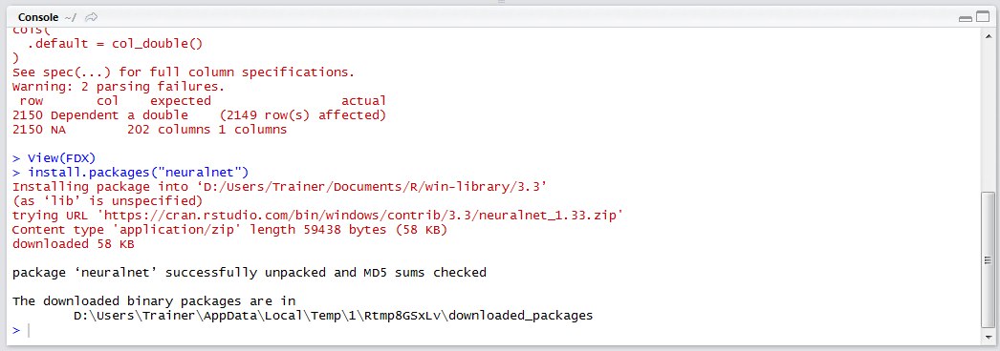

# Procedure 1: Train a Neural Network

In this procedure, improvement will be sought from module 6,  using the FDX dataset.  Start by importing the dataset using the readr package and read.csv() function (as there are no strings to be converted to factors):

``` r
library(readr)
FDX <- read_csv("D:/Users/Trainer/Desktop/Bundle/Data/Equity/Abstracted/FDX/PC_FDX_Close_200x1D_Close_50x1D_10.csv")
View(FDX)
```


Run the line of script to console:


It can be seen via the RStudio viewer that the FDX dataset has been loaded into R:


To train a neural network, firstly download and install the package using the RStudio interface:


Click Install to execute the installation:



Load the library:

``` r
library(neuralnet)
```


Run the line of script to console:


In this example, a warning has been displayed saying that the build was done in a later version of R, however backward compatibility can be reasonably assured and as such the warning can be ignored.  Once R version 3.3.3 has become stable, it might be worth upgrading.

Building, or training, a Neural Network is very similar to building a regression model, save for a few parameters nuanced to this function (not least that the overall package is VERY unforgiving with almost no intuitive error messages).  In this example, a neural network will be created with an arbitrary four processing elements, with one hidden layer.  The dot notation, typically used to instruct all variables, does not work with this function currently (it is a bug) and so a manually constructed formula need be created.  

Furthermore, for the purposes of these procedures, it is beneficial to have a slightly more limited feature set owing to the time it would take to train and that, despite popular belief, less is quite often more when training Neural Networks.  It is also worth noting that the neuralnetwork() function is a single threaded function and can take a VERY long time to train upon data frames which contain many records and many independent variables.

I this example, a neural network is going to be built upon 10 independent variables known to correlate well to the dependent variable (it is a source of contentious debate as to whether correlation is the most useful means to select variables in non-linear modelling techniques).  While neural networks are tremendous at processing a very large number of features, this is often at the expense of generalisation and as such, the bug, encourages more care and thought in creating a more appropriate neural network:

``` r
NeuralNetworkFourByOne <- neuralnet(Dependent ~ Skew_3 + Max_4 + PointStep_16 + Close_3 + Close_4 + PointStep_17_ZScore + PointStep_15 + TypicalValue_4 + Range_4 + Range_2, data = FDX, hidden = 4)
```


Run the line of script to console,  being prepared to wait a little while:


Upon the console returning,  the neural network has been trained.   Understanding the structure and performance of the neural network is a rather more complex affair than other procedures (which fits with the overall experience of using the package).