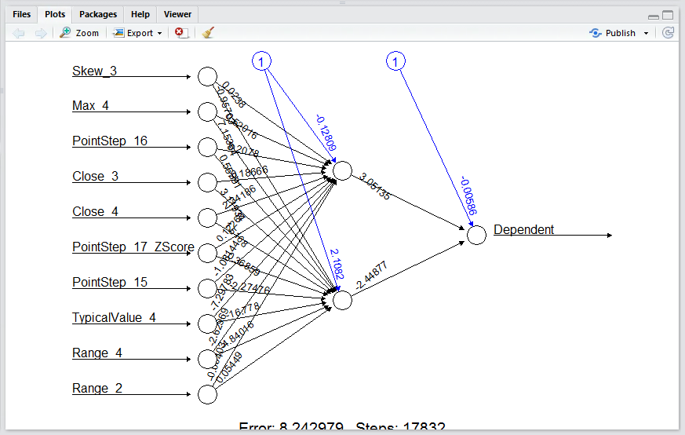

# Procedure 2: Plotting a Neural Network

It is often stated that a neural network is an unexplainable modelling techniques, which practically holds some truth, but to those with a background in regression modelling, explaining the model is not insurmountable.

The neuralnet object that was created allows for the plotting of the neural network using the base plot() function.  Simply call plot() passing the neural network object as an argument:

``` r
plot(NeuralNetworkFourByOne)
```


Run the line of script to console:


A plot is created of the neural network bearing stark resemblance to conceptual models put forward in this training manual,  and in a model of less complexity, is in fact explainable and quite reproducible on a manual basis:



As the model becomes more and more complex,  with the addition of more and more features, layers and processing elements, the neural network will naturally become less and less explainable.