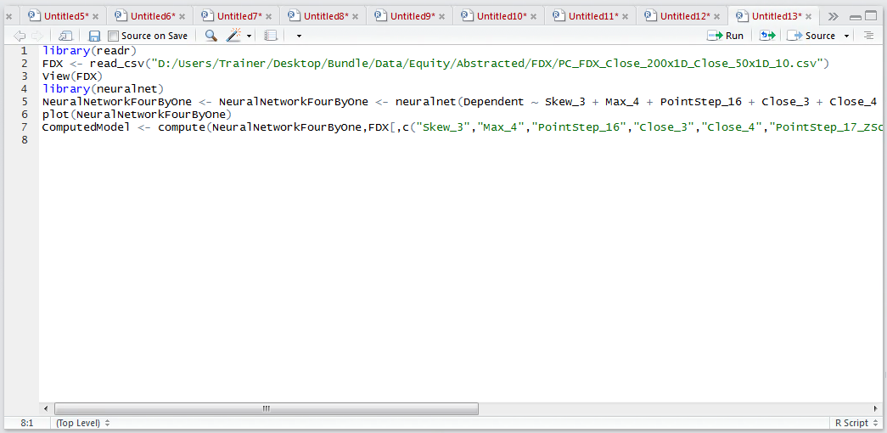
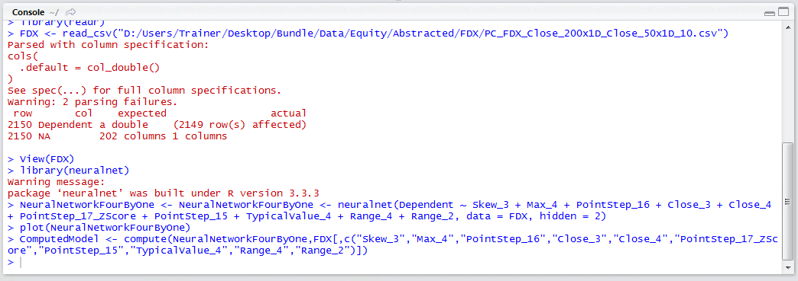
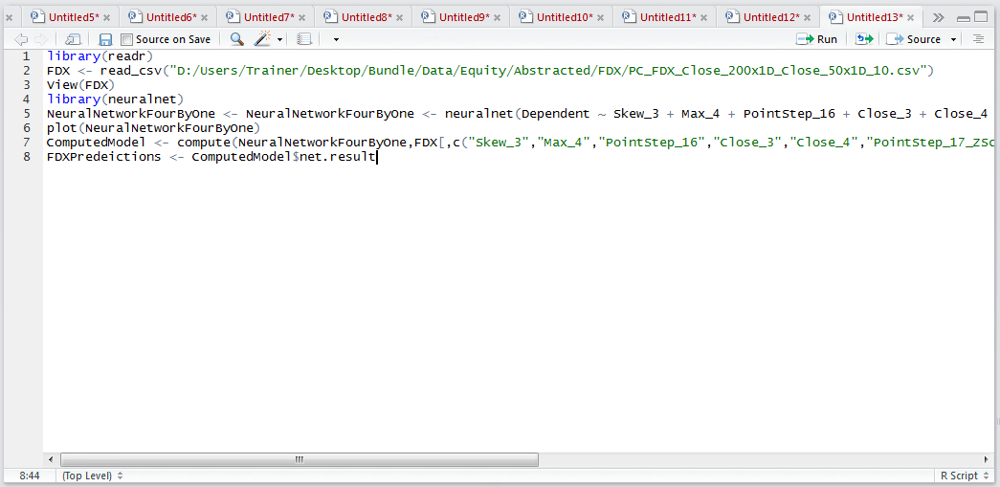
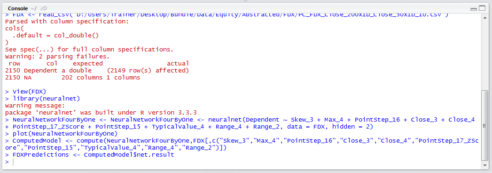
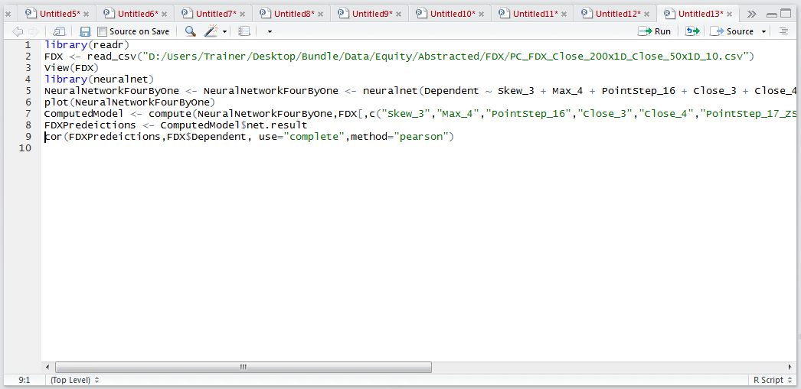
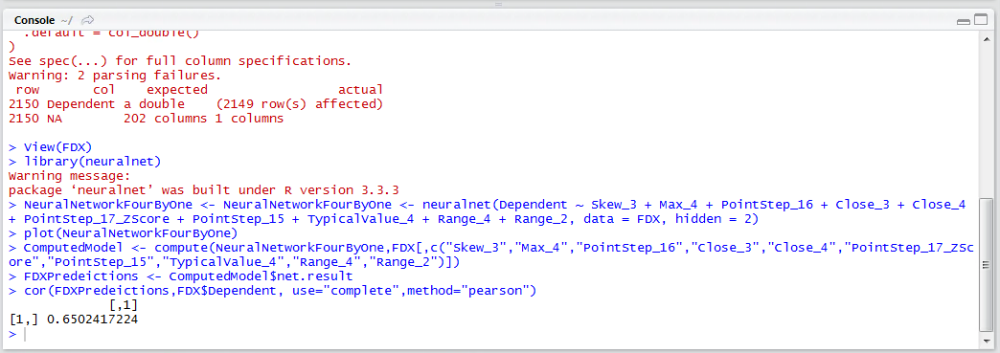

# Procedure 3: Recalling a Neural Network with compute() and understanding performance

The topology plot gives a useful window into the neural network, and its similarity to a regression model is unmistakable, there is none on the performance statistics associated with a regression model.

As this is a numeric prediction model, and not a classification model, we will use correlation to determine the relationship between the dependent variable and the predicted variable.

The compute() function is used instead of the predict() function,  which returns an object with a few other properties rather than just the prediction (which would be easier).   Something else to bear in mind is that the recall function, and indeed the training function, is very unforgiving in the event that the dependent variable has been passed (throwing an error Error in neurons[[i]] %*% weights[[i]] : non-conformable arguments). Frustratingly, it is necessary to subset the dataframe to return all columns explicitly, excluding the dependent variable, before passing it to the compute function. To recall the computed model:

``` r
ComputedModel <- compute(NeuralNetworkFourByOne,FDX[,c("Skew_3","Max_4","PointStep_16","Close_3","Close_4","PointStep_17_ZScore","PointStep_15","TypicalValue_4","Range_4","Range_2")])
```



Run the line of script to console, it may take some time:



Unlike the predict method, compute has returned an object.   It is necessary to extract the results from this object to a list, not a vector unfortunately, but that can be converted later using the unlist() function, using the net.result() method:

``` r
FDXPredeictions <- ComputedModel$net.result
```



Run the line of script to console:



To gain an assessment of the level of performance of the predictions vs the actuals, the correlation function can be used:

``` r
cor(FDXPredeictions,FDX$Dependent, use="complete",method="pearson")
```



Run the line of script to console:



It can be seen, in this example, that a correlation of 0.65 has been achieved.  Referencing the initial correlation matrix calculated on the same dataset, it can be seen that this is an absolutely fantastic uplift in performance from the input correlations in isolation.

For completeness, the FDXPredictions vector, after converting it from a list, should be merged into the FDX data frame, however, using a more complex neural network, in this case taking more hidden layers, improvement will be sought in the subsequent procedure.