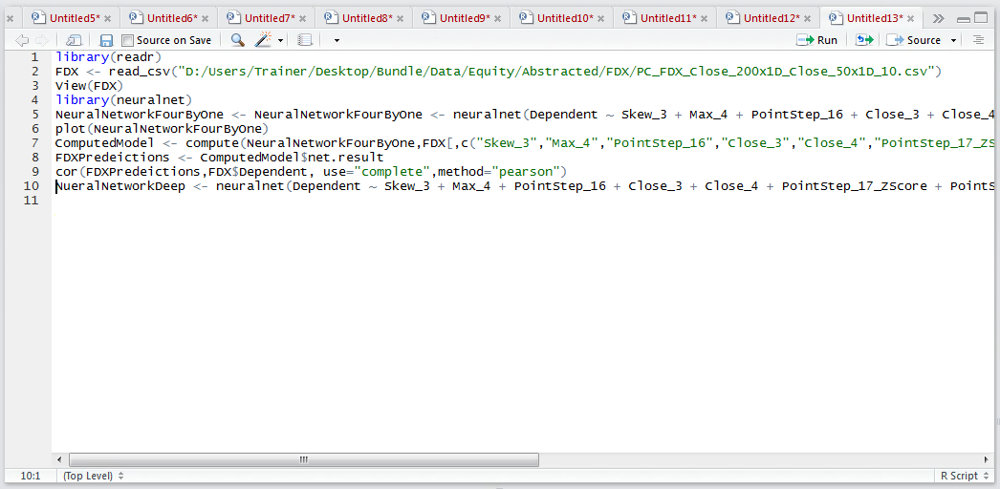
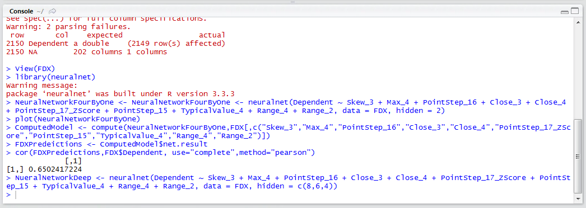
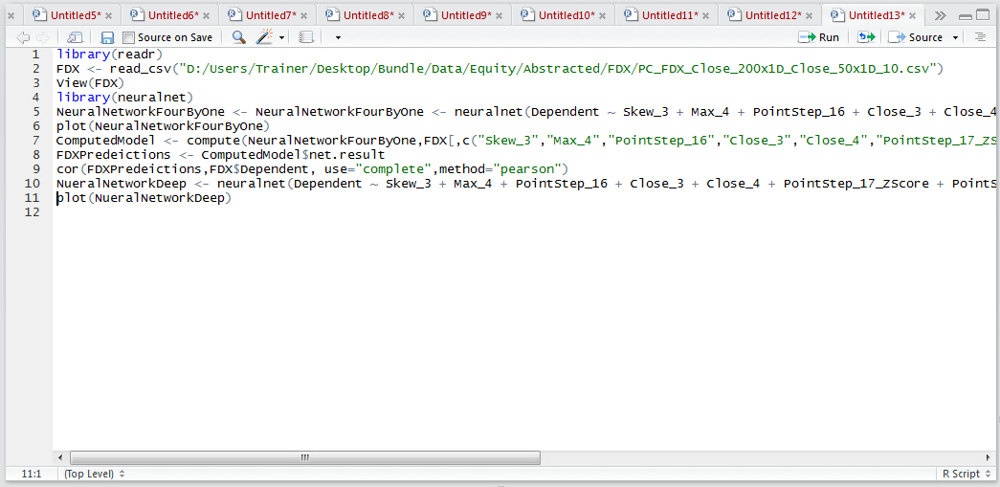
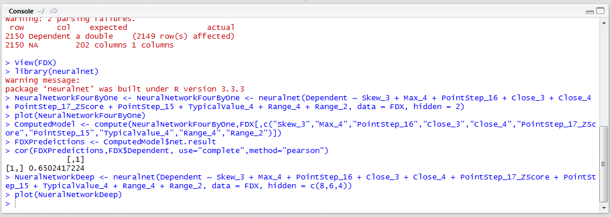
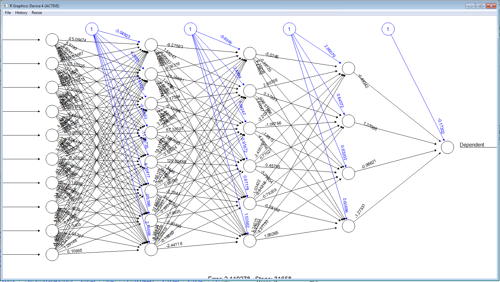
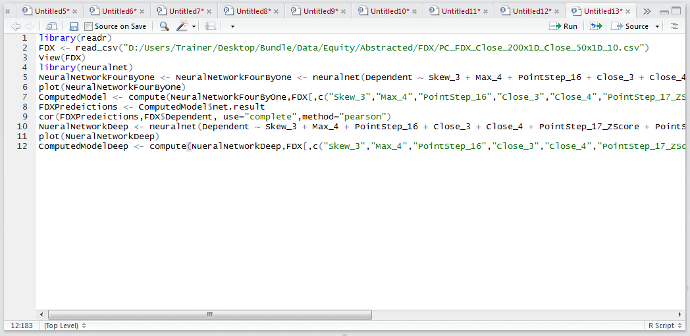
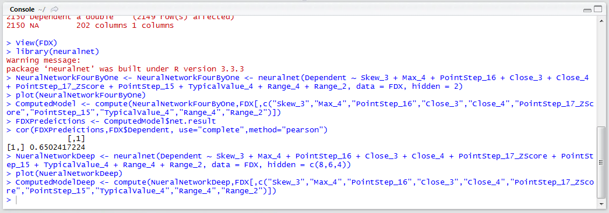
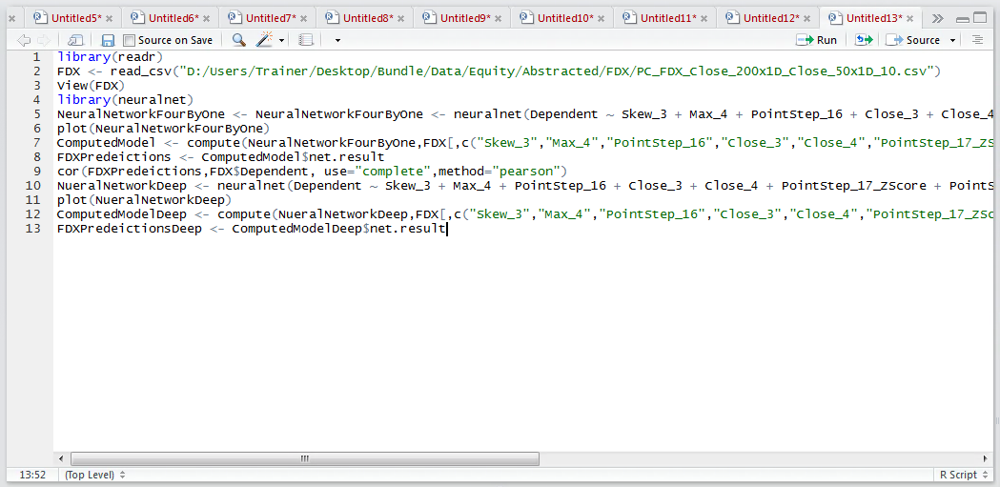
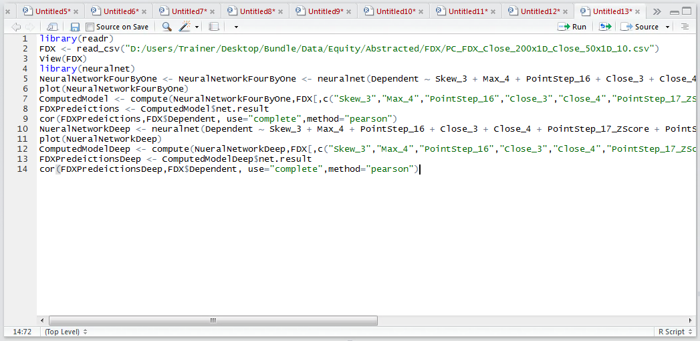
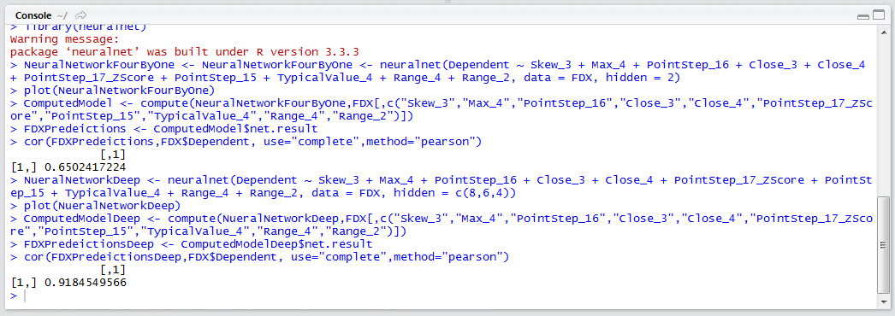

# Procedure 4: Training a Deeper Neural Network

A neural network was trained having only a single hidden layer, albeit with several processing elements.  Deep learning is the notion of having many more hidden layers and generally many more processing elements.  Each layer is able to achieve abstraction autonomously, finding patterns that may not be apparent in manual abstraction.  HOWEVER, it is lazy, adds valuable computational expense in recall (which begins to matter in super high throughput environments), as such deep learning can have circumvented to an extent, given more creativity in the abstraction phase.

In this example, a much deeper neural network will be created where the same ten inputs will be used.  The first hidden layer will have 8 processing elements, the second hidden layer will have 6 processing elements, the third hidden layer will have 4 processing elements yielding an output.

A single value specifying just the number of processing elements was provided, where it was inferred that only a single hidden later is applicable.  In this procedure, it is necessary to construct a vector, with each vector entry corresponding to a hidden layer, with the value of that hidden layer entry being the processing elements for that hidden layer:

``` r
NueralNetworkDeep <- NeuralNetworkFourByOne <- neuralnet(Dependent ~ Skew_3 + Max_4 + PointStep_16 + Close_3 + Close_4 + PointStep_17_ZScore + PointStep_15 + TypicalValue_4 + Range_4 + Range_2, data = FDX, hidden = c(8,6,4))
```



Run the line of script to console, expect it to take some time:



Plot the function to inspect the neural network:

``` r
plot(NueralNetworkDeep)
```



Run the line of script to console:



The plot has dramatically increased in complexity. It can be observed that the Neural Network now has three hidden layers, the first having 8 processing elements, the second having 6 processing elements and the third having 4 processing elements:



Naturally, this complexity is only worthwhile in the event that the classification accuracy has improved.  As such, invoke compute and extract the results:

``` r
ComputedModelDeep <- compute(NueralNetworkDeep,FDX[,c("Skew_3","Max_4","PointStep_16","Close_3","Close_4","PointStep_17_ZScore","PointStep_15","TypicalValue_4","Range_4","Range_2")])
```



Run the line of script to console:



Extract the predictions to a list, for conversion to a vector later:

``` r
FDXPredeictionsDeep <- ComputedModelDeep$net.result
```



Run the line of script to console:

Appraise the correlations between the predictions and the dependent variable:

``` r
cor(FDXPredeictionsDeep,FDX$Dependent, use="complete",method="pearson")
```



Run the line of script to console:



It can be seen that the correlation between predicted and actual has leaped to a staggering 0.91 in response to increasing the complexity of the model. 