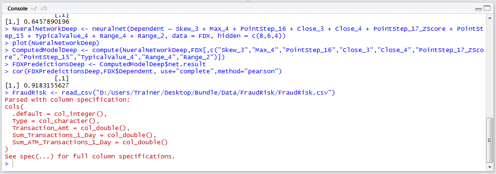
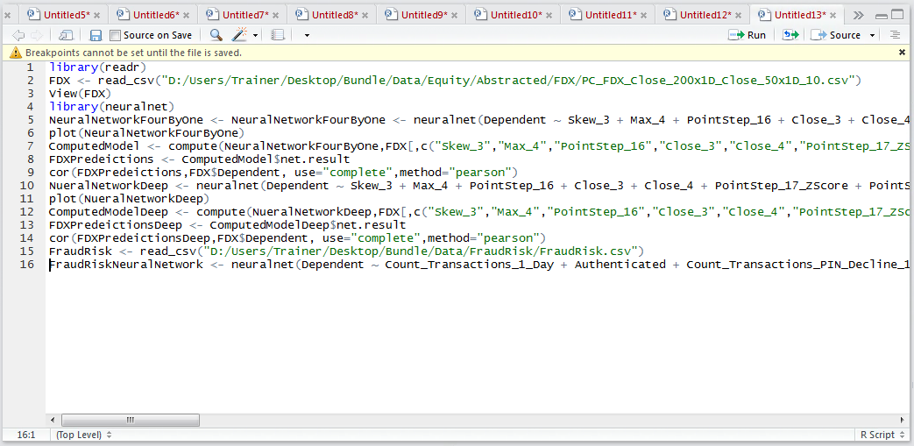
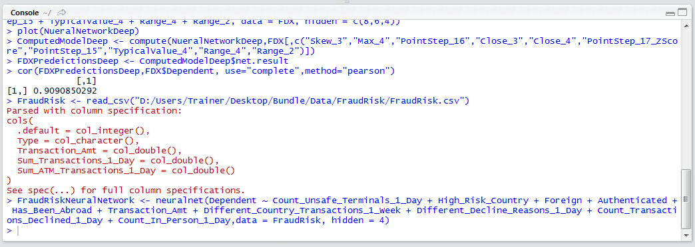

# Procedure 5: Training a Classification Model

Neural Networks are universal classifiers, which means to say that they can be used as well on numeric prediction as classification.  It won’t have escaped notice however that the internal weights comprising the neural network are all numeric coefficients.  It follows that all input and output variables should be numeric also (via categorical data pivoting to 1 / 0, unfortunately not being able to rely on neuralnet() to interpret factors).  In this example, a dataset of transactions where half of the transactions are fraud and half genuine will be used.  Start by importing the FraudRisk dataset:

``` r
FraudRisk <- read_csv("D:/Users/Trainer/Desktop/Bundle/Data/FraudRisk/FraudRisk.csv")
```


Run the line of script to console:



Once the FraudRisk data frame has been created, create a neural network of ten independent variables known to have strong correlation to the dependent variable with one hidden layer of four processing elements:

``` r
FraudRiskNeuralNetwork <- neuralnet(Dependent ~ Count_Unsafe_Terminals_1_Day + High_Risk_Country + Foreign + Authenticated + Has_Been_Abroad + Transaction_Amt + Different_Country_Transactions_1_Week + Different_Decline_Reasons_1_Day + Count_Transactions_Declined_1_Day + Count_In_Person_1_Day,data = FraudRisk, hidden = 4)
```



Run the line of script to console, it may take some time:



Once the console returns, the Neural Network has been trained upon the FraudRisk Dataset.  For the purposes of this procedure it can be taken for granted that plot would return.