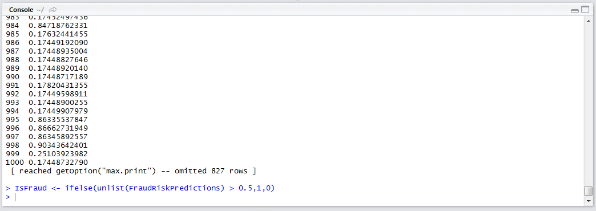

# Procedure 6 Activating a Classification Model and Appraising Performance

To recall the neural network, return a value between 0 and 1 depending on the likelihood that the record is fraudulent:

``` r
FraudRiskPredictions <- FraudRiskNeuralNetwork$net.result
```


Run the line of script to console:


Peeking the results with the head() function:

``` r
head(FraudRiskPredictions)
```


Run the line of script to console:


It can be seen that numeric values, between 0 and 1, have been returned.  The closer to one, the more likely that the record is fraudulent.   To assert a proper classification, so that a confusion matrix may be plotted to appraise performance of the model, create a vector contains a 1 where the value of FraudRiskPredictions > 0.5, else 0, yet wrapping FraudRiskPrediction with the unlist() function to transform the list output to a vector:

``` r
IsFraud <- ifelse(unlist(FraudRiskPredictions) > 0.5,1,0)
```


Run the line of script to console:



As has become customary, use a confusion matrix to appraise the value of the classifier:

``` r
library("gmodels")
CrossTable(FraudRisk$Dependent, IsFraud)
```


Run the block of script to console:


In this example, it can be seen that 720 records were classified as being fraudulent correctly.  In total, it can be seen that 901 records were classified, so the accuracy rate on predicting fraud is 79.9%, a substantial uplift on the logistic regression models created in procedure 93.  It is well worth mentioning, that for classification problems, less is very often more and rather than increase network complexity by adding more and more hidden layers and processing elements, it is often more efficient to create many more abstracted variables backed by intuitive judgement and domain expertise.