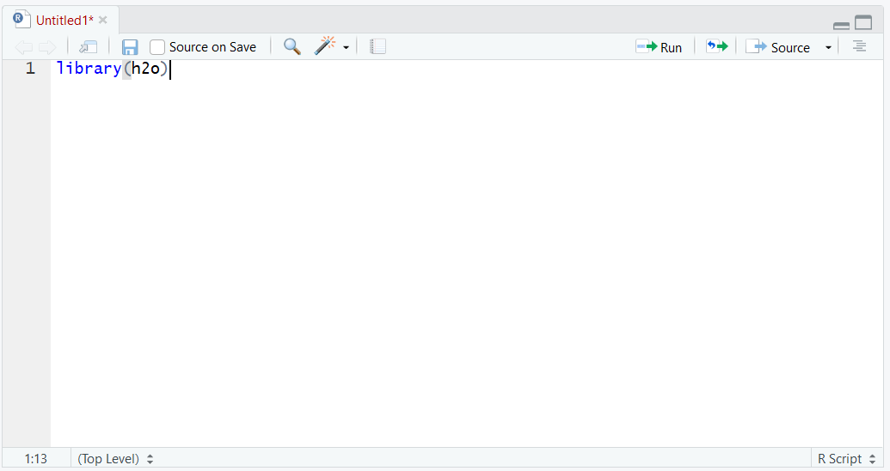
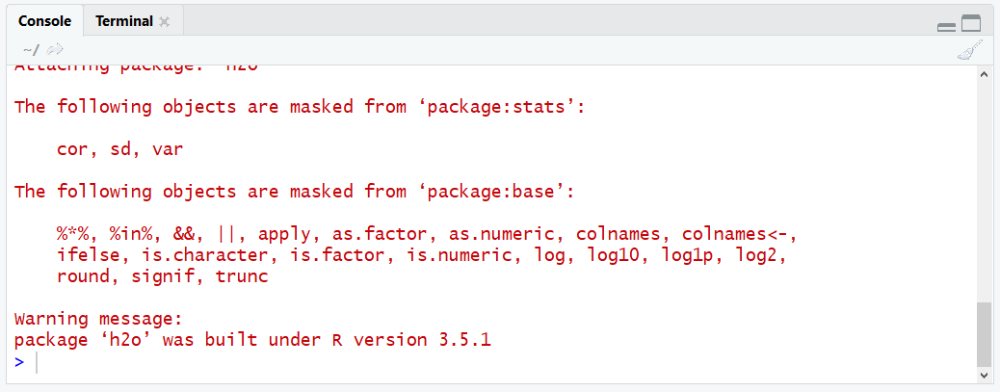

# Procedure 1: Install H2O package, instantiate and browse to the Flow User Interface

Even though H2O is server software and runs externally to R, it can be installed and initialised from with R.  Installing the entire H2O server is no more complex than installing any other R package.

To install H20, use RStudio and begin by installing the H20 package:


Wait for the installation to complete, although this will take a little bit longer than most packages as it is big:

Load the H2O package by typing:

``` r
library(h2o)
```



Run the line of script to console:



The H2O server needs to be started externally, but this can be achieved through a helper function available to the H2O library.  To start the H2O server, use the h2o.init function with the default parameters (i.e. no parameters):

``` r
H2oServer <- h2o.init()
```


Run the line of script to console and wait for confirmation to be provided that the h2o server has been started externally to R:


The h2o server acts as a web server which serves up the Flow application. To navigate to the Flow application, open a browser such as Chrome:


Navigate to the URL: http://localhost:54321


The H2o server is now installed and available for use via the Flow user interface, API or R commands.