# Procedure 2: Loading Data into H2O with Flow

In this example a logistic regression model will be created, using Flow, achieving the same results as achieved in the GLM functions of R and Exhaustive.

In the Flow user interface, start by navigating:

``` r
Flow >>> New Flow
```

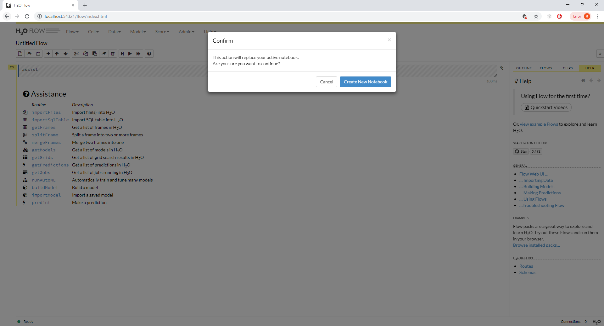

If prompted to create a new workbook, affirm this:

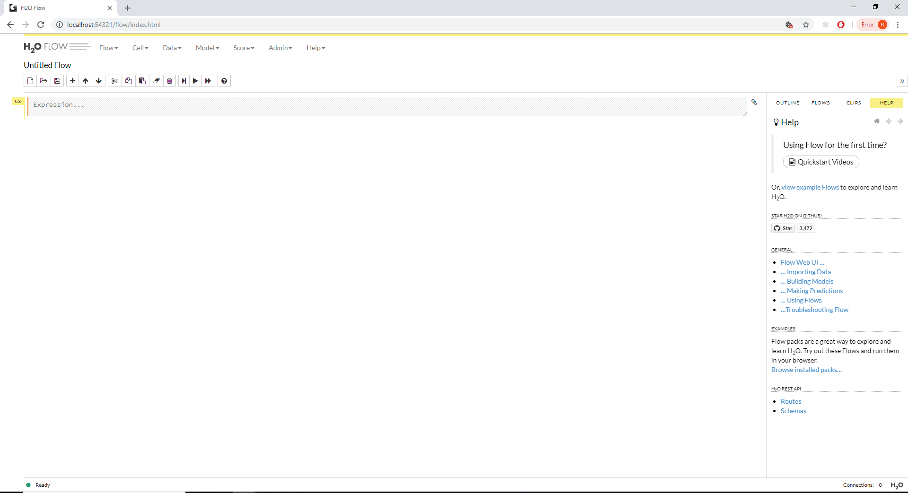

To add a cell for the importing of data, navigate to:

``` r
Data >>> Import Files
```

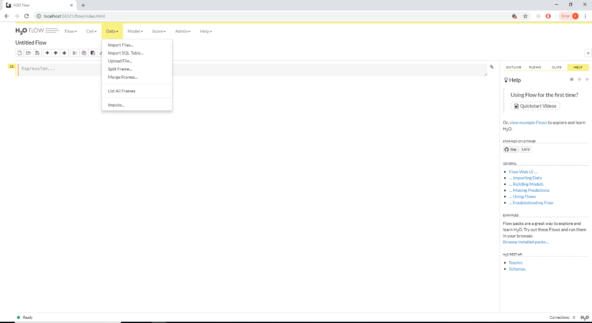

It can be seen that Import Files Cell has been added to the Flow:

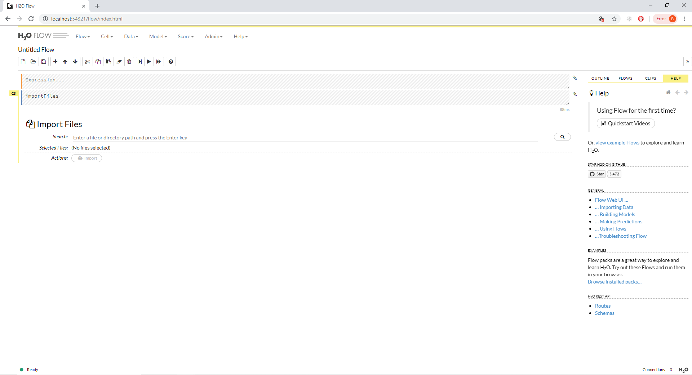

In the Search dialog box, enter the location of the FraudRisk.csv file until a drop down is populated, for example:

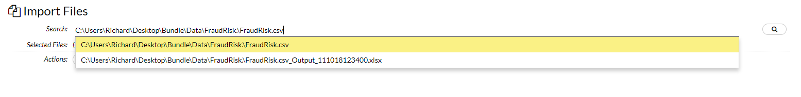

Click on the Search Icon to bring back the contents of this directory:

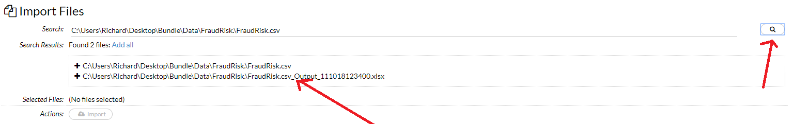

Click on the file or plus sign to add the file to the cell:

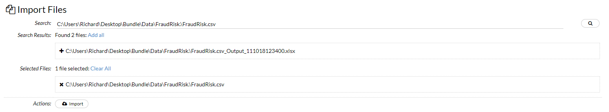

Click the Import Button to import the file to H2O:

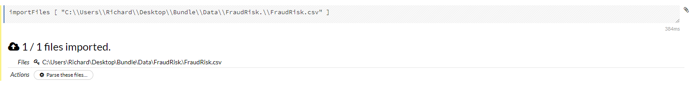

Note that the file is not parsed to the H2O column compressed format, known as Hex.  To achieve parsing, simply click the button titled 'Parse These Files':

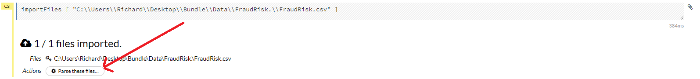

The next screen allows for the specification and data types to be more robustly configured.  In this example, a cursory check to ensure that the data types are correct is sufficient:

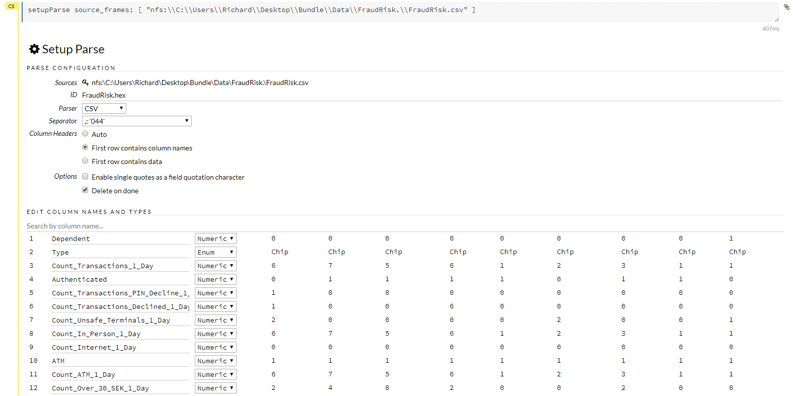

Upon satisfaction, click parse to mount the dataset in H20 as Hex:

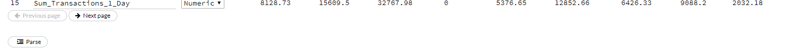

A background job will start the process of transforming the data from FraudRisk.csv to the H2O hex format:

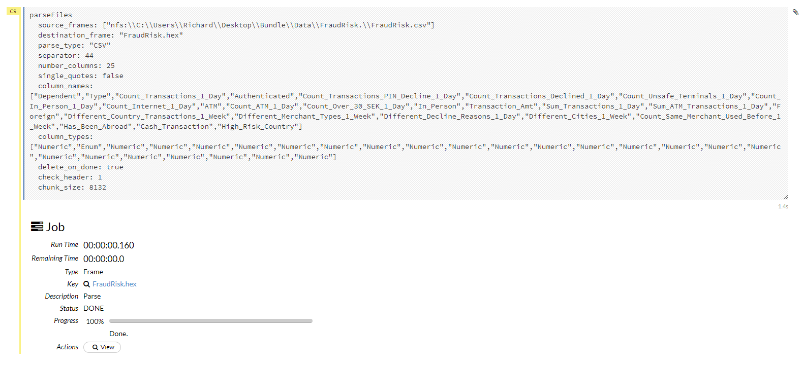

H2O supports the concept of training and validation datasets robustly, henceforth the hex file needs to be split into training and validation.  To split a Hex frame, navigate to:

``` r
Data >>> Split Frame
```

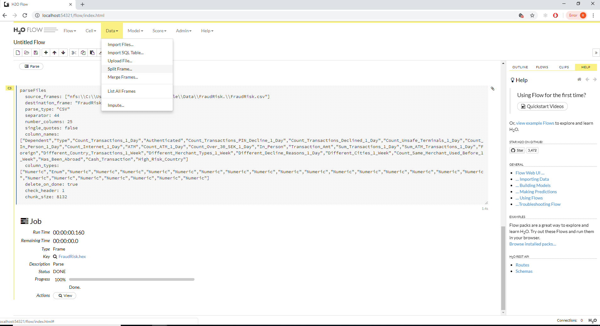

Click on the menu item to create the split data frame cell:

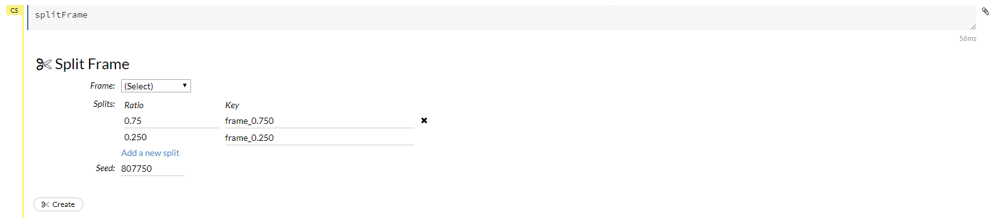

Select the frame to be split, in this case FraudRisk.hex:

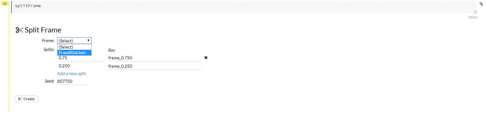

The default frame split is 75% by 25%, confirm this by clicking the Create button:

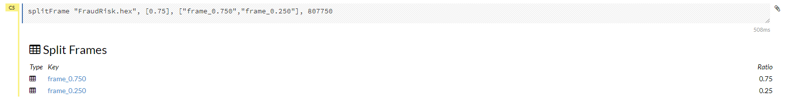

There now exists two frames in the flow, the smaller of which will be used for validation:

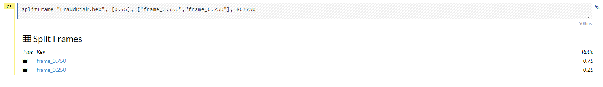