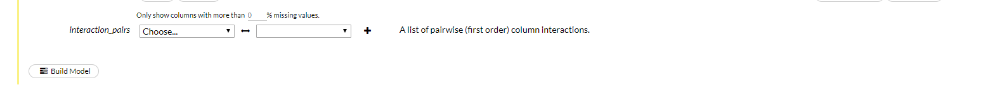

# Procedure 3: Creating a Logistic Regression model in H2O (GLM)

With the data loaded, a model now needs to be trained.  Navigate to Models to see the available algorithms:

``` r
Models
```


In this case, the algorithm is Generalised Linear Modelling (this is Logistic Regression).  Click this model to create the cell in flow:


There are a multitude of parameters that are quite outside the scope of this document, for the purposes of this document, simply specify the Training and Validation Hex sets:


Thereafter, specify the dependent variable, known as the Response Column in H2O:


In this case the Dependent Variable is titled as the same:


Scroll to the base of the cell and click Build Model to initiate the training process:



The training process will begin with progress being written out to a newly created job cell:


At this stage a Logistic Regression model has been created. It is a good idea to save the flow by navigating:

``` r
Flow >>> Save Flow
```

