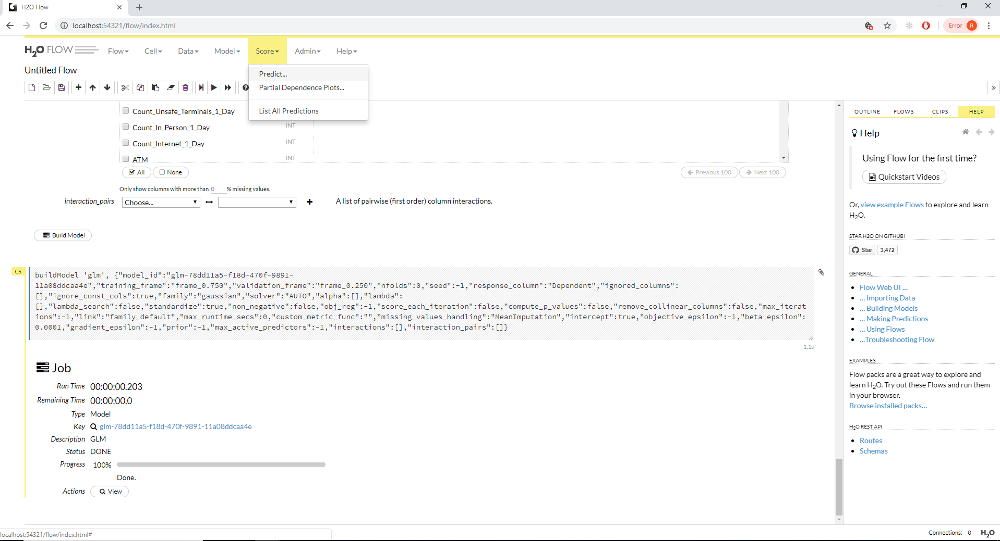
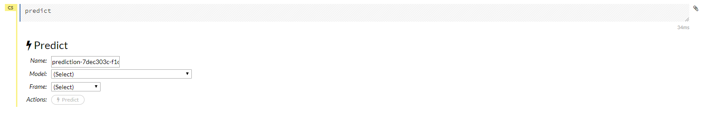
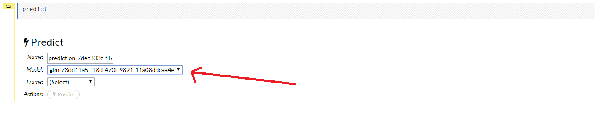
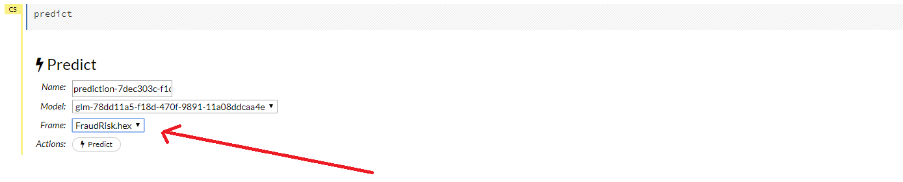
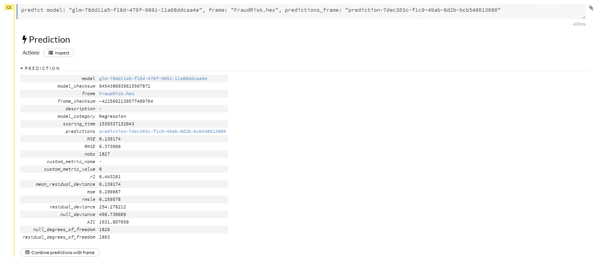
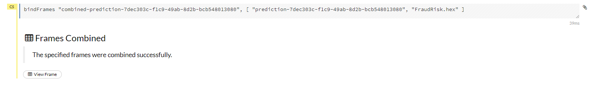
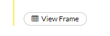
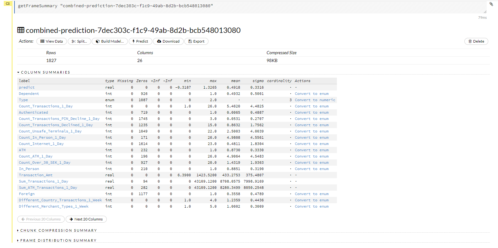

# Procedure 4: Recalling a Logistic Regression model with Flow

To recall this logistic regression model from flow, navigate to:

``` r
Scores >>> Predict
```



The predict cell will be added to the Flow:



The recall of the model may assume that a new frame has been created in flow, but for this example, the validation frame will be recalled via the logistic regression, trained, model.  Firstly, set the model to recall:



Thereafter, select the data frame to process through the model:



Upon selecting the input parameters, click the predict button to complete the prediction.  A cell detailing the output will be created:



It is sensible at this stage to combine the predictions with the original dataset.  To combine the predictions with the original dataset, simply click the Combine Predictions with Frame button:


Upon combining the predictions with the original dataset, the dataset will be available for download:



To interact with the newly created data frame click on the View Frame button:



The View Frame functionality provides for the downloading and further manipulation of the data frame:



The process thus far uses the Flow user interface to create something akin to a script, where it is the flow tool that is sending instructions to the H2O API.  It would be far less cumbersome to use R scripting to achieve such flows.