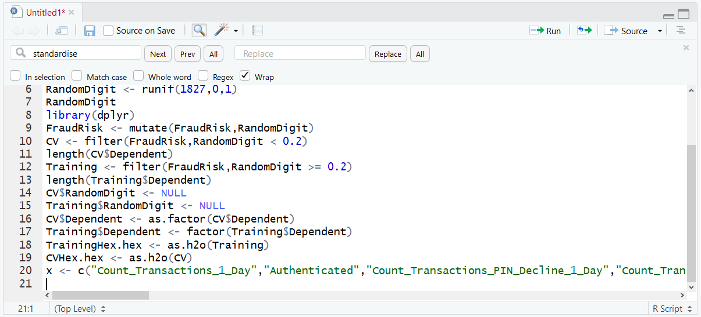
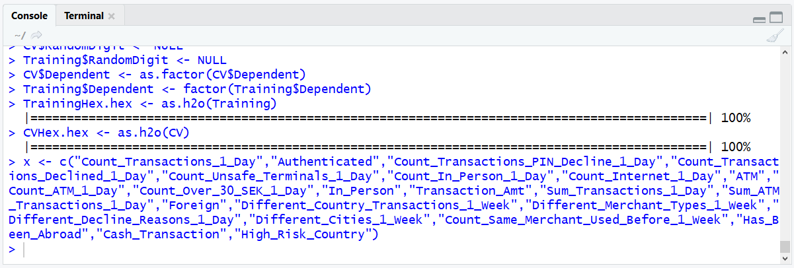
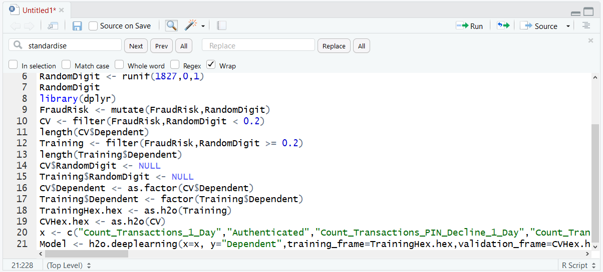

# Procedure 6: Creating a Neural Network with R

Although all of the work is offloaded to H2O, the instruction to train a model looks a lot like previous examples where a variety of R packages have been used.  In this example the deep-learning function of the H2O package is going to be used (this is really the only reason that we are using H2O in the first place).

In order to make the command easier to understand, typed parameters will be used as follows:

| Parameter           | Description                                                                                                                                                                                                                                                                                                                                                                                                                                                                                                                                                                                    |
|---------------------|------------------------------------------------------------------------------------------------------------------------------------------------------------------------------------------------------------------------------------------------------------------------------------------------------------------------------------------------------------------------------------------------------------------------------------------------------------------------------------------------------------------------------------------------------------------------------------------------|
| x                   | c("Count_Transactions_1_Day","Authenticated","Count_Transactions_PIN_Decline_1_Day","Count_Transactions_Declined_1_Day","Count_Unsafe_Terminals_1_Day","Count_In_Person_1_Day","Count_Internet_1_Day","ATM","Count_ATM_1_Day","Count_Over_30_SEK_1_Day","In_Person","Transaction_Amt","Sum_Transactions_1_Day","Sum_ATM_Transactions_1_Day","Foreign","Different_Country_Transactions_1_Week","Different_Merchant_Types_1_Week","Different_Decline_Reasons_1_Day","Different_Cities_1_Week","Count_Same_Merchant_Used_Before_1_Week","Has_Been_Abroad","Cash_Transaction","High_Risk_Country") |
| y                   | c("Dependent")                                                                                                                                                                                                                                                                                                                                                                                                                                                                                                                                                                                 |
| training_frame      | TrainingHex                                                                                                                                                                                                                                                                                                                                                                                                                                                                                                                                                                                    |
| validation_frame    | CVHex                                                                                                                                                                                                                                                                                                                                                                                                                                                                                                                                                                                          | 
| standardise         | FALSE                                                                                                                                                                                                                                                                                                                                                                                                                                                                                                                                                                                          |
| activation          | Rectifier                                                                                                                                                                                                                                                                                                                                                                                                                                                                                                                                                                                      |
| epochs              | 50                                                                                                                                                                                                                                                                                                                                                                                                                                                                                                                                                                                             | 
| seed                | 12345                                                                                                                                                                                                                                                                                                                                                                                                                                                                                                                                                                                          | 
| hidden              | 5                                                                                                                                                                                                                                                                                                                                                                                                                                                                                                                                                                                              |
| variable_importance | TRUE                                                                                                                                                                                                                                                                                                                                                                                                                                                                                                                                                                                           |
| nfolds              | 5                                                                                                                                                                                                                                                                                                                                                                                                                                                                                                                                                                                              |
| adaptive_rate       | FALSE                                                                                                                                                                                                                                                                                                                                                                                                                                                                                                                                                                                          |

The deep-learning function in H2O takes a function two vectors that contain the dependent and independent variables.    For readability, create these string vectors to be passed to the deep-learning function in advance, rather than use the c() function, inside the function call.  To create a list of eligible independent variables for the purposes of this example, enter:

``` r
x <- c("Count_Transactions_1_Day","Authenticated","Count_Transactions_PIN_Decline_1_Day","Count_Transactions_Declined_1_Day","Count_Unsafe_Terminals_1_Day","Count_In_Person_1_Day","Count_Internet_1_Day","ATM","Count_ATM_1_Day","Count_Over_30_SEK_1_Day","In_Person","Transaction_Amt","Sum_Transactions_1_Day","Sum_ATM_Transactions_1_Day","Foreign","Different_Country_Transactions_1_Week","Different_Merchant_Types_1_Week","Different_Decline_Reasons_1_Day","Different_Cities_1_Week","Count_Same_Merchant_Used_Before_1_Week","Has_Been_Abroad","Cash_Transaction","High_Risk_Country")
```



Run the line of script to console:



To instruct H2O to begin deep learning, enter:

``` r
Model <- h2o.deeplearning(x=x, y="Dependent",training_frame=TrainingHex.hex,validation_frame=CVHex.hex,activation="Rectifier",epochs=50,seed=12345,hidden=5,variable_importance=TRUE,nfolds=5,adaptive_rate=FALSE,standardize=TRUE)
```



Feedback from the H2O cluster will be received, detailing training progress.