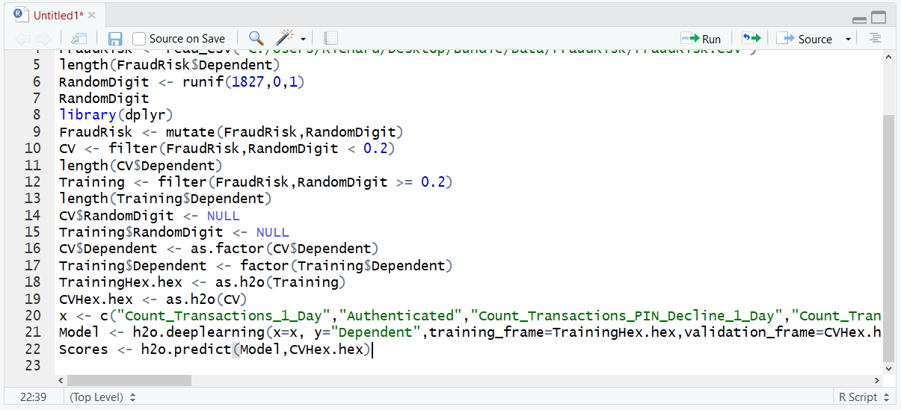
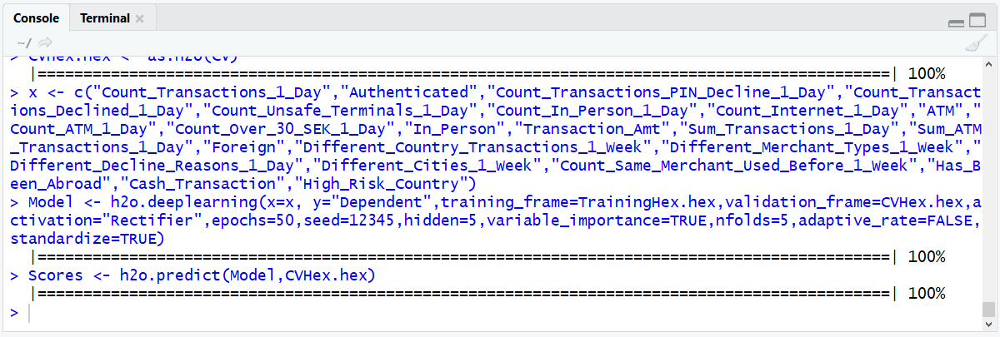
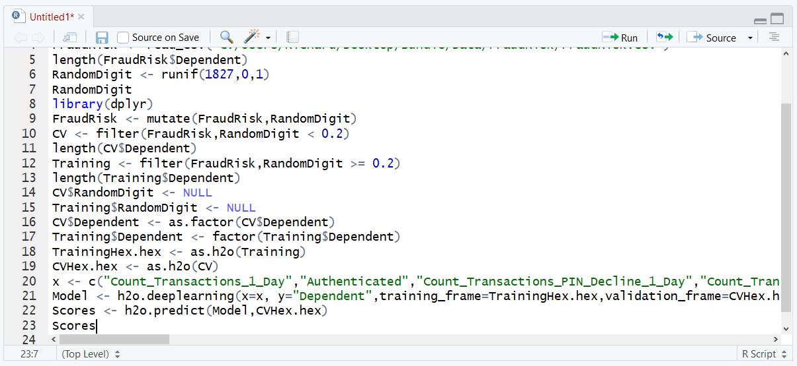
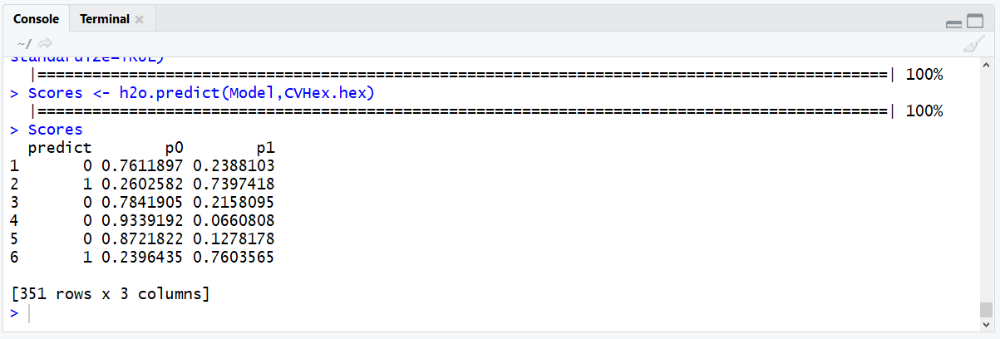
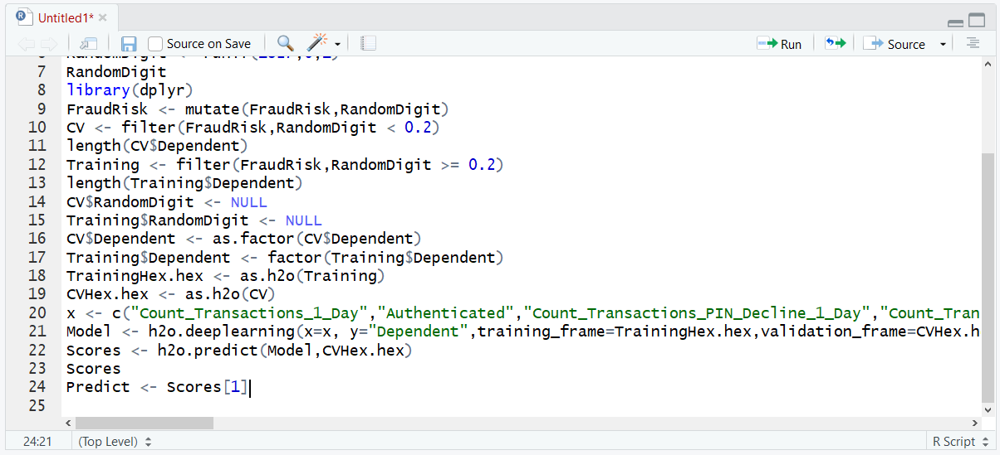
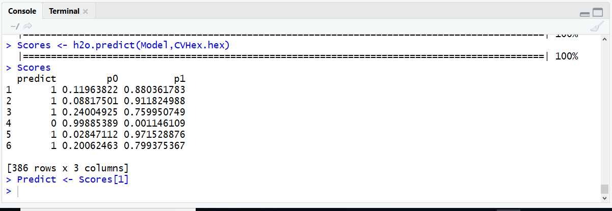

# Procedure 7: Recalling a Neural Network with R

Once a model is trained in H2O it can be recalled very gracefully with the predict() function of the H2O package.  It is a simple matter of passing the trained model and the hex dataframe to be used for recall:

``` r
Scores <- h2o.predict(Model,CVHex.hex)
```



Run the line of script to console:



A progress bar is broadcast from the H2O server and will be written out to the console.  To review the output, enter the object:

``` r
Scores
```



Run the line of script to console:



The Scores output appears similar to a matrix, but it has created a vector which details the actual prediction for a record, hence, this can be subset to a final vector detailing the predictions:

``` r
Predict <- Scores[1]
```



Run the line of script to console:



The Predict vector can be compared to the Dependent vector of the CV dataframe in the same manner as previous models within R to obtain Confusion Matrices as well a ROC curves.