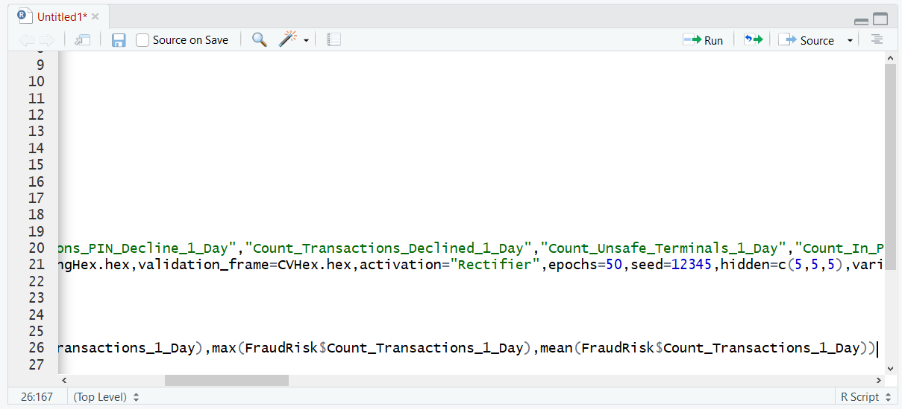
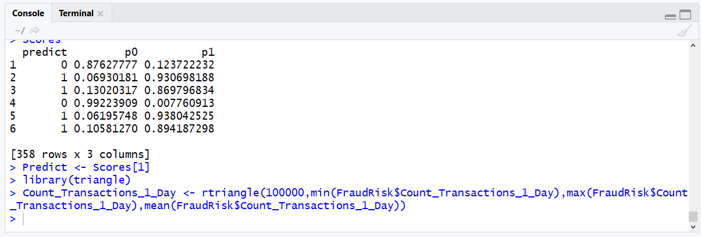
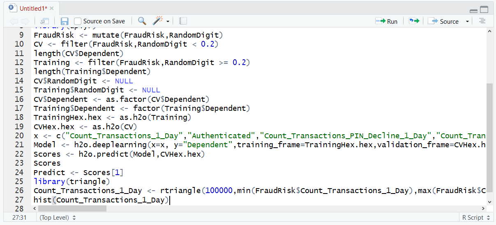
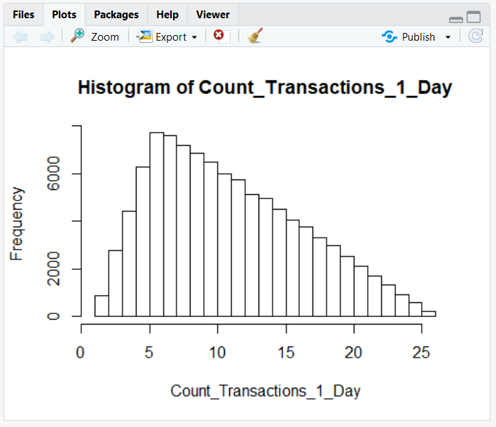
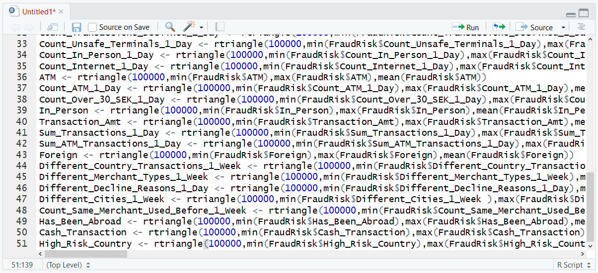
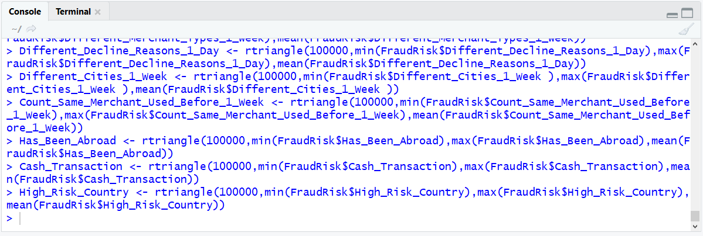
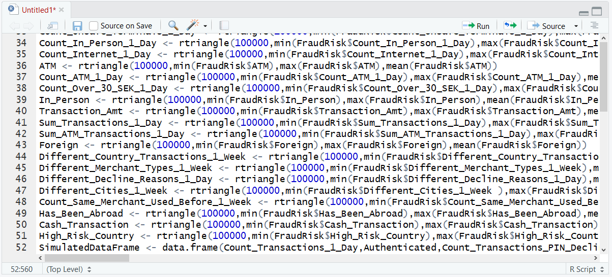
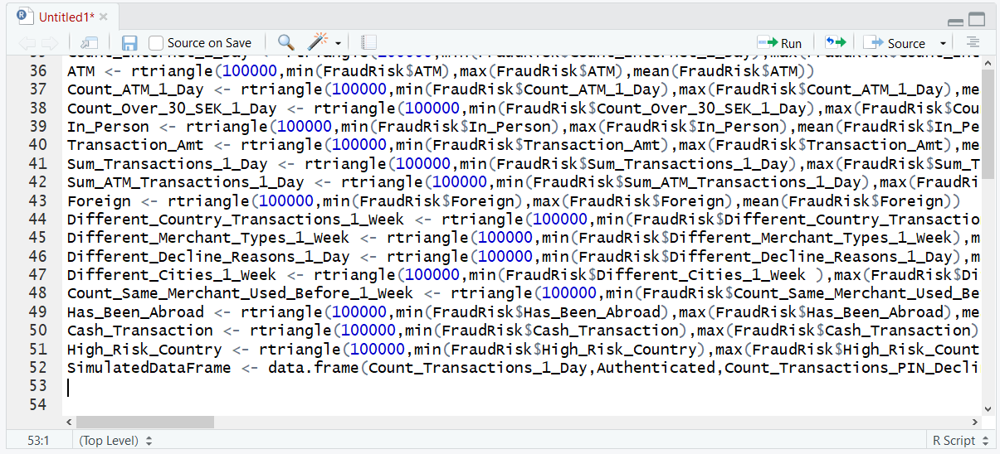
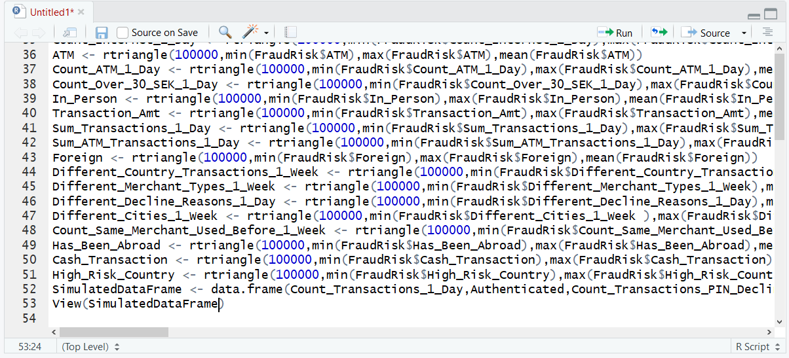
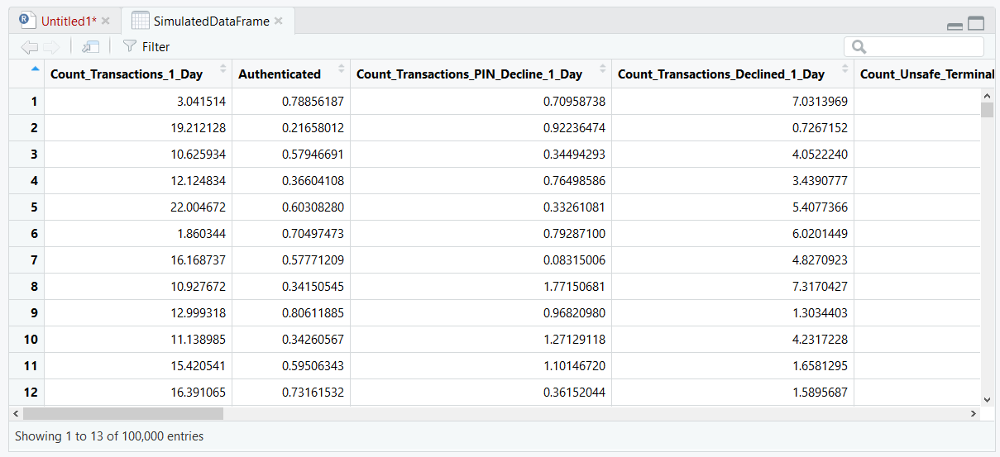

# Procedure 1: Create Discrete Vectors with triangle for each model parameter

The rtriangle() function accepts four parameters, the number of simulations,  the minimum value, maximum value and mode \ mean (depending on which one is most appropriate). The dataframe needs to be as closely aligned to the real data as possible and as such the triangular distribution points are going to be taken from the training dataframe rather than created manually.  To create a vector for the first variable used in H2O model training use the following line of script:

``` r
Count_Transactions_1_Day <- rtriangle(100000,min(FraudRisk$Count_Transactions_1_Day),max(FraudRisk$Count_Transactions_1_Day),mean(FraudRisk$Count_Transactions_1_Day))
```



Run the line of script to console:



Validate the vector by inspecting it as a histogram:

``` r
hist(Count_Transactions_1_Day)
```



Run the line of script to console:



It can be seen that a triangular distribution has been created, slightly skewed to axis.  The task now remains to repeat this for each of the variables required of the Neural Network model.  The construct and principle for this procedure will be the same, for each variable:

``` r
Authenticated <- rtriangle(100000,min(FraudRisk$Authenticated),max(FraudRisk$Authenticated),mean(FraudRisk$Authenticated))
Count_Transactions_PIN_Decline_1_Day <- rtriangle(100000,min(FraudRisk$Count_Transactions_PIN_Decline_1_Day),max(FraudRisk$Count_Transactions_PIN_Decline_1_Day),mean(FraudRisk$Count_Transactions_PIN_Decline_1_Day))
Count_Transactions_Declined_1_Day <- rtriangle(100000,min(FraudRisk$Count_Transactions_Declined_1_Day),max(FraudRisk$Count_Transactions_Declined_1_Day),mean(FraudRisk$Count_Transactions_Declined_1_Day))
Count_Unsafe_Terminals_1_Day <- rtriangle(100000,min(FraudRisk$Count_Unsafe_Terminals_1_Day),max(FraudRisk$Count_Unsafe_Terminals_1_Day),mean(FraudRisk$Count_Unsafe_Terminals_1_Day))
Count_In_Person_1_Day <- rtriangle(100000,min(FraudRisk$Count_In_Person_1_Day),max(FraudRisk$Count_In_Person_1_Day),mean(FraudRisk$Count_In_Person_1_Day))
Count_Internet_1_Day <- rtriangle(100000,min(FraudRisk$Count_Internet_1_Day),max(FraudRisk$Count_Internet_1_Day),mean(FraudRisk$Count_Internet_1_Day))
ATM <- rtriangle(100000,min(FraudRisk$ATM),max(FraudRisk$ATM),mean(FraudRisk$ATM))
Count_ATM_1_Day <- rtriangle(100000,min(FraudRisk$Count_ATM_1_Day),max(FraudRisk$Count_ATM_1_Day),mean(FraudRisk$Count_ATM_1_Day))
Count_Over_30_SEK_1_Day <- rtriangle(100000,min(FraudRisk$Count_Over_30_SEK_1_Day),max(FraudRisk$Count_Over_30_SEK_1_Day),mean(FraudRisk$Count_Over_30_SEK_1_Day))
In_Person <- rtriangle(100000,min(FraudRisk$In_Person),max(FraudRisk$In_Person),mean(FraudRisk$In_Person))
Transaction_Amt <- rtriangle(100000,min(FraudRisk$Transaction_Amt),max(FraudRisk$Transaction_Amt),mean(FraudRisk$Transaction_Amt))
Sum_Transactions_1_Day <- rtriangle(100000,min(FraudRisk$Sum_Transactions_1_Day),max(FraudRisk$Sum_Transactions_1_Day),mean(FraudRisk$Sum_Transactions_1_Day))
Sum_ATM_Transactions_1_Day <- rtriangle(100000,min(FraudRisk$Sum_ATM_Transactions_1_Day),max(FraudRisk$Sum_ATM_Transactions_1_Day),mean(FraudRisk$Sum_ATM_Transactions_1_Day))
Foreign <- rtriangle(100000,min(FraudRisk$Foreign),max(FraudRisk$Foreign),mean(FraudRisk$Foreign))
Different_Country_Transactions_1_Week <- rtriangle(100000,min(FraudRisk$Different_Country_Transactions_1_Week),max(FraudRisk$Different_Country_Transactions_1_Week),mean(FraudRisk$Different_Country_Transactions_1_Week))
Different_Merchant_Types_1_Week <- rtriangle(100000,min(FraudRisk$Different_Merchant_Types_1_Week),max(FraudRisk$Different_Merchant_Types_1_Week),mean(FraudRisk$Different_Merchant_Types_1_Week))
Different_Decline_Reasons_1_Day <- rtriangle(100000,min(FraudRisk$Different_Decline_Reasons_1_Day),max(FraudRisk$Different_Decline_Reasons_1_Day),mean(FraudRisk$Different_Decline_Reasons_1_Day))
Different_Cities_1_Week <- rtriangle(100000,min(FraudRisk$Different_Cities_1_Week ),max(FraudRisk$Different_Cities_1_Week ),mean(FraudRisk$Different_Cities_1_Week ))
Count_Same_Merchant_Used_Before_1_Week <- rtriangle(100000,min(FraudRisk$Count_Same_Merchant_Used_Before_1_Week),max(FraudRisk$Count_Same_Merchant_Used_Before_1_Week),mean(FraudRisk$Count_Same_Merchant_Used_Before_1_Week))
Has_Been_Abroad <- rtriangle(100000,min(FraudRisk$Has_Been_Abroad),max(FraudRisk$Has_Been_Abroad),mean(FraudRisk$Has_Been_Abroad))
Cash_Transaction <- rtriangle(100000,min(FraudRisk$Cash_Transaction),max(FraudRisk$Cash_Transaction),mean(FraudRisk$Cash_Transaction))
High_Risk_Country <- rtriangle(100000,min(FraudRisk$High_Risk_Country),max(FraudRisk$High_Risk_Country),mean(FraudRisk$High_Risk_Country))
```



Run the block of script to console:



There now exists many randomly simulated vectors, created using a triangular distribution for each input variable for the H2O neural network model.  They now need to be brought together in a dataframe using the data.frame function:

SimulatedDataFrame <- data.frame(Count_Transactions_1_Day,Authenticated,Count_Transactions_PIN_Decline_1_Day,Count_Transactions_Declined_1_Day,Count_Unsafe_Terminals_1_Day,Count_In_Person_1_Day,Count_Internet_1_Day,ATM,Count_ATM_1_Day,Count_Over_30_SEK_1_Day,In_Person,Transaction_Amt,Sum_Transactions_1_Day,Sum_ATM_Transactions_1_Day,Foreign,Different_Country_Transactions_1_Week,Different_Merchant_Types_1_Week,Different_Decline_Reasons_1_Day,Different_Cities_1_Week,Count_Same_Merchant_Used_Before_1_Week,Has_Been_Abroad,Cash_Transaction,High_Risk_Country)



Run the line of script to console:



On viewing the SimulatedDataFrame, it can be seen that a new data frame has been created comprising random values.  This data frame can now be used in model recall in a variety of R models:

``` r
View(SimulatedDataFrame)
```



Run the line of script to console:

