# Procedure 2: Process Random Data Frame against Neural Network Model

The data frame can be used with all of the machine learning algorithms presented in this guide thus far, although to use the data frame with H2O, it needs to be loaded into Neural Network as hex:

To load the data frame into H2O use:

``` r
library(readr)
FraudRisk <- read_csv("C:/Users/Richard/Desktop/Bundle/Data/FraudRisk/FraudRisk.csv")
```

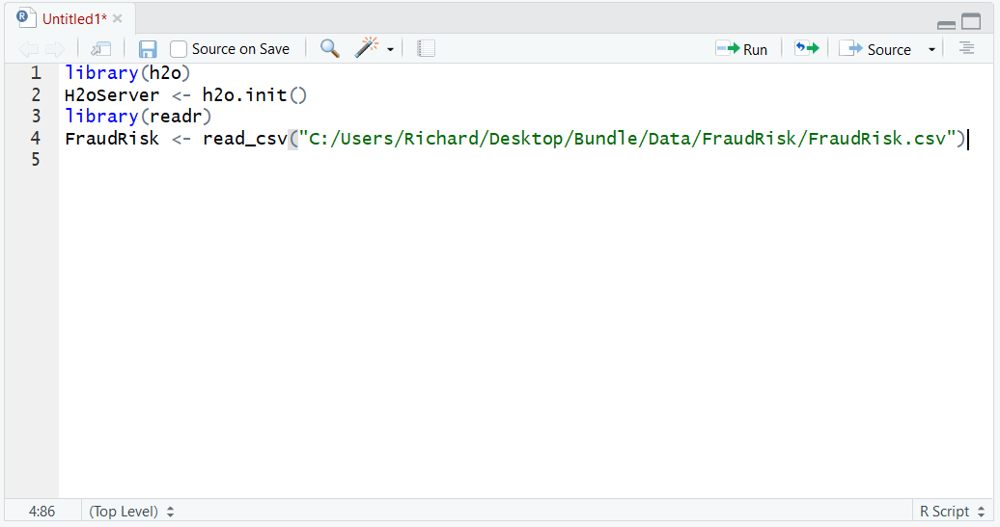

Run the block of script to console:

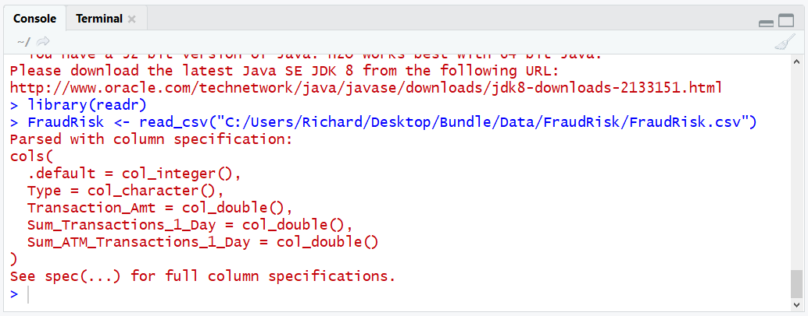

The training process will make use of a test dataset and a sample dataset. The preferred method to randomly split a dataframe is to create a vector which comprises random values, then append this vector to the dataframe.  Using Vector sub setting, data frames will be split based on a random value.

Start by observing the length of the dataframe by typing (on any dataframe variable):

``` r
length(FraudRisk$Dependent)
```

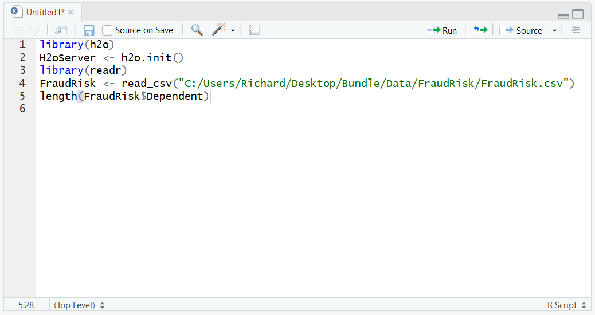

Run the line of script to console:

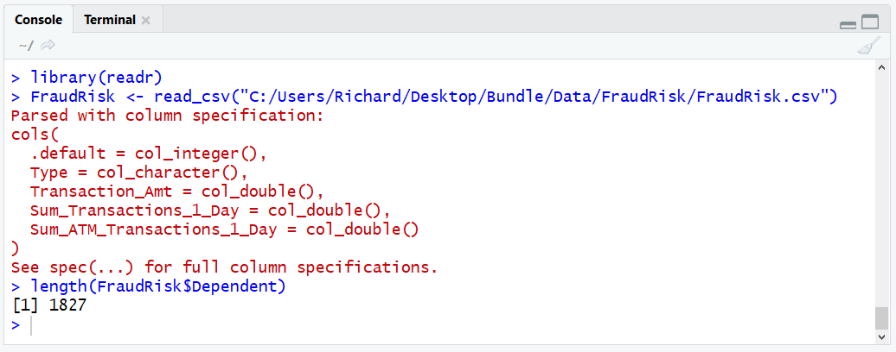

Having established that the dataframe has 1827 records, use this value to create a vector of the same size containing random values between 0 and 1.  The RunIf function is used to create vectors or a prescribed length with random values between a certain range:

``` r
RandomDigit <- runif(1827,0,1)
```

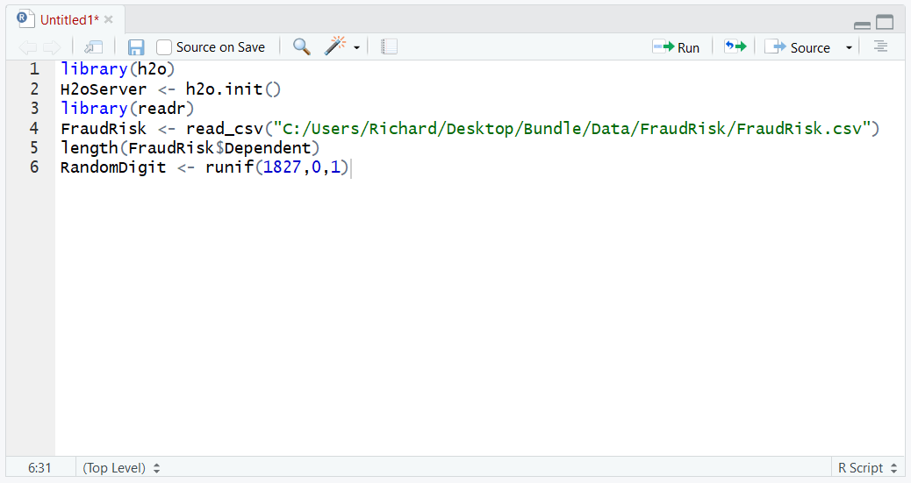

Run the line of script to console:

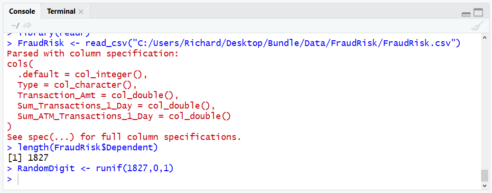

A vector containing random digits, of same length as the dataframe, has been created.  Validate vector by typing:

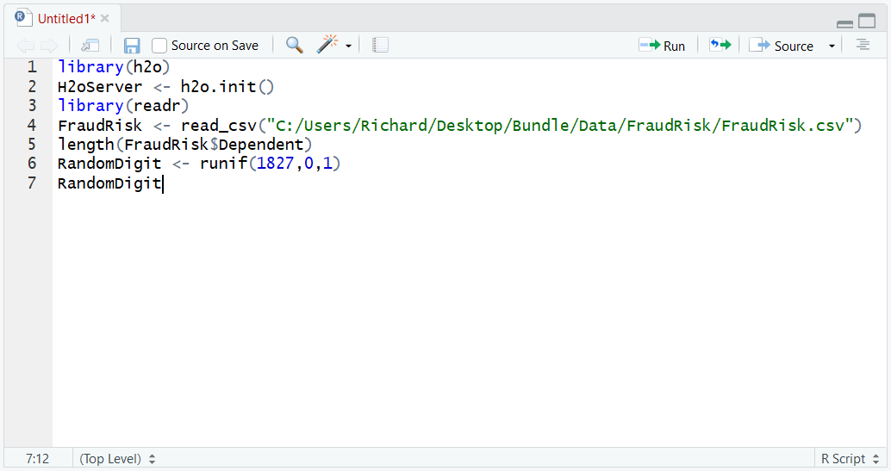

Run the line of script to console:

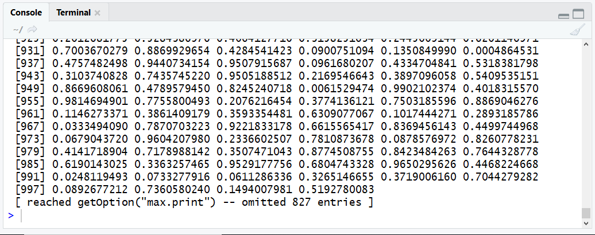

The random digits are written out showing there to be values created, on a random basis, between 0 and 1 with a high degree of precision.  Append this vector to the dataframe as using Dplyr and Mutate:

``` r
library(dplyr)
FraudRisk <- mutate(FraudRisk,RandomDigit)
```

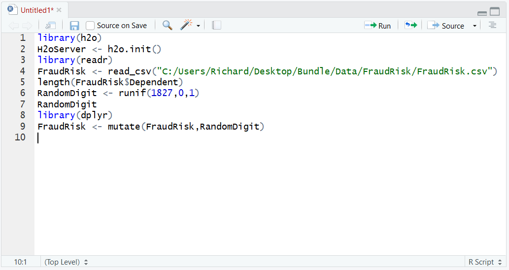

Run the block of script to console:

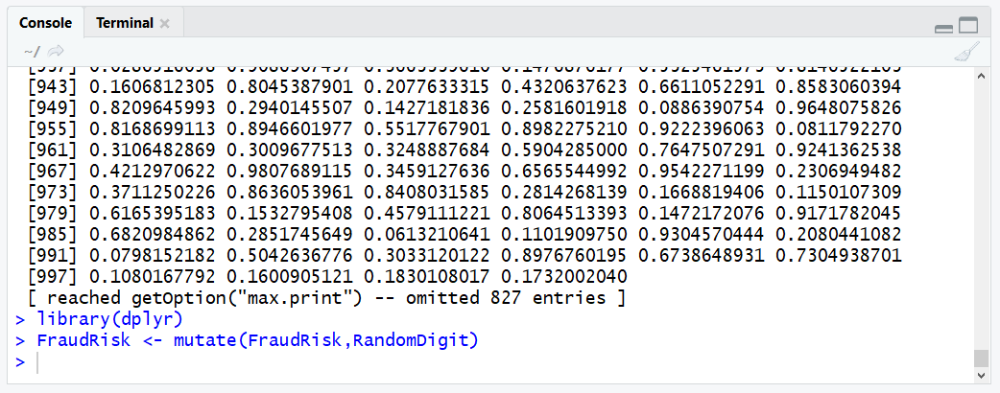

The RandomDigit vector is now appended to the FraudRisk dataframe and can be used in sub setting and splitting.  Create the cross-validation dataset by creating a filter creating a new data frame by assignment:

``` r
CV <- filter(FraudRisk,RandomDigit < 0.2)
```

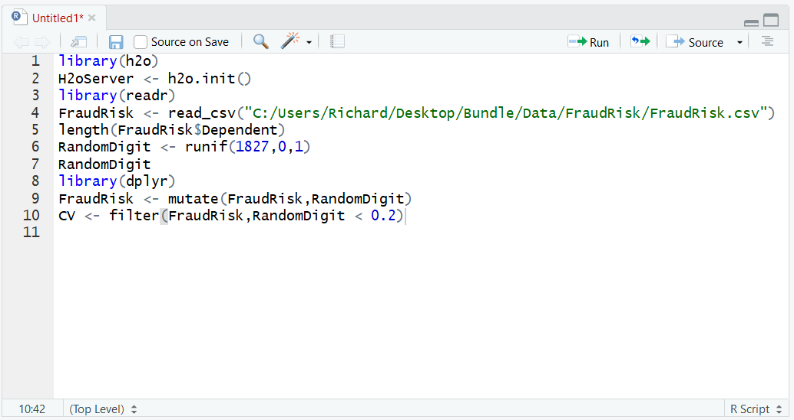

Run the line of script to console:

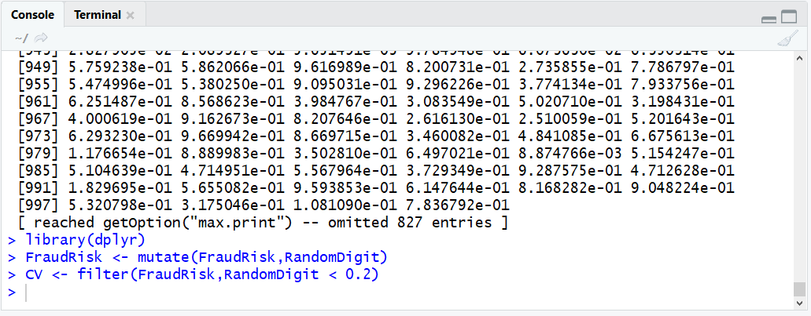

A new data frame by the name of CV has been created.  Observe the CV data frame length:

``` r
length(CV$Dependent)
```

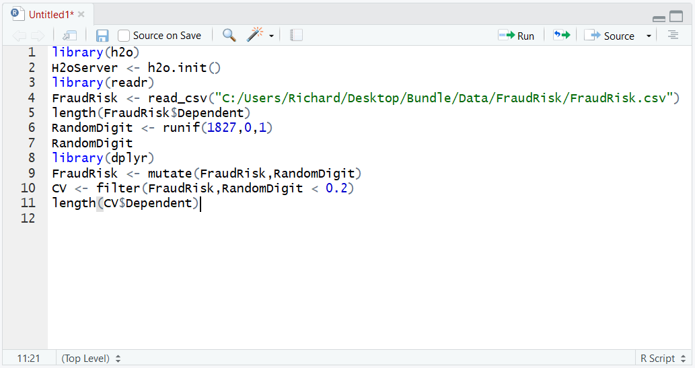

Run the line of script to console:

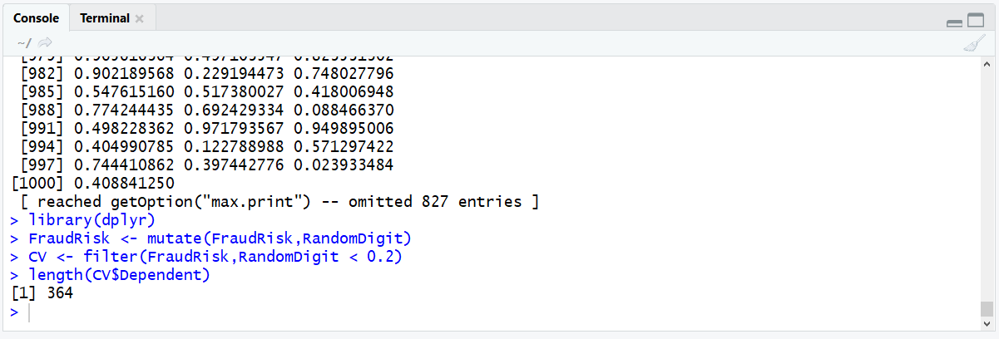

It can be seen that the data frame has 386 records, which is broadly 20% of the FraudRisk data frames records.  The task remains to create the training dataset, which is similar albeit sub setting for a larger opposing random digit filter:

``` r
Training <- filter(FraudRisk,RandomDigit >= 0.2)
```

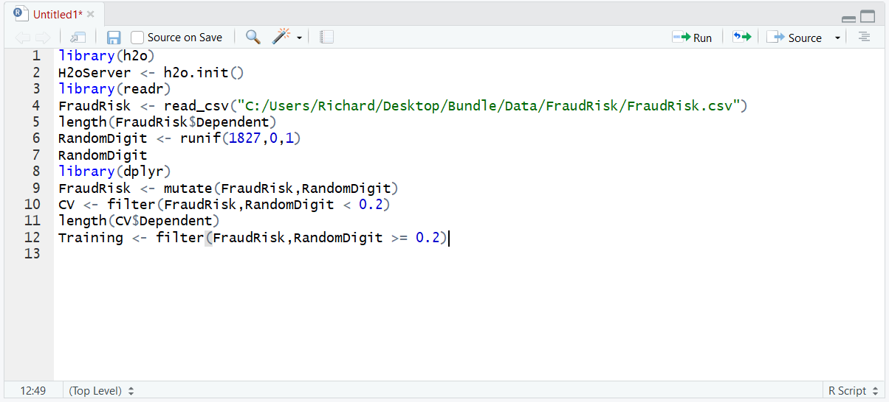

Run the line of script to console:

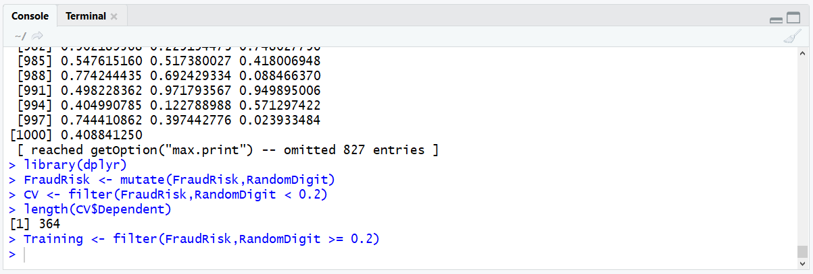

Validate the length of the Training data frame:

``` r
length(Training$Dependent)
```

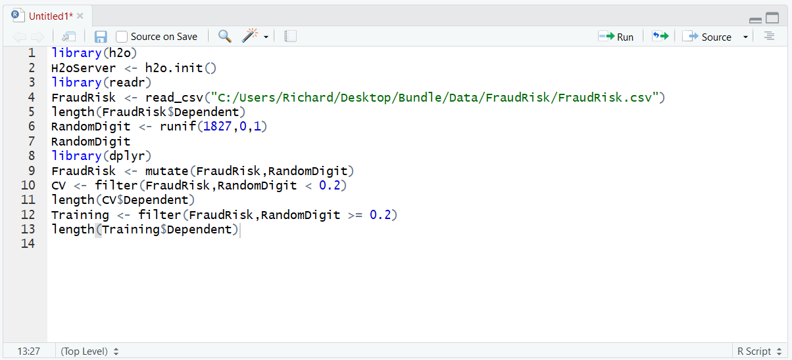

Run the line of script to console:

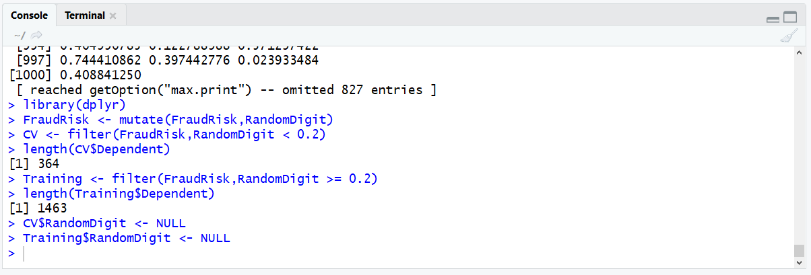

H2O requires that the Dependent Variable is a factor, it is after all a classification problem.  Convert the dependent variable to a factor for the training and cross validation dataset:

At this stage, there now exists a randomly selected Training dataset as well as a randomly selection Cross Validation training set.  Keep in mind that H2O requires that the dataframe is converted to the native hex format, achieved through the creation of a parsed data object for each dataset. Think of this process as being the loading of data into the H2O server, more so than a conversion to Hex:

``` r
Training.hex <- as.h2o(Training)
CV.hex <- as.h2o(CV)
```

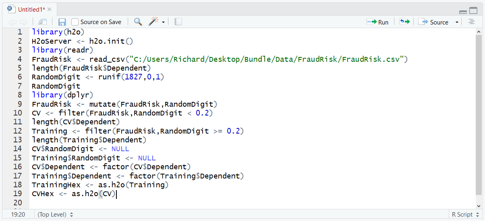

Run the block of script to console:

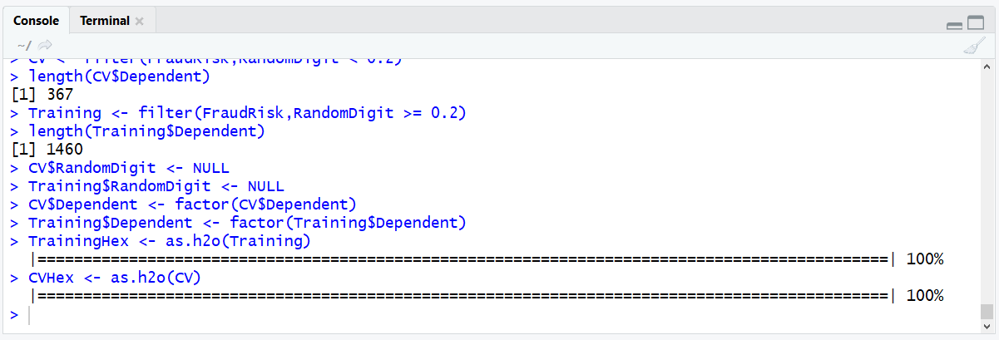

All models that are available to be trained via the Flow interface are available via the R interface, with the hex files being ready to be passed as parameters.