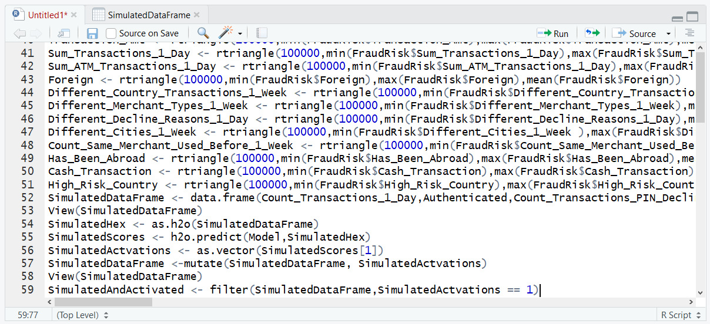
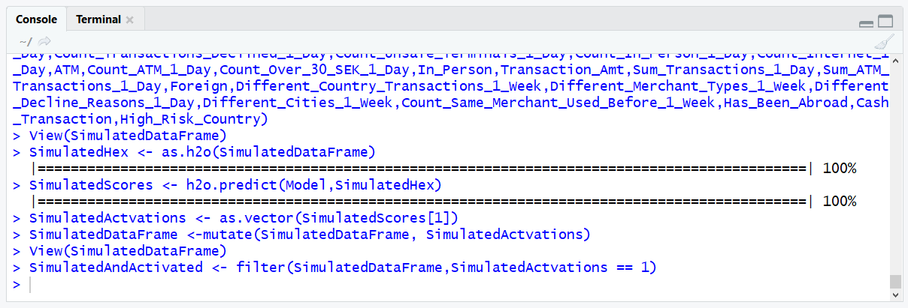
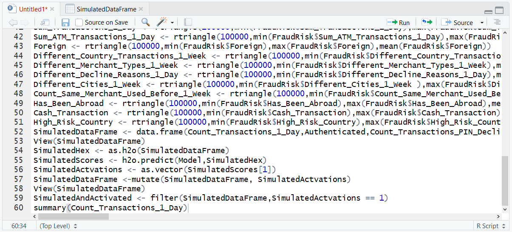
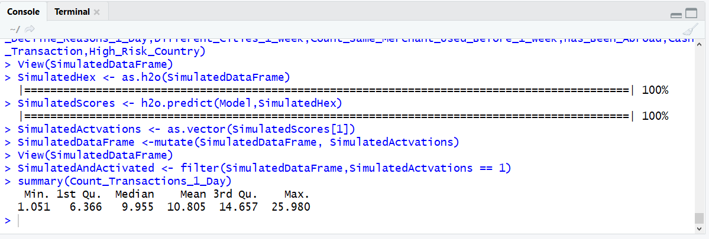

# Procedure 3: Filter Data Frame for Activations and Produce Summary Statistics to prescribe

Keeping in mind that the H2O neural network was trained on real data and is a very good approximation of fraud, by simulating millions of random variables through this model while saving these simulations, it becomes feasible to present summary statistics which can explain what the activation scenario most likely looks like.

The task is to create summary statistics upon the simulations for only those records which have been activated.  Start by filtering only those records classified as fraud to a new data frame (keeping in mind dplyr has already been loaded):

``` r
SimulatedAndActivated <- filter(SimulatedDataFrame,SimulatedActivations == 1)
```



Run the line of script to console:



The SimulatedAndActivated data frame is now a picture of the activated scenario only, henceforth a series of summary statistics can be executed against this dataframe to begin to understand the environment of fraud. In the following example, a summary of the Count_Transactions_1_Day is provided:

``` r
summary(Count_Transactions_1_Day)
```



Run the line of script to console:



Run the line of script to console:


In this case, it would seem that the average number of transactions on a fraudulent account is 10.  When taken in conjunction with other such summary statistics and used in conjunction with the original summary statistics observed from the simulated dataset, this can provide compelling prescriptions.

