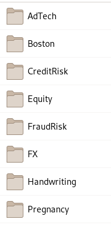

# Datasets

These materials make reference to datasets available in a zip format via the following location:

[Datasets.zip](Datasets.zip)

Download the file and unzip to reveal the contents:

Alternatively, navigate via the following index and links:

[Datasets/AdTech/AdTech.csv](Datasets/AdTech/AdTech.csv)

[Datasets/AdTech/Statistics.csv](Datasets/AdTech/Statistics.csv)

[Datasets/Boston/Boston.csv](Datasets/Boston/Boston.csv)

[Datasets/CreditRisk/German/CreditRisk.csv](Datasets/CreditRisk/German/CreditRisk.csv)

[Datasets/CreditRisk/German/CreditRisk.neta](Datasets/CreditRisk/German/CreditRisk.neta)

[Datasets/CreditRisk/Jube/CreditRisk.neta](Datasets/CreditRisk/Jube/CreditRisk.csv)

[Datasets/Equity/CSV/AAPL.csv](Datasets/Equity/CSV/AAPL.csv)

[Datasets/Equity/CSV/AMZN.csv](Datasets/Equity/CSV/AMZN.csv)

[Datasets/Equity/CSV/AXP.csv](Datasets/Equity/CSV/AXP.csv)

[Datasets/Equity/CSV/CAT.csv](Datasets/Equity/CSV/CAT.csv)

[Datasets/Equity/CSV/COST.csv](Datasets/Equity/CSV/COST.csv)

[Datasets/Equity/CSV/CRM.csv](Datasets/Equity/CSV/CRM.csv)

[Datasets/Equity/CSV/DIS.csv](Datasets/Equity/CSV/DIS.csv)

[Datasets/Equity/CSV/FB.csv](Datasets/Equity/CSV/FB.csv)

[Datasets/Equity/CSV/FDX.csv](Datasets/Equity/CSV/FDX.csv)

[Datasets/Equity/CSV/GE.csv](Datasets/Equity/CSV/GE.csv)

[Datasets/Equity/CSV/GOOG.csv](Datasets/Equity/CSV/GOOG.csv)

[Datasets/Equity/CSV/IBM.csv](Datasets/Equity/CSV/IBM.csv)

[Datasets/Equity/CSV/JWN.csv](Datasets/Equity/CSV/JWN.csv)

[Datasets/Equity/CSV/KO.csv](Datasets/Equity/CSV/KO.csv)

[Datasets/Equity/CSV/MCD.csv](Datasets/Equity/CSV/MCD.csv)

[Datasets/Equity/CSV/MSFT.csv](Datasets/Equity/CSV/MSFT.csv)

[Datasets/Equity/CSV/ORCL.csv](Datasets/Equity/CSV/ORCL.csv)

[Datasets/Equity/CSV/SBUX.csv](Datasets/Equity/CSV/SBUX.csv)

[Datasets/Equity/Pipe/AAPL.txt](Datasets/Equity/Pipe/AAPL.txt)

[Datasets/FraudRisk/FraudRisk.csv](Datasets/FraudRisk/FraudRisk.csv)

[Datasets/Handwriting/Letters.csv](Datasets/Handwriting/Letters.csv)

Most datasets are explained throughout the materials with the exception of Letters.csv which is available as follows:

[Datasets/Handwriting/Letters.pdf](Datasets/Handwriting/Letters.pdf)

