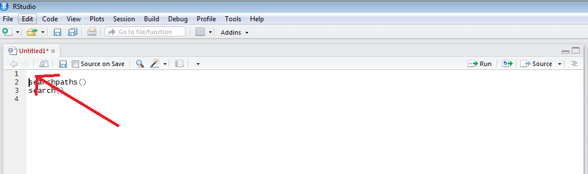
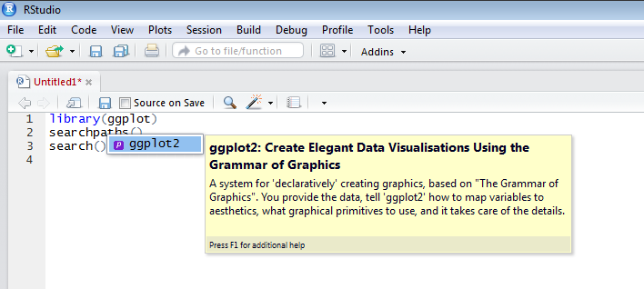
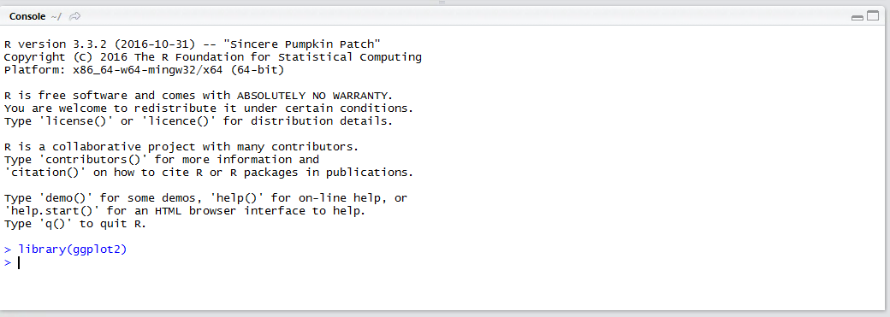

# Procedure 10: Load Packages using Script

While the toggle function is a useful feature of RStudio,  the intention is to maintain a script Active, Console Passive approach, henceforth it is important to ensure that the library() function call, to be streamed to the console is moved to the head of the script and that the detach() function is moved to the base of the script.

Start by navigating to the very top of the script and create a new line in the script editor. Navigate to the start of the first line and press the enter key:



Invoking the library() function,  type:

``` r
library(ggplot2)
```



Intellisense will look through the search path and suggest some packages,  and this can also be autocompleted to ggplot2.  Upon completion of the line,  run the script line to the console:



The ggplot library is now loaded as the first line of the script.  