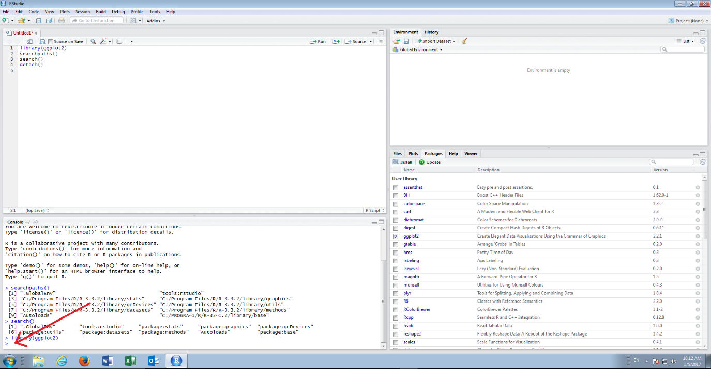
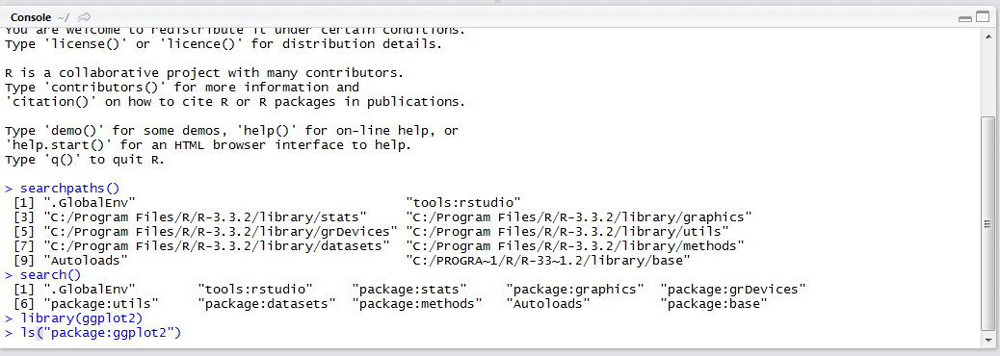
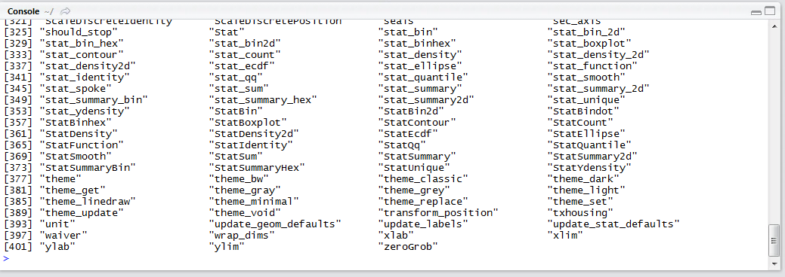

# Procedure 11: List all Functions in a Package

Once a package is loaded, beyond using the help as detailed in procedure 8, an understanding of all the functions available to the package can be obtained.   Although a script active, console passive approach is advocated this procedure is one of the few occasions where it is more appropriate to use the console directly rather than clutter up the script.

Click on the console window in the bottom left hand corner of RStudio:



Type directly into the console:

``` r
ls("package:ggplot2")
```



Press the Enter key to execute the script:



A list of all functions in the package is returned.