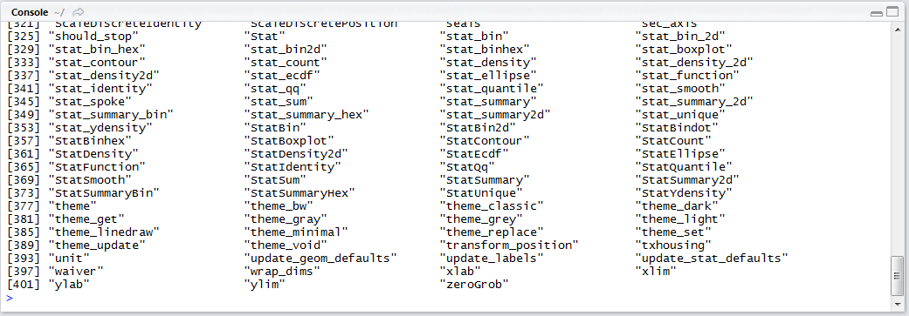
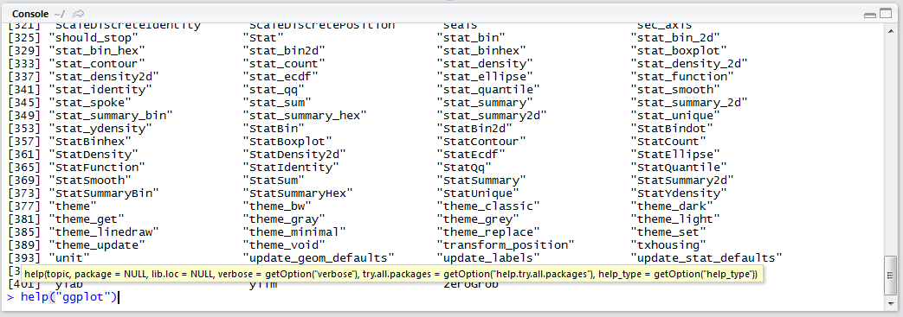
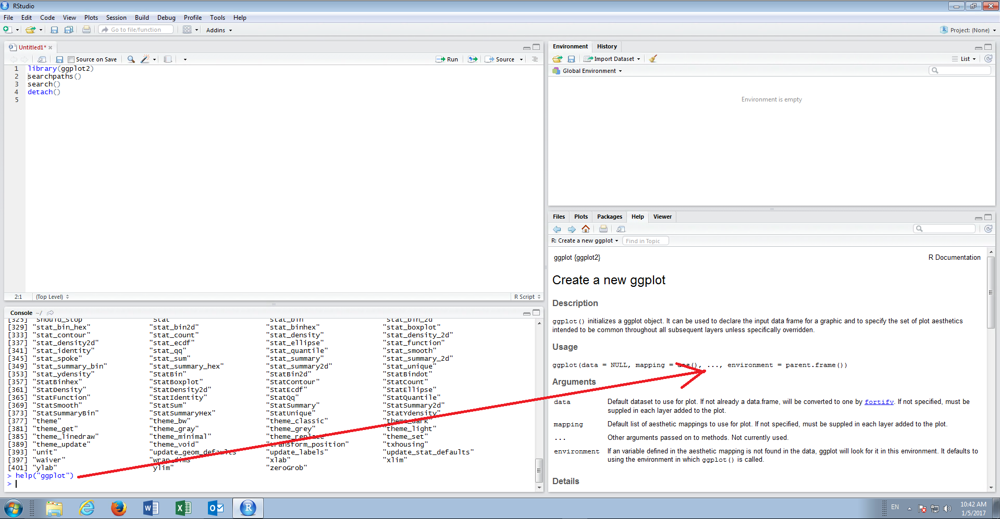

# Procedure 12: Use the help() function to explain a function

If using RStudio, navigating to the documentation via the help pane is by far the easiest and most intuitive means to access help.  Taking the output of functions recalled in procedure 11,  navigation to help can be triggered by invoking the help function.

As with procedure 11,  this procedure is one of the few occasions where it is more appropriate to target the console rather than the script.

To navigate to help,  click on the console input cursor:



Type:

``` r
help("ggplot")
```



Press the Enter key to execute the line of script:



While operating in RStudio,  the help will be displayed in the dedicated help pane.  If operating in the console,  the experience would be that the same text is written out to the console in text only.  It follows that this procedure exists for the purposes of making help and documentation available universally in R.