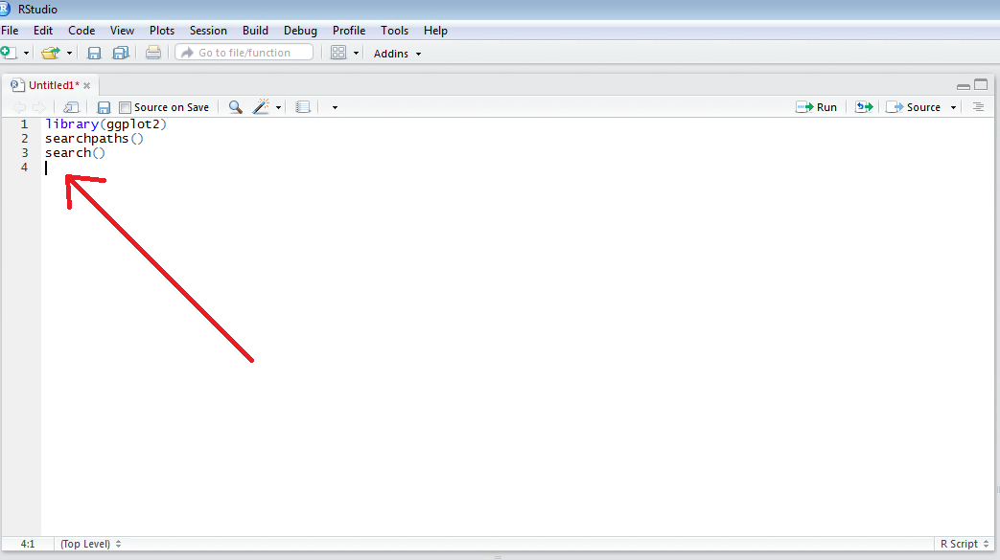
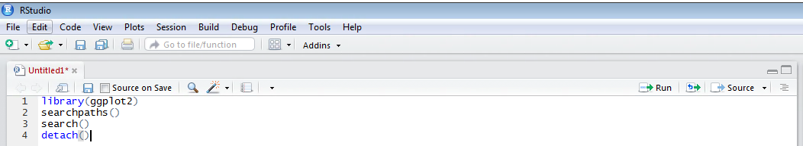
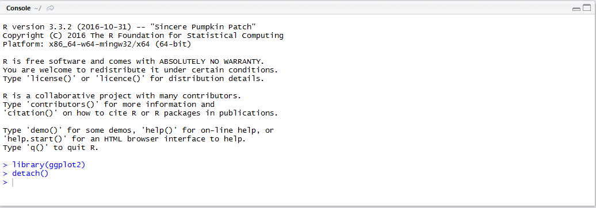

# Procedure 13: Unloading a Package

Navigate to the end of the script and create a new line:



Type the detach() function as:

``` r
detach("package:ggplot2", unload = TRUE)
```



Run the line of script to the console:



The package has now been removed from the R session and the script is essentially, tidying itself up.