# Procedure 14: Creating a Numeric Variable by Assignment

Start by creating a new script as procedure 5:

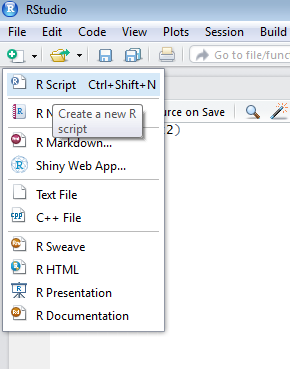

A blank script window will be created that will be the target:

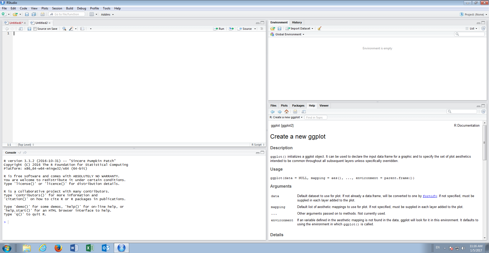

Variables in R are created by assignment,  the process of setting a value.  The operator or command for assignment is the character combination of "<-".  To create and assign a numeric variable start by typing into the script window:

``` r
Numeric <- 1
```

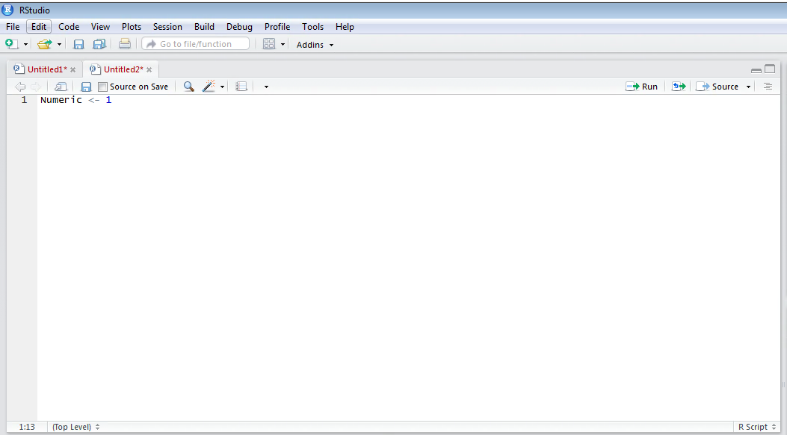

Run the script to console:

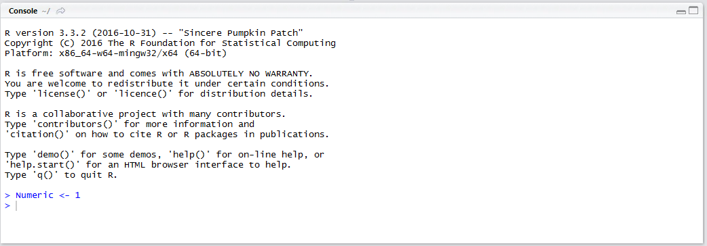

A variable with the name Numeric has now been created.   It can be seen that RStudio has also recognised the creation of a new variable in the Environment Values pane towards the top right hand side of RStudio:

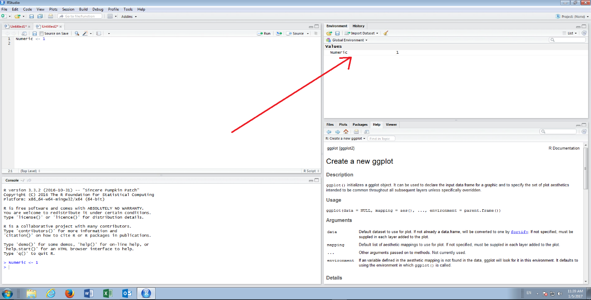

The variable can also be referenced in the script by simply typing the variable name and running the script to console.  In this example,  create a new line in the script and type the name of the variable:

``` r
Numeric
```

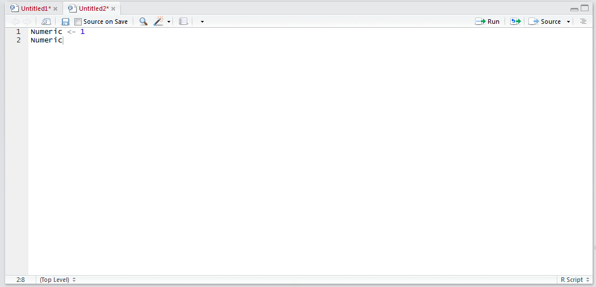

Run the line of script to console:

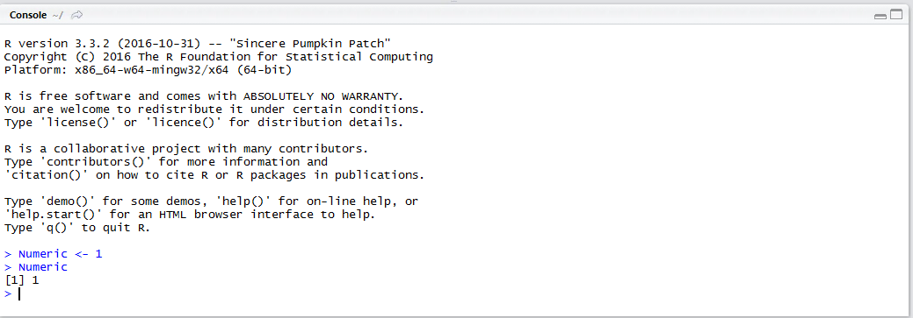

It can be seen that the assigned value is written out.

The mode() function is intended to disclose the variable type, taking the variable name as the parameter.  Create a new line in the script editor and disclose the variable type, start by typing:

``` r
mode(Numeric)
```

Run the line of script to console:

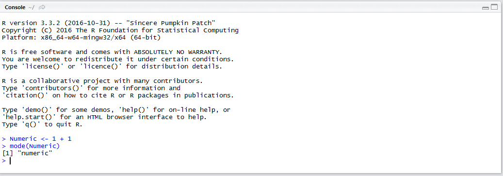

It can be observed that the variable type has been returned as numeric.  It is also possible to assign a variable as the result of arithmetic or function output.  For example,  type into the script editor:

``` r
NumericResult <- 1 + 1
```

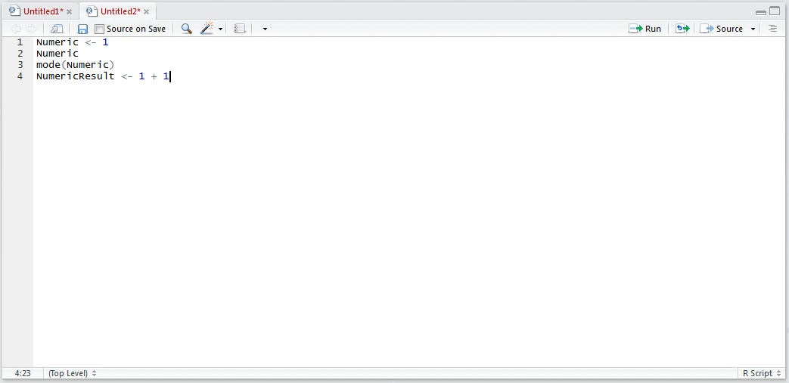

Run the line of script to the console:

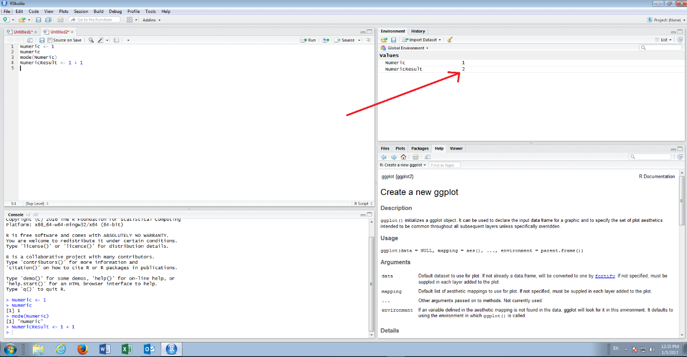

It can be observed that the NumericVariable has been created and is available in the Environment Variables windows, and it would also return in the console when referencing the variable directly:

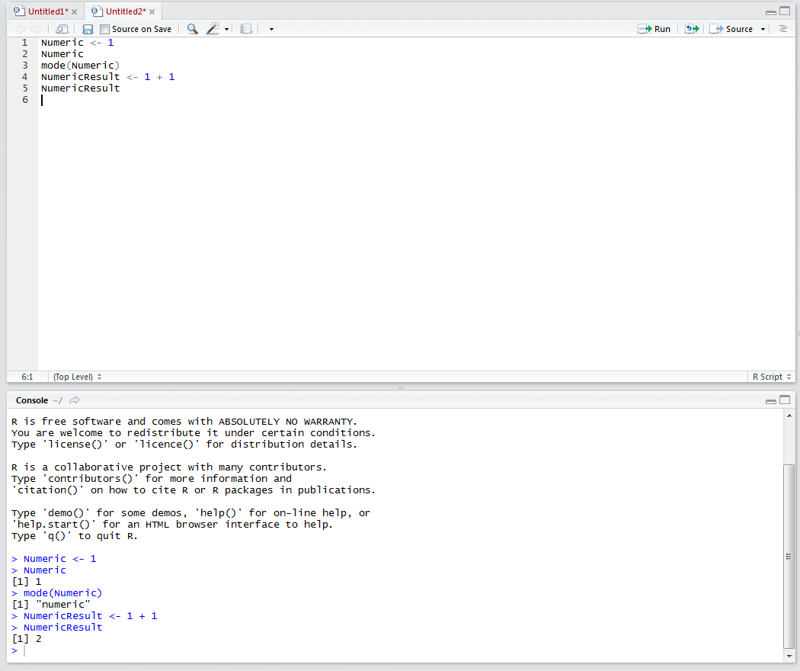