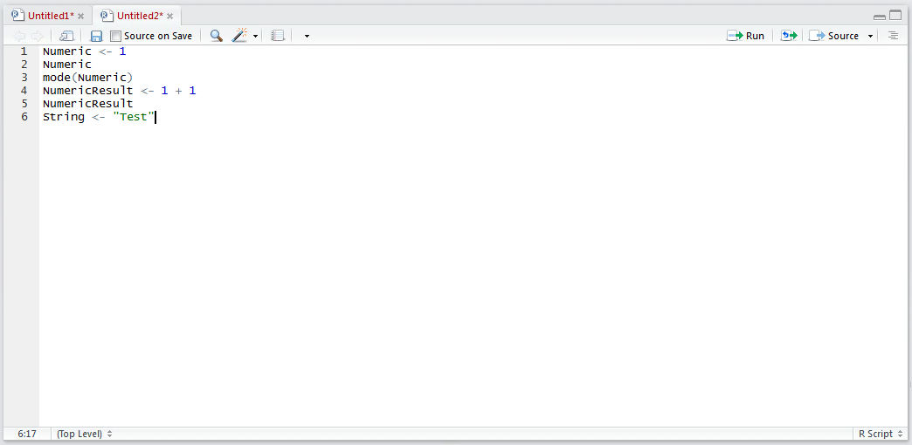
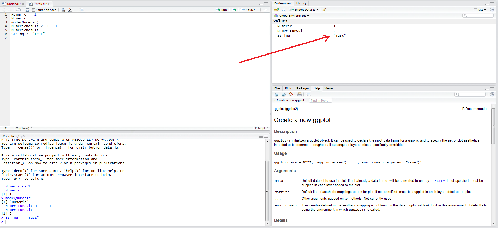
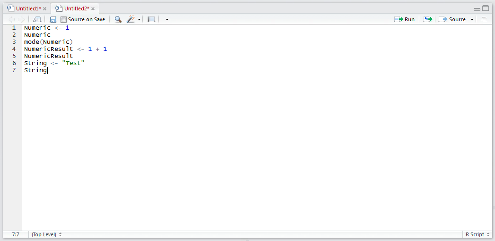
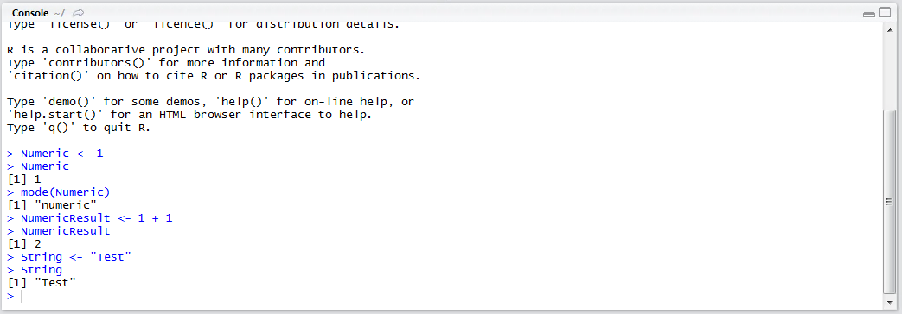
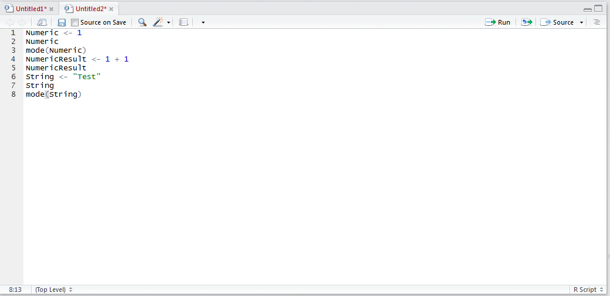
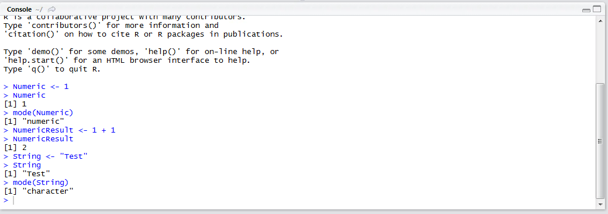

# Procedure 15: Create a string variable by assignment

Strings in R are surrounded by double quotation marks yet the assignment procedure is the same as numeric assignment.  Start by creating a new line in the script editor and typing:

``` r
Char <- "Test"
```



Run the script to console:



The new String value is written to the Environment pane.  The variable is addressable from the script by typing the variable:

``` r
String
```



Run the line of script to console:



Validate the variable type by using the mode() function. Type into the script pane:

``` r
mode(String)
```



Run the line of script to console:



It can be observed that the data type was defined as character upon assignment.